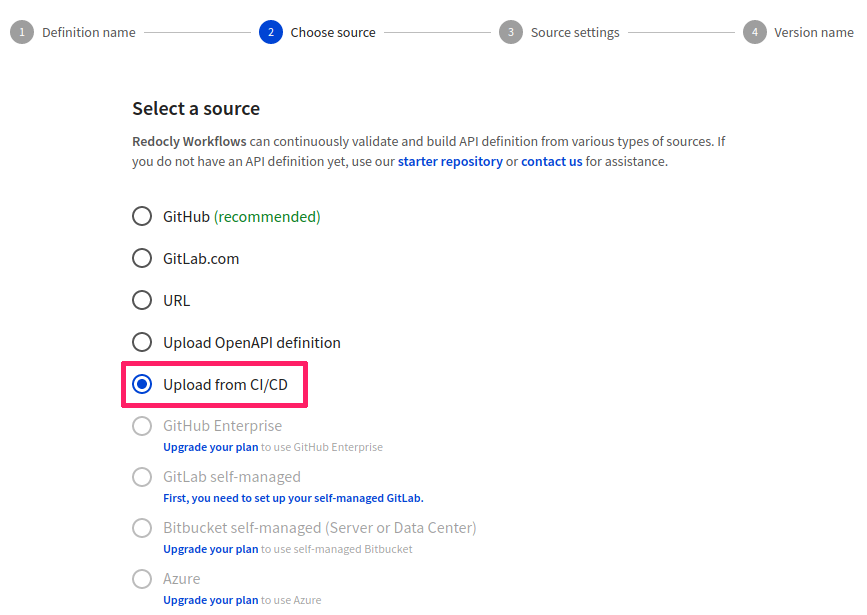

# Upload from CI/CD

When you choose to upload your API definitions from CI/CD, you're creating a link between Redocly Workflows and your existing CI pipeline without having to grant any special access permissions.

With this approach, you can:
- Set up the source in Redocly Workflows, and
- Use the Redocly CLI `push` command on the CI side.

Note: The CI/CD source supports branches, but you must explicitly define them when running the `push` command.

1. On the **API Registry** page, select **Add API**.

2. In the **Definition name** step, provide a name for your new API definition.

3. In the **Choose source** step, select **Upload from CI/CD**. The **Source settings** step is an informative page that doesn't require any input, so proceed to **Version name**.

4. Provide a name for the API version and select **Finish** to complete adding your API definition.

5. In the **Overview** page that opens, follow the instructions from *How to push to registry* to upload your API definition file(s).

Find more information in the [Redocly CLI push command](../../../docs/cli/commands/push) documentation.

