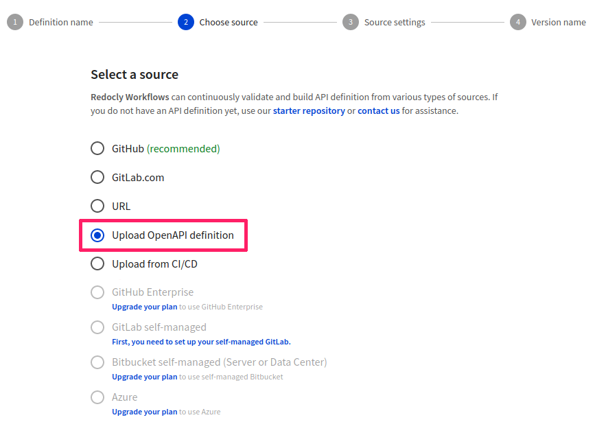
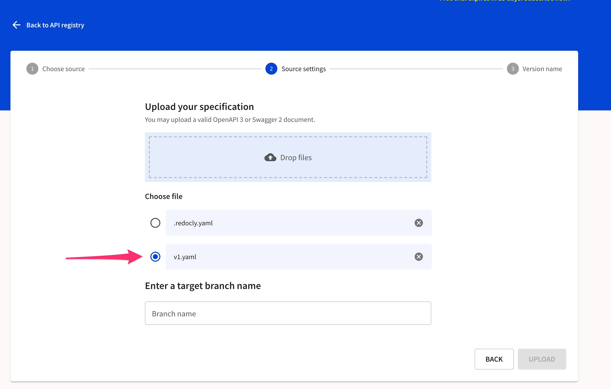

# Upload OpenAPI definition

You can use directly uploaded files as your source of OpenAPI definitions. This approach is useful for quick testing and demo purposes.

1. On the **API Registry** page, select **Add API**.

2. In the **Definition name** step, provide a name for your new API definition.

3. In the **Choose source** step, select **Upload OpenAPI definition**.

4. In the **Source settings** step, upload any of the following:

- a single API definition file
- an API definition file and the [Redocly configuration file](/docs/cli/configuration)

If you upload multiple files, you must select the file that contains your API definition.

The branch name you provide will be associated with the file, similar to branches in the Git repositories. You may upload additional files to create previews of other branches afterwards.

5. Select **Upload** to proceed to the next step.

6. In the **Version name** step, provide a name for the API version and select **Finish** to complete adding your API definition.
