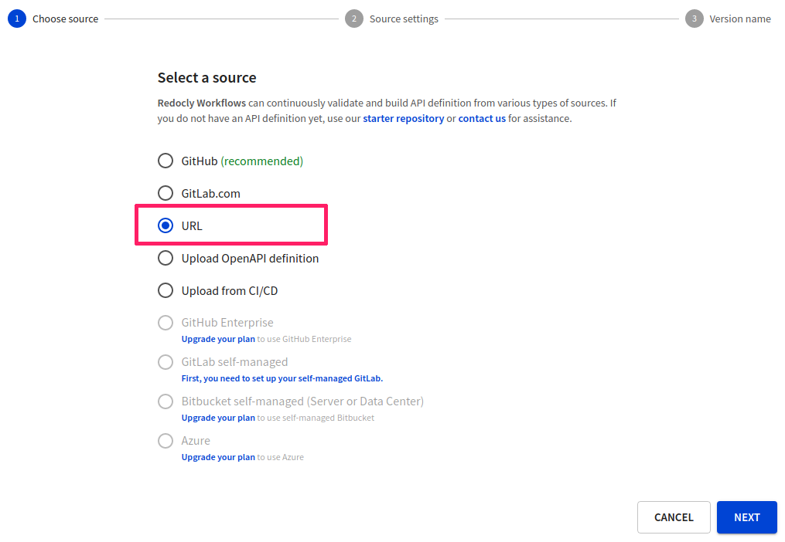
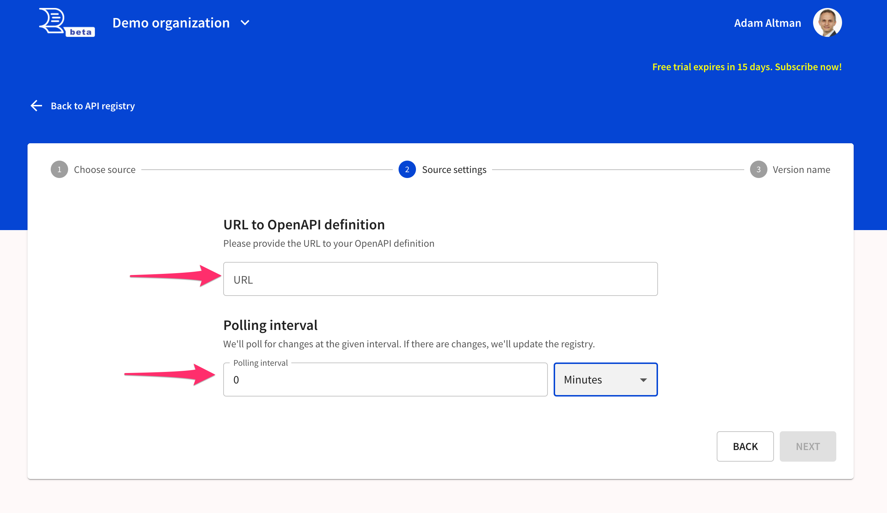

# URL source

To set up the URL source, provide a URL to an API definition. The URL will be polled at regular intervals to check for updates.


Unlike the other sources, the URL source does not support [branches](../../api-registry/settings/branches.md).
It also does not support using the Redocly configuration file.


1. On the **API Registry** page, select **Add API**.

2. In the **Definition name** step, provide a name for your new API definition.

3. In the **Choose source** step, select **URL**.

4. In the **Source settings** step, provide a fully-qualified and publicly accessible URL. Set the polling interval (as a positive integer value in minutes, hours, or days). The polling interval determines how frequently Redocly checks the URL for changes to the API definition.

5. Select **Next** to proceed to the **Version name** step. Provide a name for the API version and select **Finish** to complete adding your API definition.
