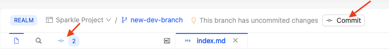

1. Click the **Commit** button, or the commit icon.

   

2. Review the diff by clicking on the modified file.

   

   When you are finished reviewing the diff, you can close the tab on the (changes) file.
3. (Optional) you can deselect the files you want to exclude from the commit.
4. Enter a commit message describing your updates.
   For example, "Update index.md"
5. Click **Commit**.
