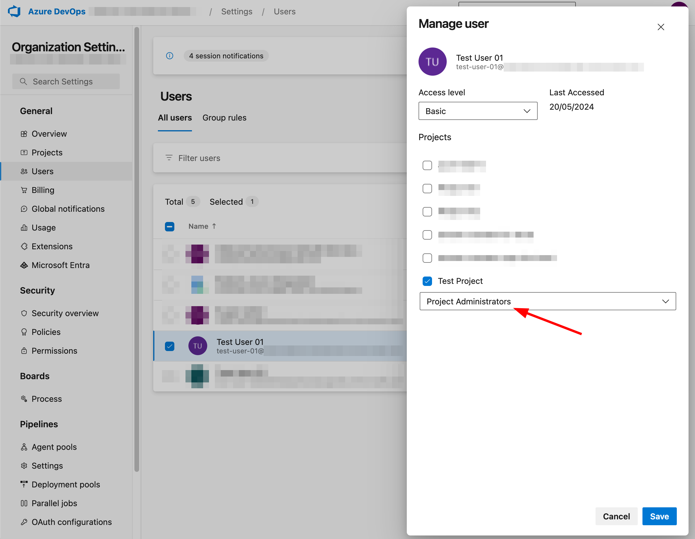
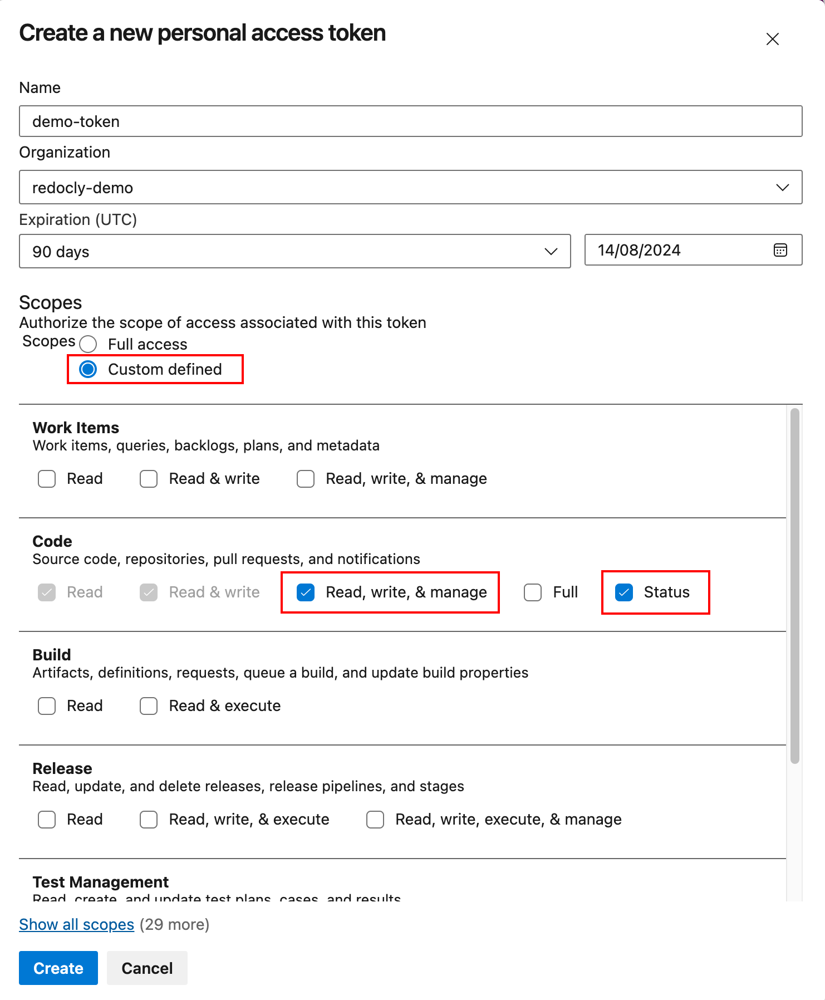

### Permissions

Before creating Personal Access Token (PAT) for your user, make sure that they have a correct access right to the desired Azure projects.
Redocly recommends putting your user in the `Project Administrators` security group for your Azure DevOps project, since this security group has all the needed permissions by default.

_(For example, only the `Project Administrators` security group has the `View subscriptions` and the `Edit subscriptions` permissions enabled [by default](https://learn.microsoft.com/en-us/azure/devops/service-hooks/overview?view=azure-devops#q-what-permissions-do-i-need-to-set-up-a-subscription).
Redocly needs these permissions to be able to setup service hooks (webhooks) for the Azure project.)_

Alternatively, you can put your user in the `Project Contributors` security group and add the `View subscriptions` and the `Edit subscriptions` permissions manually.
See [Manage permissions with command line tool](https://learn.microsoft.com/en-us/azure/devops/organizations/security/manage-tokens-namespaces?view=azure-devops)
or [Security REST API](https://learn.microsoft.com/en-us/rest/api/azure/devops/security/?view=azure-devops-rest-7.1) in Microsoft Azure DevOps documentation for detailed instructions.

### PAT scopes

Before you enter the connection details in Redocly, you need to create and copy a new PAT for your account in Azure DevOps.
Redocly uses this access token to establish a connection to your repository.

See [Create a PAT](https://learn.microsoft.com/en-us/azure/devops/organizations/accounts/use-personal-access-tokens-to-authenticate?#create-a-pat) in Microsoft Azure DevOps documentation for detailed instructions.

You must select an Organization for this PAT. Do not select **All accessible organizations**.

Also, the PAT you use must have API scopes defined. You can choose the **Full access** option, or select **Custom defined** and enable the following specific scopes:

- Code: `Read, write, & manage` and `Status`

The following screenshot from Azure DevOps shows the required custom defined scopes:

Reunite requires:

- **Code -> Read** (`vso.code`) scope for all read operations in Reunite _(list of repositories, branches, files, file contents, diffs, list of PRs, etc.)_.
- **Code -> Write** (`vso.code_write`) scope for all write operations in Reunite _(create/update Pull Requests, remove branches, synchronize remote content)_.
- **Code -> Manage** (`vso.code_manage`) scope for creating new code repositories from Reunite app.
- **Code -> Status** (`vso.code_status`) scope for setting commit and PR statuses _(Lint status, Build status, Link checker status, Visual review)_.

See [Scopes](https://learn.microsoft.com/en-us/azure/devops/organizations/accounts/use-personal-access-tokens-to-authenticate?#create-a-pat) in Microsoft Azure DevOps documentation for detailed information about scopes permissions.

  
Detailed list of all resources that Reunite uses from Azure API and their required scopes:

| Resource                                                                                                                                                              | Auth Type | Scopes                              | Description                                                   |
| --------------------------------------------------------------------------------------------------------------------------------------------------------------------- | --------- | ----------------------------------- | ------------------------------------------------------------- |
| [Repositories - List](https://learn.microsoft.com/en-us/rest/api/azure/devops/git/repositories/list?view=azure-devops-rest-7.1&tabs=HTTP)                             | PAT       | `vso.code`                          | To get repositories list                                      |
| [Repositories - Get Repository](https://learn.microsoft.com/en-us/rest/api/azure/devops/git/repositories/get-repository?view=azure-devops-rest-7.1&tabs=HTTP)         | PAT       | `vso.code`                          | To get repository metadata                                    |
| [Stats - List](https://learn.microsoft.com/en-us/rest/api/azure/devops/git/stats/list?view=azure-devops-rest-7.1&tabs=HTTP)                                           | PAT       | `vso.code`                          | To get branch list                                            |
| [Refs - Update Refs](https://learn.microsoft.com/en-us/rest/api/azure/devops/git/refs/update-refs?view=azure-devops-rest-7.1&tabs=HTTP)                               | PAT       | `vso.code`                          | To delete branches                                            |
| [Items - List](https://learn.microsoft.com/en-us/rest/api/azure/devops/git/items/list?view=azure-devops-rest-7.1&tabs=HTTP)                                           | PAT       | `vso.code`                          | To get folders list and PR templates list                     |
| [Items - Get](https://learn.microsoft.com/en-us/rest/api/azure/devops/git/items/get?view=azure-devops-rest-7.1&tabs=HTTP)                                             | PAT       | `vso.code`                          | To get PR template content                                    |
| [Commits - Get](https://learn.microsoft.com/en-us/rest/api/azure/devops/git/commits/get?view=azure-devops-rest-7.1&tabs=HTTP)                                         | PAT       | `vso.code`                          | To get commit details                                         |
| [Merge Bases - List](https://learn.microsoft.com/en-us/rest/api/azure/devops/git/merge-bases/list?view=azure-devops-rest-7.1)                                         | PAT       | `vso.code`                          | To find the merge bases of two commits                        |
| [Diffs - Get](https://learn.microsoft.com/en-us/rest/api/azure/devops/git/diffs/get?view=azure-devops-rest-7.1&tabs=HTTP)                                             | PAT       | `vso.code`                          | To get diff between commits                                   |
| [Statuses - List](https://learn.microsoft.com/en-us/rest/api/azure/devops/git/statuses/list?view=azure-devops-rest-7.1&tabs=HTTP)                                     | PAT       | `vso.code`, `vso.code_status`       | To get existing commit statuses                               |
| [Statuses - Create](https://learn.microsoft.com/en-us/rest/api/azure/devops/git/statuses/create?view=azure-devops-rest-7.1&tabs=HTTP)                                 | PAT       | `vso.code_write`, `vso.code_status` | To set commit statuses (for deployments and scorecards)       |
| [Pull Requests - Get Pull Requests](https://learn.microsoft.com/en-us/rest/api/azure/devops/git/pull-requests/get-pull-requests?view=azure-devops-rest-7.1&tabs=HTTP) | PAT       | `vso.code`                          | To get pull requests list                                     |
| [Pull Requests - Get Pull Request](https://learn.microsoft.com/en-us/rest/api/azure/devops/git/pull-requests/get-pull-request?view=azure-devops-rest-7.1)             | OAuth2    | `vso.code`                          | To get details about a specific pull request                  |
| [Pull Requests - Create](https://learn.microsoft.com/en-us/rest/api/azure/devops/git/pull-requests/create?view=azure-devops-rest-7.1&tabs=HTTP)                       | OAuth2    | `vso.code`                          | To create a new pull request                                  |
| [Pull Requests - Update](https://learn.microsoft.com/en-us/rest/api/azure/devops/git/pull-requests/update?view=azure-devops-rest-7.1)                                 | OAuth2    | `vso.code`                          | To manage existing pull requests (merge, close, reopen, etc.) |
| [Pull Request Statuses - Create](https://learn.microsoft.com/en-us/rest/api/azure/devops/git/pull-request-statuses/create?view=azure-devops-rest-7.1&tabs=HTTP)       | PAT       | `vso.code_write`, `vso.code_status` | To set pull request statuses                                  |
| [Policy Configurations - Get](https://learn.microsoft.com/en-us/rest/api/azure/devops/git/policy-configurations/get?view=azure-devops-rest-7.1)                       | OAuth2    | `vso.code`                          | To get configurations for merge strategies                    |
| [Subscriptions - List](https://learn.microsoft.com/en-us/rest/api/azure/devops/hooks/subscriptions/list?view=azure-devops-rest-7.1&tabs=HTTP)                         | PAT       | `vso.code`                          | To get a list of existing project subscriptions (webhooks)    |
| [Subscriptions - Create](https://learn.microsoft.com/en-us/rest/api/azure/devops/hooks/subscriptions/create?view=azure-devops-rest-7.1&tabs=HTTP)                     | PAT       | `vso.code`                          | To create a new project subscription (webhook)                |
| [Profiles - Get](https://learn.microsoft.com/en-us/rest/api/azure/devops/profile/profiles/get?view=azure-devops-rest-7.1&tabs=HTTP)                                   | OAuth2    | `vso.profile`                       | To get user display name                                      |

> Note:
* Push and pull Git actions are performed using PAT.
* Redocly uses `https://dev.azure.com/{organization}/_apis/connectionData` endpoint to verify if the user is authorized.

