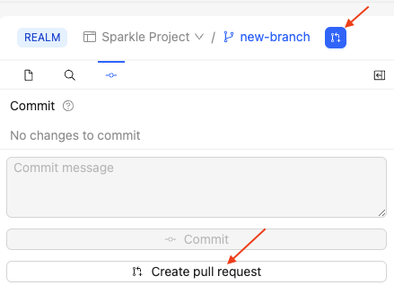
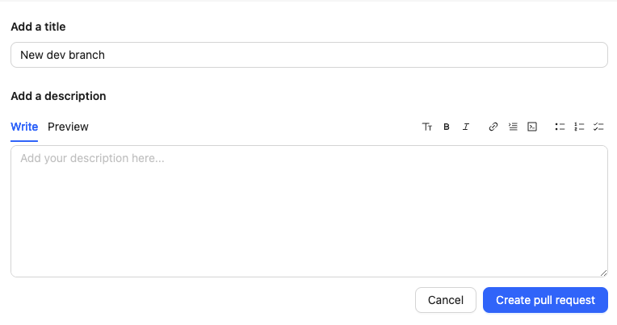

1. Click the **Create pull request icon**, or the **Create pull request** button on the **Commit** tab.

    
1. (Optional) In the page that opens:
    * Edit the **Title** to your preference, By default, Reunite uses the first commit message.
    * Provide a short description for the pull request.
1. Click the **Create pull request** button.

    