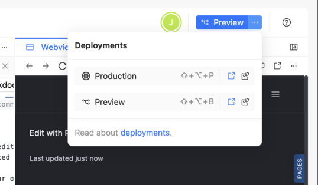

# Reunite

Reunite is Redocly's cloud platform for creating, editing, previewing, and deploying API documentation projects using a Git-based version control system.
You can [use the editor](../how-to/use-editor.md) to add, edit, and delete content and files in your project using a Git-based workflow to track and manage changes.


You can also use Reunite with a Git hosting provider of your choice and a docs-as-code workflow by [connecting a git content source](../../setup/how-to/git-providers/connect-git-provider.md). This article is about using the cloud platform.


## Editor

Reunite includes an **Editor** page where you can [add and delete files](../how-to/use-editor.md#add-files), edit content within files, and [view live previews](../how-to/use-webview.md) of your changes as you make them.

The editor includes the following panes that can be minimized:

- A file tree pane where you can view all files included in your project, even remote and static files.
- An editor pane where you can edit content using Markdown and Markdoc syntax.
- A Webview live preview pane where you can view your formatting updates as you add them.

The changes you make in the editor are introduced to your published project using a Git-based workflow.
Git is a version control system for tracking and managing changes that is integrated into Reunite.

## Version control

Reunite uses Git for version control, either with a [connected remote provider](../../setup/how-to/git-providers/connect-git-provider.md) or a Redocly provided repository.
The inclusion of Git for version control means that the changes you make in the Reunite editor are introduced to your published project using a Git-based workflow.

What is a Git-based workflow?

  A Reunite Git-based workflow includes the following steps:

- Before making changes in your project, create a new development branch.
- After making updates, commit your changes to save them to your branch.
- Open a pull request to have your committed changes reviewed by others.
- When the pull request has been approved, it can be merged to the main project.

### Branches and commits

Before making updates to your project, [create a new development branch](../how-to/use-editor.md#create-a-new-branch).
Do this before each set of changes that you make.
You can make changes to the project on a development branch without affecting the production project, or main branch.

All new branches in Reunite are based on the main branch.
You can [switch between branches](../how-to/use-editor.md#switch-branches) if you have changes on multiple branches.

To include changes in your development branch in a preview deployment, you must [commit those changes](../how-to/use-editor.md#commit-updates).
You can choose to include all of your changes, or only select some of your changes.
You can also revert all or any number of your changes, before committing.

After your first commit to a new development branch, you can [open a draft pull request](../how-to/open-pull-request.md#open-a-draft-pull-request).
All subsequent commits to that branch are added to the pull request until it is closed or merged.

When a pull request is merged, the branch is automatically deleted from Reunite.

### Pull requests

The **Pull requests** page in Reunite is where you can manage your open and closed pull requests.

Pull requests are the first step in merging updates from a development branch with the main, or production, branch.
If you want changes from a development branch to be added to the production project, you must merge the pull request with those changes.

On the **Pull requests** page, you can view, make comments, invite reviewers, request changes, or approve pull requests.
You can also check the build status to see if your pull request has any issues like broken links or syntax issues.

## Deployments

A Reunite deployment is the result of a successful build of your project.
In Reunite, you can access the following two types of deployments:

- A **Production deployment** is triggered each time you merge a pull request to the default branch (usually main)
  or commit directly to the default branch.
- A **Preview deployment** is triggered when you make a commit to a development branch and open a pull request (PR). Or if you have a PR opened,
  the preview deployment is triggered when you make another commit to the development branch.

When a deployment is successful, you can view the deployment build by clicking on the **Production** or **Preview** button
in the top right corner of the page. When a deployment isn't finished, you are redirected to the deployment details page.
Also, you can open a menu that displays all available deployments, shortcuts to those deployments,
a direct link to the deployment, and a copy link button for the deployment.

To see more information about deployments, you can visit the **Deploys** page.

## Remote content

In the editor, you can add content to your project from external sources like hosted Git repositories, CI/CD platforms, or URLs.
This content is represented in the file tree of the editor with a cloud icon to indicate it is connected to a remote source.
You can view, edit, or sync the remote content in your project on the **Remote content** page.

## Feedback

By default, every page of your published project includes a feedback mechanism that can be used to collect data from your users.
Also, all code snippets by default include a report icon that users can click to report an error or issue with the code sample.
These [feedback mechanisms can be configured in your `redocly.yaml` file](../../config/feedback.md) and the data they collect can be viewed and exported on the **Feedback** page.

## API registry

The API registry is a list of all the API descriptions you have included in an API catalog.
API catalogs are an organized way to present many APIs that can be filtered and searched.
You can [add an API catalog](../how-to/add-catalog.md) by organizing your API descriptions and adding a configuration to your `redocly.yaml` file.
You can view the Scorecard status, metadata, custom fields, and logs for each API description included in your catalog on the **API registry** page.

## Project settings

Most aspects of your project are configured in your `redocly.yaml` configuration file, but a few things are configured in Reunite on the **Settings** page.
From the **Settings** page, you can view your Project ID, edit your Project name, and [delete a project](../../setup/how-to/manage-projects.md#delete-a-project).
You can also [set a custom domain](../../setup/how-to/custom-domain.md), [add environment variables](../../setup/how-to/env-variables.md), and [connect a Git repository](../../setup/how-to/git-providers/connect-git-provider.md) from a remote provider like GitHub, GitLab, or Azure DevOps.

## Related how-tos

- Follow step-by-step instructions for [configuring the feedback mechanism](../../setup/how-to/feedback/index.md) in the `redocly.yaml` file and viewing the data in Reunite.
- Learn more about the different ways you can [Manage projects](../../setup/how-to/manage-projects.md) in Reunite.
- Discover more about pull requests, including how to [Open a pull request](../how-to/open-pull-request.md), [Review a pull request](../how-to/review-pull-request.md), and [Manage pull requests](../how-to/manage-pull-requests.md).

## Resources

- Learn more about the [Remote content](../../setup/concepts/remote-content.md) feature, including what the mount folder path is, and the difference between auto-sync and auto-merge.
- To deploy regardless of link checker or Markdoc errors, see the [reunite](../../config/reunite.md) configuration option reference page.
- Discover the different kinds of [feedback](../../setup/concepts/feedback.md) mechanisms you can choose from and the different options that can be configured for each one in your `redocly.yaml` file.
