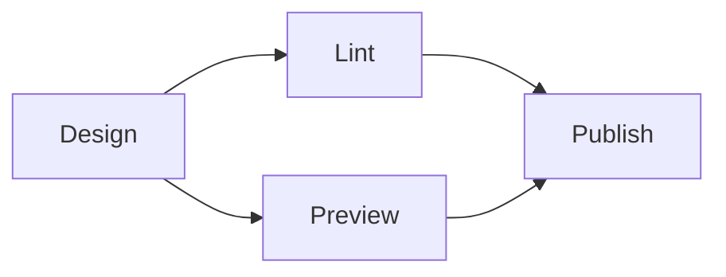
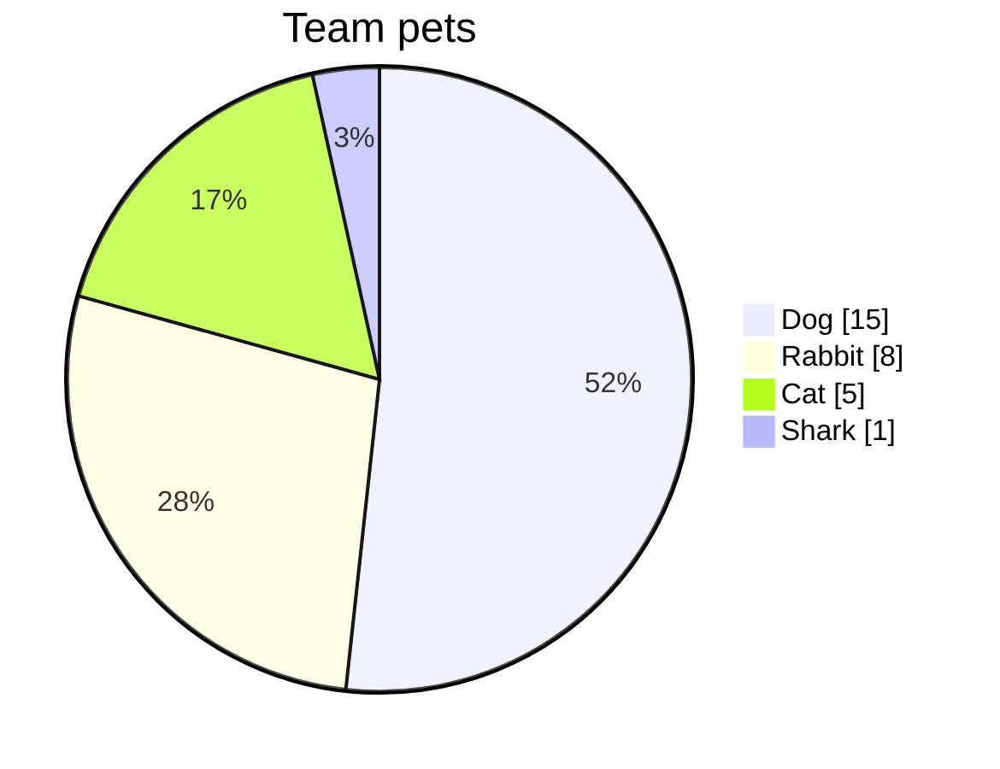

# Add diagrams using Mermaid

Redocly projects have built-in support for the [Mermaid](https://mermaid.js.org/) diagramming and charting tool.
Use Mermaid to add diagrams, charts and other visualizations to your pages.

Adding diagrams can help your users to quickly grasp the structure or concept that your content conveys.
It's good practice to use diagrams alongside explanatory text to make sure that all users can access the information.

## Add a flowchart

Create your first Mermaid diagram, a flowchart, by copying the following snippet and adding it to a page in your own project:

````text

````

The diagram that is produced looks like the following:


Use the special code markup to indicate where in the content the diagram starts and ends.

## Add a piechart

Most of the chart types are supported, for example the following snippet shows a pie chart:

````text

````

When added to your own content, the output shows up like the following diagram:


Most chart types are supported; sometimes there is a delay before adding the very newest ones, so let us know if there's something you'd like to use that hasn't been added yet.

## Resources

* Visit the [Mermaid project documentation](https://mermaid.js.org/intro/#diagram-types) to learn how to create Mermaid diagrams.
* How to [configure code snippets](./configure-code-snippets.md) in your content.
* How to [configure navigation](./configure-nav/index.md) on your site.
