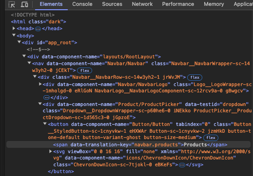

# Localize UI labels using translation keys

Redocly projects include user interface (UI) elements with text labels.
These labels can either be the default generated labels or configured labels added by users when defining elements such as the sidebars or the footer.

To localize UI labels, first you need to add keys to the user-defined UI elements, then copy them to a `translations.yaml` file and add the translations to each key.
A `translations.yaml` file contains translation keys and localized labels for a specific language.
These key-value pairs are used to translate different types of content, including the following:

- **User-defined UI elements:** Define and translate project labels by updating the `sidebars.yaml` or `redocly.yaml` files with the translation keys and including a `translations.yaml` file in each locale folder with the language specific key-value pairs.
- **Base UI component labels:** Translate base UI component labels by including a `translations.yaml` file in each locale folder with the language specific key-value pairs.
- **Content on React pages:** Define and translate content on React pages by creating the translation keys on the React page and including a `translations.yaml` file in each locale folder with the language specific key-value pairs.

Base UI component labels include predefined keys; however, you must create keys for all other types of content.

## Before you begin

Make sure you have the following:

- A Redocly project with a `l10n` folder containing your translated content organized into locales.
  See [Set up folder structure](./set-up-l10n-folder.md) and [Add translated content](./localize-content.md) for more information.

## Localize base UI components

Each label from the components that come bundled with the project has a predefined translation key assigned to it.
See [l10n translation keys](../../reference/translation-keys.md) for a list of predefined translation keys available.

To localize the base UI components:

1. If you haven't already, add a `translations.yaml` file to each of your locale folders.
1. Copy and paste the [l10n translation keys](../../reference/translation-keys.md) into each `translations.yaml` file in the locale folders.
1. Add the translated values for the translation keys.

For example, to translate the login button text to Spanish, use the following key value pair in your `translations.yaml` file in the `es-ES` subfolder:

```yaml 
userMenu.login: acceso
```

## Localize user-defined UI elements

Some UI elements in your project support customizable configurations and can contain user-defined text, such as labels and titles.
To be able to localize the text components of these elements, you must first create translation keys in their configuration files.

The user-defined UI elements that use translation keys are:
* [navbar](../../../config/navbar.md)
* [breadcrumbs](../../../config/breadcrumbs.md)
* [search bar](../../../config/search.md)
* [footer](../../../config/footer.md)
* [catalog classic](../../../config/catalog-classic.md)
* [user menu](../../../config/user-menu.md)
* [sidebars](../../reference/sidebars.md)

### Add translation keys to user-defined UI elements

Translation keys for most user-defined UI elements are included in the `redocly.yaml` configuration files.
Sidebars are an exception and have their configuration in the `sidebars.yaml` files.

To add translation keys to user-defined elements:

1. Access an element's configuration in the `redocly.yaml` or `sidebars.yaml` files.
1. To each option that accepts translation keys, add a translation key option, as in the following example.
    ```yaml 
    navbar:
      items:
        - label: Home
          page: /
        - group: Products
          groupTranslationKey:
          items:
            - page: /redocly-museum/
              label: Redocly Museum API
    footer:
      items:
        - groupTranslationKey:
          items:
            - label: Terms of Use
              labelTranslationKey: footer.legal.termsOfUse
              href: '/terms-of-use/'
    ```
    For more information on the types of keys an UI element uses, see [Configure Redocly](../../../config/index.md) and navigate to the relevant reference documentation.
1. Add unique values to reference as translation keys to the translation key options, as in the following example:
    ```yaml 
    navbar:
      items:
        - label: Home
          page: /
        - group: Products
          groupTranslationKey: navbar.products.label
          items:
            - page: /redocly-museum/
              label: Redocly Museum API
    footer:
      items:
        - groupTranslationKey: footer.legal.label
          items:
            - label: Terms of Use
              labelTranslationKey: footer.legal.termsOfUse
              href: '/terms-of-use/'
    ```

The following is an example of `redocly.yaml` file that includes the `groupTranslationKey` and `labelTranslationKey` properties alongside the `group` and `label` properties for navbar and footer links:

```yaml 
navbar:
  items:
    - label: Home
      page: /
    - group: Products
      groupTranslationKey: navbar.products.label
      items:
        - page: /redocly-museum/
          label: Redocly Museum API
footer:
  items:
    - groupTranslationKey: footer.legal.label
      items:
        - label: Terms of Use
          labelTranslationKey: footer.legal.termsOfUse
          href: '/terms-of-use/'
```

The following example is a sidebar with translation keys added to each `group`, `label`, and `separator`:

```yaml 
    - group: Getting Started
      groupTranslationKey: sidebar.gettingStarted
      items:
        - separator: My separators
          separatorTranslationKey: sidebar.gettingStarted.separator
        - group: Introduction
          groupTranslationKey: sidebar.gettingStarted.introduction
          separatorLine: true
          items:
            - page: index.md
              label: First steps
              labelTranslationKey: sidebar.gettingStarted.first-steps
    - page: overview.md
      label: Installation
      labelTranslationKey: sidebar.installation
```

### Localize user-defined UI elements

1. If you haven't already, add a `translations.yaml` file to each of your locale folders.
1. Find the options that end with `TranslationKey` in your project's `redocly.yaml` and `sidebars.yaml` files, such as the following options: `groupTranslationKey`, `labelTranslationKey` `titleTranslationKey` and `descriptionTranslationKey`, `separatorTranslationKey` and `missingCategoryNameTranslationKey`.
1. Copy the values of these options to each locale folder's `translations.yaml` file, as in the following example:
    ```yaml 
    navbar.home:
    navbar.products.label:
    navbar.products.redocly-museum:
    footer.legal.label:
    footer.legal.termsOfUse:
    ```
1. For each copied translation key value, add a translated text, as in the following example:
     ```yaml 
    navbar.home: página de inicio
    navbar.products.label: productos
    navbar.products.redocly-museum: Redocly Museo
    footer.legal.label: Legal
    footer.legal.termsOfUse: Condiciones de uso
    ```

The following example is a `translations.yaml` file for the Spanish language with the key-value pairs for the navbar, footer, and sidebar elements:

```yaml 
navbar.home: página de inicio
navbar.products.label: productos
navbar.products.redocly-museum: Redocly Museo
footer.legal.label: Legal
footer.legal.termsOfUse: Condiciones de uso
sidebar.gettingStarted: Commencer
sidebar.gettingStarted.separator: Mes séparateurs
sidebar.gettingStarted.introduction: Introduction
sidebar.gettingStarted.first-steps: Premiers pas
sidebar.installation: Installation
```

## Localize React pages

You must create translations keys in the React file before you can assign it a language specific value in the `translations.yaml` file.

To translate content in React pages, use the `useTranslate` hook by extracting it from `useThemeHooks`.
This hook returns a `translate` function which accepts the following two arguments:

- a translation key
- a default value which is used when a translation is missing

The following is an example of a React page with a translated heading 1:

```typescript
import React from 'react';

import { useThemeHooks } from '@redocly/theme/core/hooks';

export default function () {
  const { useTranslate } = useThemeHooks();  
  const { translate } = useTranslate();
  return (
    <div>
      <h1>{translate('react-page.heading', 'This is default fallback text!')}</h1>
    </div>
  );
}
```


The `react-page.heading` is an arbitrary name. You can name your translation keys however you want.


The heading on the example React page includes the same text for all languages by default, "This is default fallback text!".
To translate it to different languages, add the key `react-page.heading` to the respective `translations.yaml` files, as in the following example for a Spanish translation:

```yaml 
react-page.heading: ¡Este es un texto traducido!
```

## Change the built-in UI labels

Redocly projects come with a set of built-in UI labels in US English.
You can configure a `translations.yaml` file to override these labels, accomplishing the following goals:

* Adjust the UI text to better suit your project (for example, change "Login" to "Sign in").
* Change the language used in the UI, without adding a language picker.

To change the built-in UI labels:

1. Add a `translations.yaml` file to the root of your project.
1. Copy and paste the [l10n translation keys](../../reference/translation-keys.md) to the file.
1. Add your customized values for the translation keys.
1. Commit your changes.

The following is an example `translations.yaml` file that if included in the root of your project, changes the label of the login button to "Sign in":

```yaml
userMenu.login: Sign in
```

Alternatively, you can change the labels in the default UI components, by [ejecting the components you want to change](../../../extend/how-to/eject-components).

## Find translation keys using your browser

Your browser's developer tools can help you identify which translation keys to use.
These tools allow you to inspect HTML elements and see which translation keys are applied.

To find translation keys using browser developer tools:

1. Right-click the page element that you want to find the translation key for and click **Inspect element**.
    The browser opens developer tools with the element highlighted in the **Elements** tab.
1. In the code of the highlighted element, locate the `data-translation-key` property.
    The translation key is the value of the `data-translation-key` property.
    In some cases you might need to drill down the code nested in the selected element.
    

Now you can add the key to the `translations.yaml` file and use it to localize or customize your project.

## Resources

- Find the next steps to add localization to your project in [Configure localization](./index.md).
- Learn how to localize your content files in [Add translated content](./localize-content.md).
