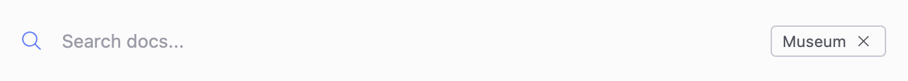

# Add multiple products

You can include multiple products in your project that users can switch between using a product picker in the navbar.
A product can be any set of content you want to separate from other documentation.
An example would be a set of related API description files, help content for a piece of software, or even a chapter of a book.

Each product has its own file and subfolder structure, although it can have links and references to other files.
You can customize each product, including custom navbars and footers.

When you select a product with the product picker and use the **Search** interface, search results are filtered by product by default.
This limits the results to files within the product structure.

You can remove this filter by clicking **x**.
This enables you to search all content within your project.

To configure multiple products, complete the following tasks:
<!-- no toc -->
1. [Create product folders](#create-product-folders)
2. [Configure multiple products in redocly.yaml](#configure-multiple-products)
3. [Customize products](#customize-products)

## Before you begin

Make sure you have the following before you begin:

-  a `redocly.yaml` configuration file

## Create product folders

Configure multiple products by adding product folders with content:

1. Create a separate folder for each product. \
   A product cannot be located in the subfolder of another product.
2. Place your content in its respective folders. \
   This includes text files and API description files.

For example, the following directory structure can represent a project with two products, `acme` and `museum`, as well as documentation not related to these two products.
Each product folder contains documentation files and an optional `redocly.yaml` file that you can use to [override the `redocly.yaml`](#customize-products) file at the root directory.

Note that image files for product logos are in an `images` folder inside the root directory.
However, you can place image files inside product folders, or other suitable locations.

```treeview
your-awesome-project/
├── images/
│   ├── acme-logo.png
│   └── museum-logo.svg
├── products/
│   ├── acme/
│   │   ├── acme-openapi.yaml
│   │   ├── index.md
│   │   ├── box.png
│   │   └── redocly.yaml
│   └── museum/
│       ├── images/
│       │   ├── bronze-ticket.png 
│       │   ├── golden-ticket.png
│       │   └── silver-ticket.png
│       ├── redocly-museum.yaml
│       ├── index.md
│       └── redocly.yaml
├── tutorials/
│   ├── getting-started.md
│   └── index.md
├── index.md
└── redocly.yaml
```

## Configure multiple products

After organizing your documentation into product folders, configure products in your `redocly.yaml` file.

To configure products:

1. In the root directory's `redocly.yaml` file, add a `products` object.
    ```yaml
    products:
    ```
2. Inside `products`, define an object for each of your products.\
    You can name the objects after your products for ease of use.
    ```yaml
    products:
      acme:
      redocly-museum:
    ```
    Products appear in the product picker in the order you set in the main `redocly.yaml` file.
3. Inside each object representing your product, add the following:
  
    - `name`: the name of your product in the product picker.
      ```yaml
      products:
        acme:
          name: Acme Inc.
        redocly-museum:
          name: Museum
      ```
    - `folder`: the path to your product's folder.
      ```yaml
      products:
        acme:
          name: Acme Inc.
          folder: products/acme/
        redocly-museum:
          name: Museum
          folder: products/redocly-museum/
      ```
    - (Optional) You can add an `icon` object with a path to a `.png` or `.svg` file. This image displays alongside the product name in the product picker.
      ```yaml
      products:
        acme:
          name: Acme Inc.
          folder: products/acme/
          icon: images/acme-logo.png
        redocly-museum:
          name: Museum
          folder: products/redocly-museum/
          icon: images/redocly-logo.svg
      ```
  
    For details on configuration options, see [products](../../config/products.md).

After you complete the configuration, Redocly adds a product picker to the navbar of the project

## Customize products

You can configure the contents and behavior of some UI elements separately for each product.
You can customize the UI elements by overriding options that are defined in your project's `redocly.yaml` file.

To override `redocly.yaml`:

1. In each product folder you want to customize, create a `redocly.yaml` file.
2. In this file, add the configuration for your product. \
    You can override the following options:

    - [`breadcrumbs`](../../config/breadcrumbs.md)
    - [`codeSnippet`](../../config/code-snippet.md)
    - [`feedback`](../../config/feedback.md)
    - [`footer`](../../config/footer.md)
    - [`logo`](../../config/logo.md)
    - [`navbar`](../../config/navbar.md)
    - [`sidebar`](../../config/sidebar.md)
    - [`search`](../../config/search.md)
  
    
    All paths that you enter in `redocly.yaml` in the product folder are resolved relative to that file.
    

This is an example of a `redocly.yaml` file in the product folder which changes the navbar for the `acme` product:

```yaml 
navbar:
  items:
    - page: index.md
      label: Museum Home
    - page: redocly-museum.yaml
      label: Museum API
```

This is an example of a `redocly.yaml` file in the product folder which replaces the feedback feature for the `acme` product:

```yaml 
feedback:
  type: rating
  settings:
    label: How many stars for this page?
    submitText: Thank you for your stars!
```

### Per product Google Analytics

You can set up a different Google Analytics tracking ID for each product by adding or modifying the `redocly.yaml` files in the product folders.
Unlike other options, these configurations do **not** override the global analytics configuration, but additionally send page view events to the product-specific tracking ID.

The following is an example configuration of a different Google Analytics tracking ID in the `redocly.yaml` file in the product directory:

```yaml 
analytics:
  ga:
    trackingId: GA-XXXXXXXX
```

For a full list of Google Analytics options available in the product's `redocly.yaml` see the [Google Analytics configuration reference](../../config/analytics/google.md).

## Resources

- Reference the options for configuring multiple products in your project in the [products](../../config/products.md) reference documentation.
- Learn how to set up the navbar in the [Configure navigation on the navbar](../how-to/configure-nav/navbar.md) how-to documentation.

