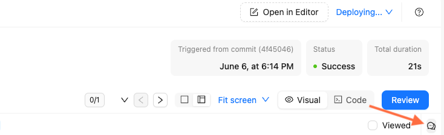
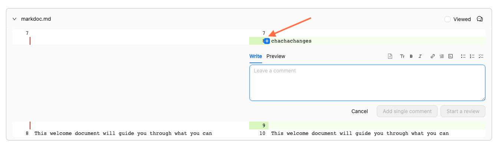

# Review a pull request in Reunite

Select a pull request from the list on the **Pull requests** page and click the **Review** tab to begin your review.

## Before you begin

Ensure you have:

- A [project](../../setup/concepts/projects.md) in Reunite
- The [owner or member role](../../setup/concepts/roles.md#organization-roles) in your project's organization
  
You cannot review a pull request if you authored it.

## Review visual and code diff

The **Review** tab opens with the **Visual** view by default, showing rendered pages before and after updates for visual comparison.

Click **Code** on the toggle to view the Markdown diff instead.
For multi-page updates, select different pages from the sidebar navigation to review each one.

Mark pages as reviewed by clicking the **Viewed** checkbox, or click **Review all** to mark all pages.

Use the file tree filter on the left to find specific pages.

## Add comments to reviews

Add feedback as comments in either visual or code diff views.

To add comments in the visual or code diff view:

1. Click the comments icon on the right side.

    

2. Enter your feedback.
3. Click **Comment**.

To add line-specific comments in code diff view:

1. Hover over the line numbers.
2. Click the plus icon.

    

3. Enter your feedback.
4. Select one option:
   - **Add a single comment**: For a standalone comment.
   - **Start a review**: For multiple comments in a complete review.

Use the text field toolbar to format text, add links, or insert images.
Mention people or teams with the `@` symbol followed by their name.

## Approve or request changes

After reviewing the pull request, click the **Review** button, add your final thoughts, and select one option:

- **Comment:** Provide feedback without explicit approval or rejection.
- **Approve:** Indicate the pull request is ready to merge.
- **Request changes:** Specify issues that require resolution before approval.

Format your review comment using the toolbar options, then click **Submit review**.

## Merge a pull request

After a **Ready for review** pull request receives approval and passes checks, click **Merge**.


Check **Merge without requirements** only for urgent changes when you're certain they won't cause build issues.


After merging, the updates appear in the main branch and trigger a deployment to publish changes to the production project.

## Related how-tos

- Learn how to [use the editor](./use-editor.md) to create content in Markdown and Markdoc.
- See [Switch between projects](./switch-between-projects.md) if you work with multiple projects.

## Resources

- Learn about [Reunite](../concepts/reunite.md), Redocly's cloud platform.
- Configure [reunite](../../config/reunite.md) to allow publishing builds with broken links or broken Markdoc syntax.
