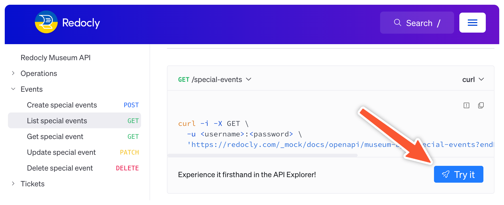
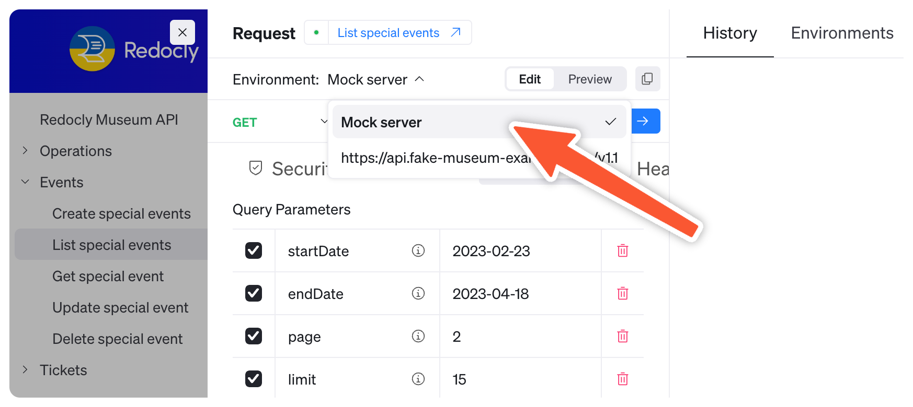
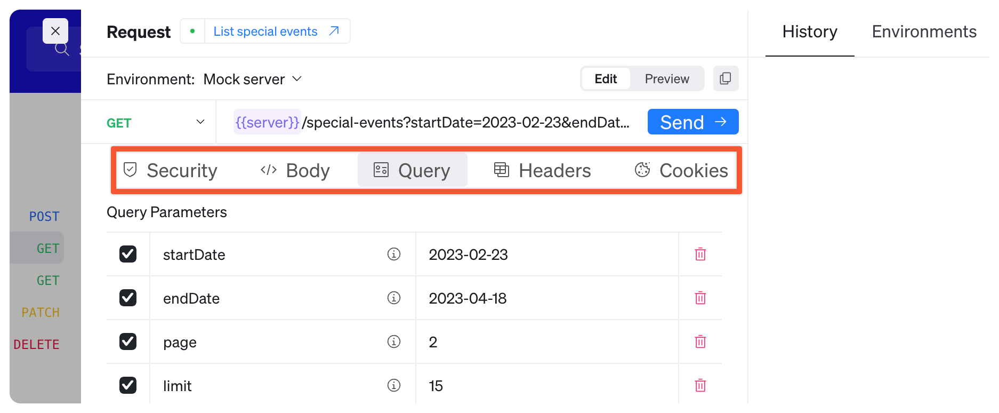
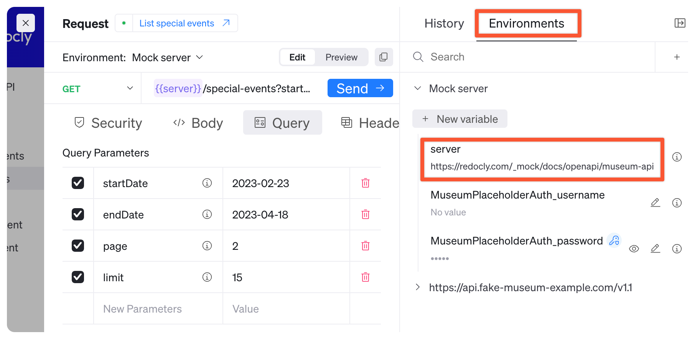

# Try APIs with Mock Server

You have access to a built-in mock server anywhere that Redocly Replay is running, including your local preview. The mock server allows you to try APIs without the need for live data or backend services.

This guide shows you how to use the mock server _as an API consumer_ and send API requests to the mock server using Replay or cURL.

## Before you begin

Make sure you have the following before you begin:

- Access to API reference docs with Redocly's mock server enabled

## Use Replay to call mock server

To send an API call to the mock server using Replay:

1. Open Replay by clicking the **Try it** button.

    

2. Click the **Environment** dropdown and select **Mock server**.

    

3. (Optional) Make changes to the API request using the different tabs.
Some operations may automatically fill example data, like [List special events](https://redocly.com/demo/openapi/museum-api/events/listspecialevents) does in the following screenshot:

    

4. Click **Send** to send the API request to the mock server.
Review the response payload in the **Response** panel at the bottom.

    


## Use cURL to call mock server

To send an API request to the mock server using cURL:

1. Go to the API reference page for the operation you want to call.

2. Copy the cURL command from the code samples and verify the request is being sent to the mock server.

    - If you need the mock server url, open Replay and check the **Environments** tab.

        

3. Update the values in the cURL command as needed.

        ```curl 
        curl -i -X PATCH \
            -u : \
            'https://redocly.com/_mock/docs/openapi/museum-api/special-events/dad4bce8-f5cb-4078-a211-995864315e39' \
            -H 'Content-Type: application/json' \
            -d '{
                "location": "Under the sea."
            }'
        ```

4. Use the cURL command in a CLI (command line interface) tool to send the API request to the mock server.

5. Observe the resulting output, which contains the response from the mock server.

```bash 
HTTP/2 200
access-control-allow-credentials: true
access-control-allow-headers: *
access-control-allow-methods: *
access-control-allow-origin: *
alt-svc: h3=":443"; ma=2592000
content-type: application/json
date: Thu, 11 Jul 2024 17:24:24 GMT
server: Caddy
strict-transport-security: max-age=31536000;
x-content-type-options: nosniff
x-frame-options: deny
x-xss-protection: 1;mode=block;

{"eventId":"dad4bce8-f5cb-4078-a211-995864315e39","name":"Mermaid Treasure Identification and Analysis","location":"Under the sea.","eventDescription":"Join us as we review and classify a rare collection of 20 thingamabobs, gadgets, gizmos, whoosits, and whatsits, kindly donated by Ariel.","dates":["2023-09-05","2023-09-08"],"price":15}%
```

## Return a specific response example

Force the mock server to respond with a specific example from the API description using the `x-redocly-response-body-example` header to pass the example's name.

The following example forces a response for a `general_entry` ticket from the Museum API's mock server:

        ```curl
        curl -i -X POST \
            -u : \
            https://redocly.com/_mock/docs/openapi/museum-api/tickets \
            -H 'x-redocly-response-body-example: general_entry' \
            -H 'Content-Type: application/json' \
            -d '{
                "ticketType": "event",
                "eventId": "dad4bce8-f5cb-4078-a211-995864315e39",
                "ticketDate": "2023-09-05",
                "email": "dave@example.com"
            }'
        ```


The following example forces a response for an `event_entry` ticket from the Museum API's mock server:

        ```curl
        curl -i -X POST \
            -u : \
            https://redocly.com/_mock/docs/openapi/museum-api/tickets \
            -H 'x-redocly-response-body-example: event_entry' \
            -H 'Content-Type: application/json' \
            -d '{
                "ticketType": "general",
                "ticketDate": "2023-09-07",
                "email": "dave@example.com"
            }'
        ```

If no match is found for the named example passed in the header, the mock server will do one of the following (depending on its [configuration](../../config/mock-server.md#options)):

    - Throw an error
    - Return another example for that operation

## Resources

- Modify the behavior of the mock server: [Configure mock server](./configure-mock-server.md).
- Generate your own reference documentation by [Adding OpenAPI reference docs](./add-openapi-docs.md).
- Learn the mock server settings in the [Mock server config reference](../../config/mock-server.md).
- Control API reference docs using [OpenAPI config reference](../../config/openapi/index.md).
