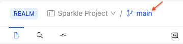
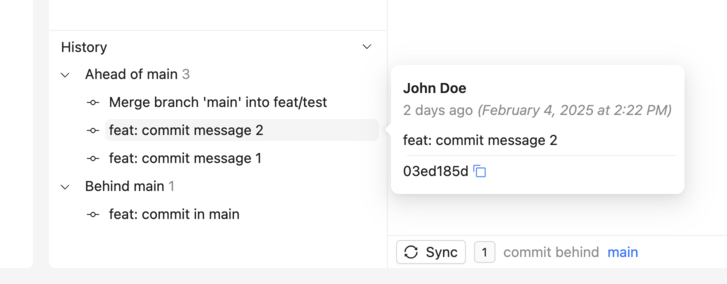
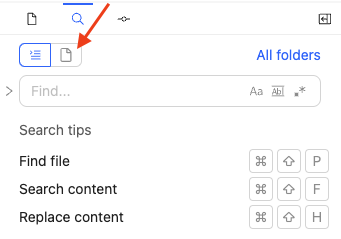
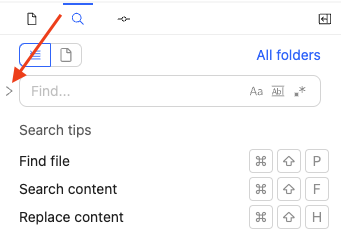
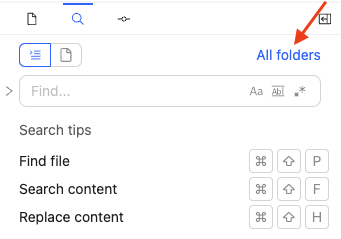
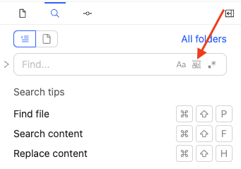
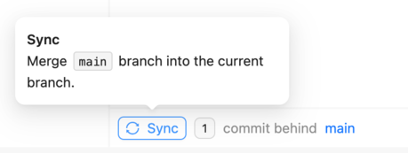

# Use the editor

Redocly offers an online editor in Reunite where you can add, edit, or delete files and folders in your project.
Since Redocly projects are saved using Git, any updates are saved by committing changes, and opening, reviewing, and merging pull requests.

## Before you begin

Make sure you have the following before you begin:

- A project created in your organization in Reunite.

## Create a new branch



### Switch branches

If you need to change to a different branch from the branch you are working in, you can change the branch using the branch switcher at the top of the editor page.

To switch branches, click the branch switcher and select the branch.
If you don't see the branch, use the search field to find it.

## Add files

After you have created a new branch, you can add or delete files or folders in the editor.

- To add files or folders, click the **+** icon and select **New file** or **New folder**.
  - You can also drag and drop files from your computer into the file tree pane.
  - Create a directory structure for a file when creating the file by typing the folder name followed by a `/` and then the file name.
- To delete files or folders, right-click the file or folder and select **Delete**.
- To copy files or folders, right-click the file or folder and select **Copy**.
- To rename files or folders, right-click the file or folder and select **Rename**.

## Edit files

The editor includes an editor pane where you can edit the content in your files.
To edit content, select the file in the file tree pane and make your edits in the editor pane.
Your updates display in the Webview live preview pane.
You can also use the toolbar at the top of the editor pane to add the following Markdown syntax automatically:

- Headings
- Bold text
- Italics text
- Links
- Blockquote text
- Code blocks
- Ordered lists
- Unordered lists
- Checkbox lists


Another way you can add images and links is to drag the files from the file tree to the editor pane and drop them.


The toolbar also includes the following options to add Markdoc tag syntax automatically:

- If
- Else
- Table
- Partial
- Admonition
- Code snippet

See the [Markdoc tag library](https://redocly.com/docs/learn-markdoc/tags/tag-library/) for more information on both the built-in and custom Redocly tags.

### Add images to Markdown files

You can add images to to Markdown files in the following ways:

- Drag an image file from the file tree and drop it into an open Markdown file.
- Drag an image file directly from your computer and drop it into an open Markdown file. \
  The image is automatically saved to the closest `images` folder if one exists. If there isn't an `images` folder in the same location as the Markdown file, one is created.
- Manually type the image link in the file.

## Commit updates

Once you are finished making your updates, you must commit them to your branch.

To commit your updates:



After you have made the first commit to a branch, you can [open a draft pull request](../how-to/open-pull-request.md#open-a-draft-pull-request).

## View commit history

The commit history panel displays all changes made to your branch and helps you stay in sync with the production branch.

### Open the commit history for a preview branch

1. In the editor, click the **Commit** tab and then click **History** at the bottom of the **Commit** panel.
   The panel displays two sections:
   - **Ahead of main**: Displays new commits on your current preview branch.
     You can also create a new pull request or view the pull request for your branch.
   - **Behind main**: Displays commits from the production branch that aren't in your current preview branch.
     You can also sync your preview branch with the production branch by clicking the **Sync with main** button.

Commit history is only available for preview branches.

### View commit details

Hover over any commit to see details including:

- Author
- When the commit was made
- Commit message
- Commit hash

## Revert changes

If you want to discard the changes you made, before you commit them to the branch, you can revert the changes to put the files back into the state from the last commit.
You can revert changes to all files since the last commit, or select the files to revert.

To revert changes:

1. Above the file tree, click the **Commit** icon to access the Commit tab.
2. Select the checkboxes of files you want to revert, or select **All changes**.
3. Click the **Revert** icon and confirm the action.

## Search in files

You can search in the editor to find content or files or to find and replace content within the files of your project.
To set search to files instead of content inside of files, click the Find a file icon above the search input field.

By default, search does not include a replace option.
You can add the replace option by selecting the replace toggle.

Selecting the replace toggle again removes the option.

By default, searches include all folders, but you can specify a folder using the folder selector.

You can also specify whether search should match the case and whole word of your search query, and use regular expressions in your search query by clicking the icons in the search field.

## Sync with main

If you are working on a development branch, you may need to sync your branch with the main branch if changes have been added to main while you were working in the development branch.

You can sync your branch, pulling in the changes from main since you created your development branch, by clicking the **Sync** button at the bottom of the editor pane.

## Related how-tos

- Learn more about how you can access the deployment preview in [Use previews](./use-previews.md).
- See [Use Webview](./use-webview.md) to learn more about adjusting the live preview of your updates as you are editing your content in the editor.
- To include files in a remote location in your project, see [Add remote files](../../setup/how-to/remote-content/index.md).

## Resources

- Checkout the [Markdoc tag library](https://redocly.com/docs/learn-markdoc/tags/tag-library/) for more information on using Markdoc tags in your project.
- See [Project structure](../concepts/project-structure.md) to learn more about how to structure a project.
