# Use the Webview

The Webview pane in the Editor displays a preview for each branch.
Any time you make a change in the Editor, the change is reflected in the Webview.
You can disable auto-sync, view different screen sizes, reload the page or restart, navigate the pages, and close the Webview to expand the Editor.

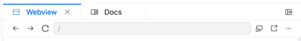

  
    There is a difference between the **Webview** and the **[preview deployment](./use-previews.md)**. The Webview displays uncommited changes while the preview deployment triggers when you make a commit to a branch with an open pull request.
  

## Before you begin

Make sure you have the following before you begin:

- At least a member role in your organization in Reunite.
- If you have RBAC configured, you need to log in to the interface.
  You do not need to use actual credentials.

## View different screen sizes

If you want to see how a page renders on different screen sizes, click the **Toggle device view** icon.

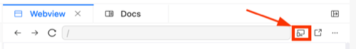

You can select from the following preset sizes:
- Mobile (320x675)
- Tablet (1024x765)
- Desktop (1400x800)
- Desktop HD (1920x1080)

You can also enter specific length and width pixel sizes and click and drag the sides of the Webview to expand or contract the sides.

To see a full screen version in a new tab, click the **Open in a new window** icon.

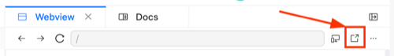

## More actions

Click the **More actions** icon to either do a full restart or disable auto-sync.

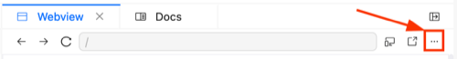

### Full restart

To completely restart the server, click the **More actions** icon and select **Full Restart**.

When you update the `package.json` file in the Editor, the Webview re-installs dependencies and restarts automatically.

### Disable auto-sync

When you disable auto-sync, the Webview does not update based on the page you are on in the Editor.
To disable auto-sync, you can click the **More actions** icon and select **Disable auto-sync**.

To turn auto-sync back on, click the **More actions** icon and select **Enable auto-sync**.

## Reload

To reload the page you are on in the Editor, click the **Reload** icon.

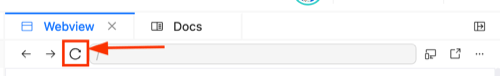

## Navigate pages

You can use the back and forward arrow icons to navigate pages in the Editor.

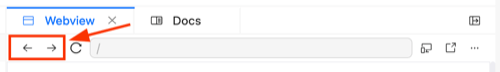

The back and forward arrow icons consider page view history, which starts over when the Webview is reloaded or restarted.

## Close or open

You can close the Webview by clicking the panel toggle, which changes direction after you click it.

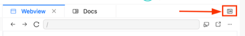

To open it, click the toggle again.

## Access build logs in the Webview tab

You can monitor and manage Webview logs using the **Logs** panel at the bottom of the screen.
Logs automatically appear when changes are made to the project or when the Webview generates new output.
The **Logs** panel automatically scrolls to show the most recent logs.
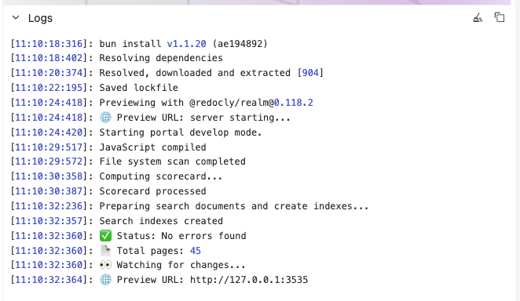

In the **Logs** panel you can:

- Expand and collapse the panel
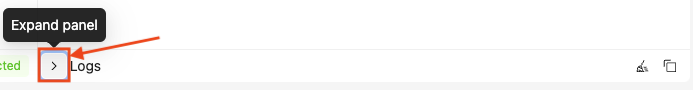

- **Clear logs**: remove all current logs
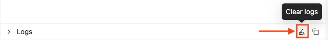

- **Copy logs**: copy all logs to clipboard
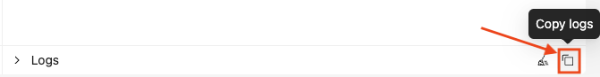

## Related how-tos

* [Use the editor](./use-editor.md)
* [Use previews](./use-previews.md)