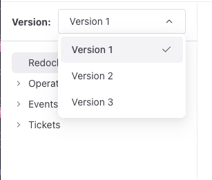

# Add versioned content

You can set up your project to maintain multiple concurrent versions of documents or API description files.
It is possible to apply versioning to single files or sets of files in the same location.
You can do this by creating version subfolders for each version of content you want to include.

When you access content inside a version subfolder, a version picker is displayed at the top of the sidebar.
The version picker enables users to select which version of content to display.
The sidebar reflects the changes in files and filenames when you switch between versions.



You can use this feature to: keep past versions of API descriptions for backwards compatibility, document experimental versions of software, or maintain release notes separate for each version.

To configure your project to include multiple versions, complete the following tasks:

1. Create version subfolders
1. (Optional) Customize the sidebar containing versioned content
1. (Optional) Customize the version picker

## Before you begin

Make sure you have the following before you begin:

- a `redocly.yaml` configuration file
- versioned content

## Create version subfolders

To include versioned content with a version picker, you must organize your content into version subfolders.

To organize your content into version subfolders:

1. Create a main content folder.
1. Create subfolders for the different versions within the main content folder. \
   Version subfolder names must start with the "@" symbol, but otherwise can be any string, with or without numbers.
   For example, `@latest`, `@1.0.0`, `@rc1` are all valid. \
   You can add as many version subfolders as you need, but nesting them is **not** supported.
1. Place the files for the different versions in their specified folders.

After building your project, when you access versioned content, the sidebar displays the version picker, enabling you to switch between content versions.

### Examples of versioned content structures

The following example includes versions `1.0`, `2.0`, and `3.0` of the `museum_api`, and the `legacy` and `latest` versions of the `customer_api`:

```treeview 
├── museum_api/
│   ├── @1.0/
│   │   ├── index.md
│   │   ├── museum.yaml
│   │   └── overview.md
│   ├── @2.0/
│   │   ├── index.md
│   │   └── museum.yaml
│   └── @3.0/
│       ├── images/
│       │   └── diagram.png
│       ├── index.md
│       ├── readme.md
│       └── museum.yaml
├── customer_api/
│   ├── @latest/
│   │   ├── index.md
│   │   └── payments.yaml
│   ├── @legacy/
│   │   ├── index.md
│   │   ├── payments.yaml
│   │   └── readme.md
│   └── versions.yaml
├── index.md
└── sidebars.yaml
```

The `museum_api` versions will appear in the version picker in the same order as the version subfolders in the file tree: `1.0`, then `2.0`, and finally `3.0`.
The version opened by default will be the the last version, in this case: `3.0`.

Since in `customer_api` the `legacy` version appears second, it would also be the default version.
To make the `latest` version appear at the bottom of the list and be the default version, a `versions.yaml` file with the [desired configuration](#customize-the-version-picker) was added to the `customer_api` folder.

Another example shows the `public beta` version of `payments_api`:

```treeview 
├── payments_api/
│   └── @public_beta/
│       ├── index.md
│       └── payments.yaml
├── index.md
└── sidebars.yaml
```

In this case `payments_api` contains only one version subfolder.
This configuration is enough to enable the version picker that displays one available version: `public_beta`.
You can use a similar structure to prepare your project for upcoming versions of content.

## Customize the sidebar containing versioned content

After creating the structure for your versioned content, you can create a custom sidebar configuration for this structure.
Depending on your preferences and the contents of your project, you can place `sidebars.yaml` in the root directory of your project, or in the same folder as versioned content folders.
For example, if you have more than one collection of versioned content, you might want to create a separate sidebar for each collection.

For more information about customizing sidebars, see: [Configure navigation on the sidebar](./configure-nav/sidebar.md).

When you switch between versions, the sidebar updates according to the content of version subfolders, including sidebar item labels and the number of files in a version subfolder.

### Customize a sidebar for versioned content using the `directory` option

If you want to create a sidebar for versioned folders without further customizations, you can add the entire parent folder of versioned content to a `sidebars.yaml` file.
Using this method, any files you add or modify later, automatically update sidebar links when you build the project.
The `directory` option sorts the links in the natural order.

To customize a sidebar using the `directory` option:

1. Add a `directory` option for each folder containing versioned content in your `sidebars.yaml` file, as in the following example:
    ```yaml 
    - page: index.md
      label: Main page
    - directory:
    - directory: 
    ```
1. As the values for the `directory` keys, add paths to the folders containing versioned content, as in the following example:
   ```yaml 
    - page: index.md
      label: Main page
    - directory: /museum_api
    - directory: /customer_api
    ```

This configuration modifies the sidebar to include links to all content files in the `museum_api` folder followed by files in `customer_api`. The titles or the first headings of the files are used for the sidebar labels.

### Add a single sidebar for all version folders

If you want to control the sidebar with a single file that determines the order of the links and the labels, create a `sidebars.yaml` file in the folder containing your version subfolders and add links to the individual files inside the version subfolders.

To add a single sidebar for all version folders:

1. In your project create a `sidebars.yaml` file in a folder a that contains your versioned content, as in the following example:
    ```treeview  
    ├── my-awesome-docs/
    │   ├── museum_api/
    │   │   ├── @1.0/
    │   │   ├── @2.0/
    │   │   └── @3.0/
    │   └── customer_api/
    │        ├── @latest/
    │        └── @legacy/
    └── sidebars.yaml
    ```
1. Add a `page` option with the value of a file path for each content file in each version subfolder in your `sidebars.yaml` file, as in the following example:
    ```yaml 
    - page: index.md
      label: Main page
    - page: /museum_api/@1.0/index.md
    - page: /museum_api/@1.0/museum.yaml
    - page: /museum_api/@1.0/overview.md
    - page: /museum_api/@2.0/index.md
    - page: /museum_api/@2.0/museum.yaml
    - page: /museum_api/@3.0/index.md
    - page: /museum_api/@3.0/museum.yaml
    - page: /museum_api/@3.0/readme.md
    - page: /customer_api/@legacy/index.md
    - page: /customer_api/@legacy/payments.yaml
    - page: /customer_api/@legacy/readme.md
    - page: /customer_api/@latest/index.md
    - page: /customer_api/@latest/payments.yaml 
    ```
1. (Optional) You can arrange the `page` options into groups so that each group appears under a single label.
    ```yaml 
    - page: index.md
      label: Main page
    - group: Museum API
      items:
        - page: /museum_api/@1.0/index.md
        - page: /museum_api/@1.0/museum.yaml
        - page: /museum_api/@1.0/overview.md
        - page: /museum_api/@2.0/index.md
        - page: /museum_api/@2.0/museum.yaml
        - page: /museum_api/@3.0/index.md
        - page: /museum_api/@3.0/museum.yaml
        - page: /museum_api/@3.0/readme.md
    - group: Customer API
      items:
        - page: /customer_api/@legacy/index.md
        - page: /customer_api/@legacy/payments.yaml
        - page: /customer_api/@legacy/readme.md
        - page: /customer_api/@latest/index.md
        - page: /customer_api/@latest/payments.yaml 
    ```

This configuration modifies the sidebar by adding two groups, Museum API and Customer API. Within each group are multiple versions of files.
When you first access your project, the sidebar displays only the links to files from the versions: `3.0` and `legacy` respectively.
These versions are the default versions, as they are the lowest on the alphanumeric ascending order. To set custom default versions, see [Customize the version picker](#customize-the-version-picker).

### Add a dedicated sidebar for each version folder

To prevent the sidebar at the root of your project from becoming overly long, you can maintain separate `sidebars.yaml` files for your versioned content in their respective folders.
This approach can be especially useful when your content has a large number of versions.

To add a dedicated `sidebars.yaml` for each version folder:

1. Add a `sidebars.yaml` file to each folder containing versioned content in your project, as in the following example:
    ```treeview 
    ├── museum_api/
    │   ├── @1.0/
    │   │   ├── index.md
    │   │   ├── museum.yaml
    │   │   └── overview.md
    │   ├── @2.0/
    │   │   ├── index.md
    │   │   └── museum.yaml
    │   ├── @3.0/
    │   │   ├── images/
    │   │   │   └── diagram.png
    │   │   ├── index.md
    │   │   ├── readme.md
    │   │   └── museum.yaml
    │   └── museum.sidebars.yaml
    ├── customer_api/
    │   ├── @latest/
    │   │   ├── index.md
    │   │   └── payments.yaml
    │   ├── @legacy/
    │   │   ├── index.md
    │   │   ├── payments.yaml
    │   │   └── readme.md
    │   ├── versions.yaml
    │   └── customer.sidebars.yaml
    ├── index.md
    └── sidebars.yaml
    ```
1. Add a `page` option with a value of the file path for each content file in each version subfolder in each `sidebars.yaml` file, as in the following example:
    ```yaml 
    - page: /@1.0/index.md
      label: Museum API
    - page: /@1.0/museum.yaml
    - page: /@1.0/overview.md
    - page: /@2.0/index.md
      label: Museum API
    - page: /@2.0/museum.yaml
    - page: /@3.0/index.md
      label: Museum API
    - page: /@3.0/museum.yaml
    - page: /@3.0/readme.md
    ```
1. In the `sidebars.yaml` file at the root of your project, add references to the sidebar files for versioned content, as in the following example:
    ```yaml 
    - page: index.md
      label: Main page
    - $ref: /museum_api/sidebars.yaml
    - $ref: /customer_api/sidebars.yaml 
    ```
In the built project, the sidebar combines the referenced `sidebars.yaml` files and displays links to the default version of the content.

## Customize the version picker

By default, the order of versions in the version picker is the same as the folder structure in the project, in the alphanumeric ascending order.
The version that opens when you navigate to versioned file, is by default the version last in the order. \
You can customize which versions appear in the version picker, the order of the versions, and the version that opens by default.

For more information on version picker configuration, see the [Versions configuration options](../reference/versions-config.md) reference documentation.

To specify the default version as well as choose which versions to display:

1. Create a `versions.yaml` file on the same level as your version subfolders.
1. In the file, set the default version to display by adding a `default` object with the default version subfolder's name, without the `@` sign, as the value, as in the following example:
    ```yaml 
    default: latest
    ```
1. Add a `versions` object, and inside it a map of `version` objects with version subfolder names as values, excluding the `@`, as in the following example:
    ```yaml 
    default: latest
    versions:
      - version: legacy
      - version: latest
    ```
1. (Optional) Provide a `name` option for each `version`, as in the following example:
   ```yaml 
    default: latest
    versions:
      - version: legacy
        name: Legacy version
      - version: latest
        name: Latest version
    ```
    If you do not provide a name for a version, the versioned folder's name is used instead.
As an example, let's assume this file structure:

```treeview 
my_awesome_docs/
└── customer_api/
    ├── @latest/
    │   ├── index.md
    │   └── museum.yaml
    ├── @legacy/
    |   ├── index.md
    |   ├── museum.yaml
    |   └── readme.md
    ├── @demo/
    │   ├── index.md
    │   └── museum.yaml
    └── versions.yaml
```

For this structure, we created a `versions.yaml` file with two versions: `legacy` and `latest`, specifying `latest` as the default.
The `demo` version was purposefully not included.

```yaml 
default: latest
versions:
  - version: legacy
    name: Legacy version
  - version: latest
    name: Latest version
```

## Add version picker to all content

You can configure your project to display the version picker on all pages, even those that do not have defined versions.

To display the version picker for all content use the following configuration in your `redocly.yaml` file:

```yaml 
versionPicker:
  showForUnversioned: true
```

For pages that do not have multiple version, the version picker is inactive and displays **All versions**.

## Resources

- Reference the options for configuring which [versions](../reference/versions-config.md) appear in the version picker, in what order, and which version is the default.
- Learn how to set up the sidebar in the [Configure navigation on the sidebar](./configure-nav/sidebar.md) how-to documentation.