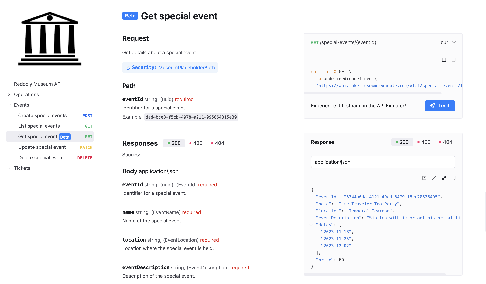

# OpenAPI extension: `x-badges`

The `x-badges` option allows you to add badges to an operation, to use as an indicator in documentation.
The badges are displayed in API reference documentation in the following locations:
- the title of an operation in the header of the page
- the operation item when it displays in a navigation list

Each operation can have multiple badges, and the displayed color is also configurable.

## Location

Add an array of `x-badges` to any Operation object.

## Options



* Option
* Type
* Description

---

* x-badges
* [ [Badge Object](#badge-object) ]
* A list of badges.



### Badge Object



* Option
* Type
* Description

---

* name
* string
*  **REQUIRED**. The text that displays in the badge.

---

* position
* string
* The position of the badge in relation to the header. Possible values: `before`, `after`. The default value is `after`.

---

* color
* string
* The color of the badge. It can be defined in various formats such as color keywords, RGB, RGBA, HSL, HSLA, and Hexadecimal. The default value is `#1f7cff`.



## Examples

The following example sets a `Beta` badge on the `Get special event` operation:

```yaml 
openapi: 3.1.0
...
paths:
  /special-events/{eventId}:
    get:
      summary: Get special event
      description: Get details about a special event.
      operationId: getSpecialEvent
      tags:
        - Events
      parameters:
        - $ref: '#/components/parameters/EventId'
      x-badges:
        - name: 'Beta'
          position: before
      responses:
        '200':
          description: Success.
          content:
            application/json:
              schema:
                $ref: '#/components/schemas/SpecialEventResponse'
              examples:
                default_example:
                  $ref: '#/components/examples/GetSpecialEventResponseExample'
```



## Resources

- Control which extensions are included in your API reference documentation with the [showExtensions configuration setting](../../../config/openapi/show-extensions.md).
- See all [openapi configuration settings](../../../config/openapi/index.md).
- See a full [list of supported OpenAPI extensions](./index.md).

