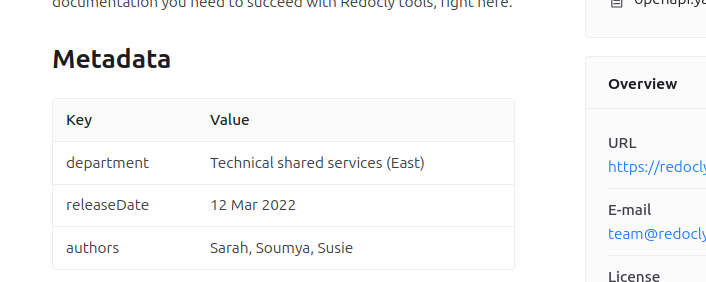

# OpenAPI extension: `x-metadata`

Use `x-metadata` to add a table of additional data to the top of your API reference documentation.
You can add any keys or values that you want users to easily find at the top level of the documentation.





The data is formatted as a table and added as part of the description section at the top of the page.

## Location

The `x-metadata` extension can be added to Info Object.

## Options



* Option
* Type
* Description

---

* x-metadata
* Object
* Custom metadata in key/value format.



## Examples

Metadata keys can be any string.
The values can be any primitive type, or a list of strings.

The following example shows an `x-metadata` section of an OpenAPI description:

```yaml
info:
  x-metadata:
    department: Technical shared services (East)
    releaseDate: '12 Mar 2022'
    authors:
      - Sarah
      - Soumya
      - Susie
```

The data is presented as shown in the following screenshot:



## Resources

- When an API description contains metadata, but you don't want it included in the API reference documentation, use the [hideInfoMetadata configuration option](../../../config/openapi/hide-info-metadata.md) to hide it.
- Control which extensions are included in your API reference documentation with the [showExtensions configuration setting](../../../config/openapi/show-extensions.md).
- See all [openapi configuration settings](../../../config/openapi/index.md).
- See a full [list of supported OpenAPI extensions](./index.md).

