# Replay the API explorer reference

Replay the API explorer allows your users to make API calls directly from the API reference documentation in your project.
It uses the API description document and `mockServer` configuration in your `redocly.yaml` file to create an interactive interface for your API users.

Access Replay in your reference documentation by clicking the **Try it** button for a request.

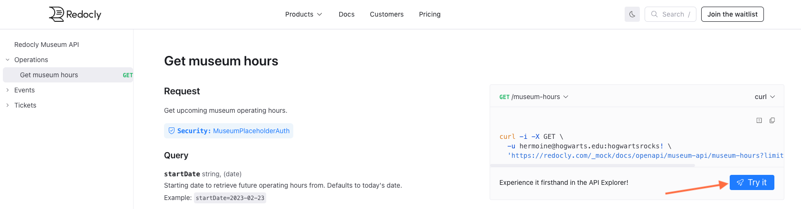

When the Replay interface opens, it overlays the API reference documentation page you were on originally.

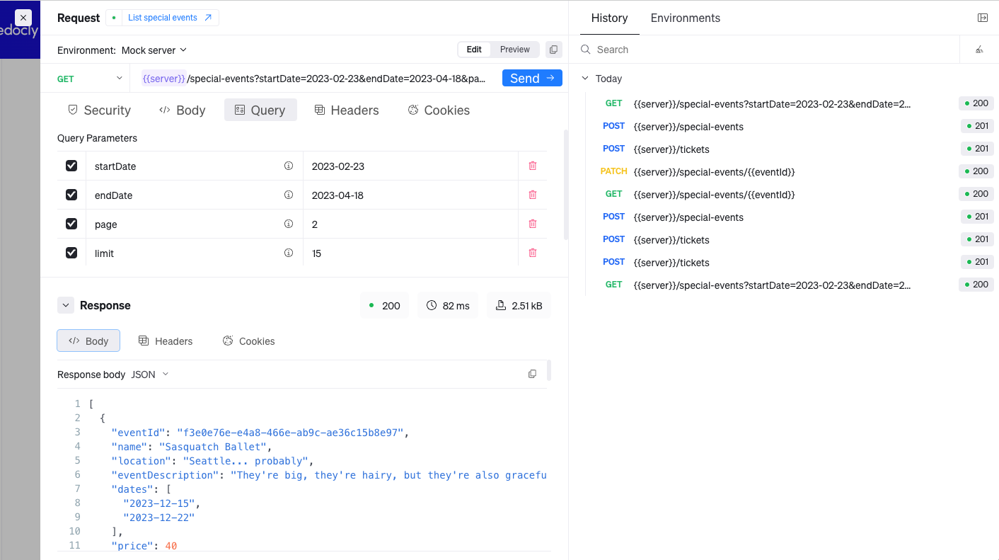

Replay is split into two panes, Request and History/Environment.

## Request pane

The Request pane is located on the left side of Replay and includes everything needed to make a request for an endpoint from your API description.
From the Request pane you can click the request link at the top of the page to open the API reference documentation for that request in another tab.

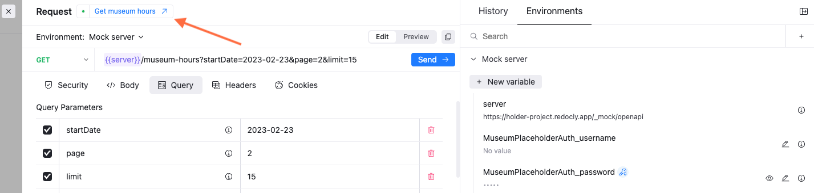

Otherwise, if you want to see the reference documentation, you can close Replay using the **X** icon on the top left side of the Request pane.

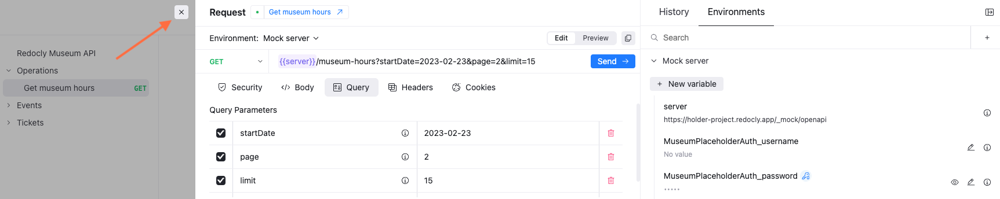

To send a sample response, enter the required parameters and click the **Send** button.

### Path parameter variables

If your endpoint includes path parameters they display as variables in the endpoint when **Edit** is selected on the edit toggle.

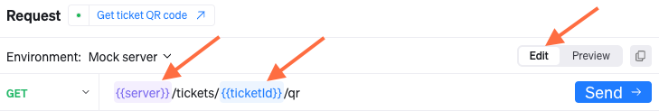

If the variables are highlighted red, you need to enter a variable value to send a valid response.
Before you can enter a value for the variable, select **Edit** on the edit toggle.

### Edit toggle

If you click **Edit** on the edit toggle, you can hover over the path parameter variables and either see the endpoint with the path parameter values or see a **Set value** button.
You can enter a sample path parameter value and select to make it secret after you click the **Set value** button.

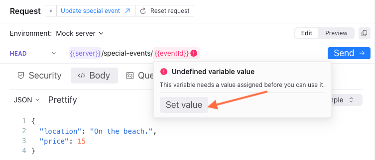

Click **Preview** on the edit toggle to view the endpoint with the path parameter values and copy it using the copy icon to the right of the toggle.
If you did not include sample path parameter values in your API description, the path parameter variable displays instead.

### Request method dropdown

You can select a request method from the available request methods included in your API description from the request method dropdown to the right side of the endpoint.
All other request methods are also listed underneath the documented methods.

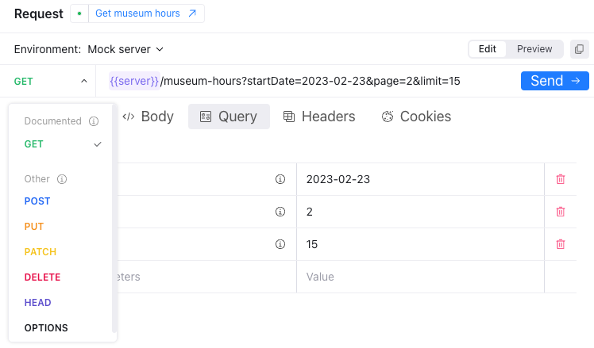

### Parameter tabs

Below the endpoint you can click the following parameter tabs to enter values for your request:

- **Security:** For the Security tab, enter sample security values such as API keys or basic auth username and password information.
- **Body:** For the Body tab, enter the body of the request in JSON format for a PUT or PATCH request.
  If you have included example requests in your API description, you can select one of the examples.
- **Query:** For the Query tab, enter query parameter values such as begin and end dates or return value limits.
- **Headers:** For the headers tab, enter header values.
- **Cookies:** For the Cookies tab, enter cookies.

You can also delete parameter values by clicking the red trashcan icon for the value.

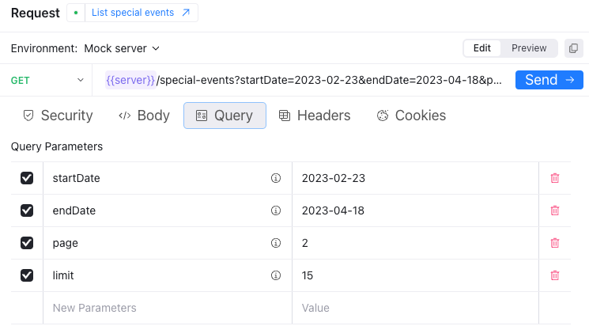

### Response panel

After you have sent a sample request, a sample response displays in the bottom of the Request pane.

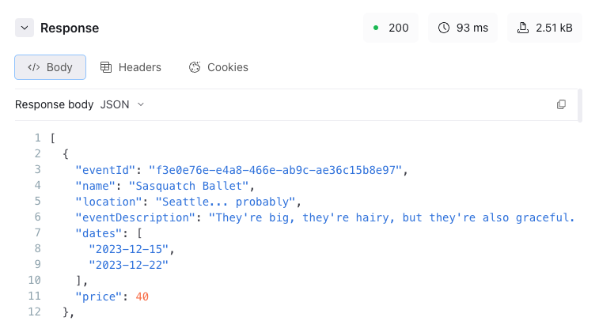

The sample response is based on example responses included in your API description and can include the following information:

- a status code, response time, and size
- a response body in either JSON, text, HTML, or XML
- response headers and values
- response cookies

Click the copy icon on the right side of the panel to copy the sample response.

## History and environments pane

The history and environment pane includes two tabs:

- **History:** The history tab is a list of requests you make with the response status codes.
  You can search the history tab data to find specific requests or click the icon to the right side of the search bar to clear the history.

  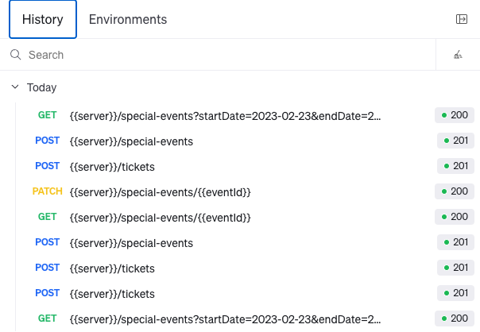

- **Environments:** The environments tab is a list of environments you have included in your OpenAPI description.
  The mock server is included in this list by default, but can be disabled in your `redocly.yaml` file.
  You can also add additional variables here that can be used in your requests.

  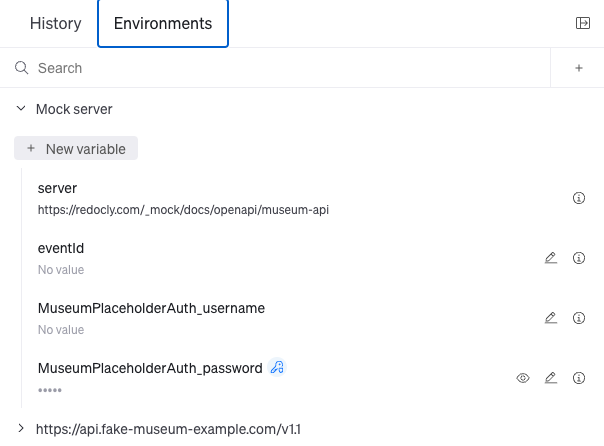

## Resources

- Learn more about the kinds of tasks users can accomplish with Replay in the [Replay concept documentation](../../setup/concepts/replay.md).
- View the configuration options available for the Mock server used in Replay in the [`mockServer` reference documentation](../../config/mock-server.md).
- Check the [`x-usePkce` OpenAPI extension](../reference/openapi-extensions/x-use-pkce.md) to enable Proof Key for Code Exchange (PKCE) by default in Replay.