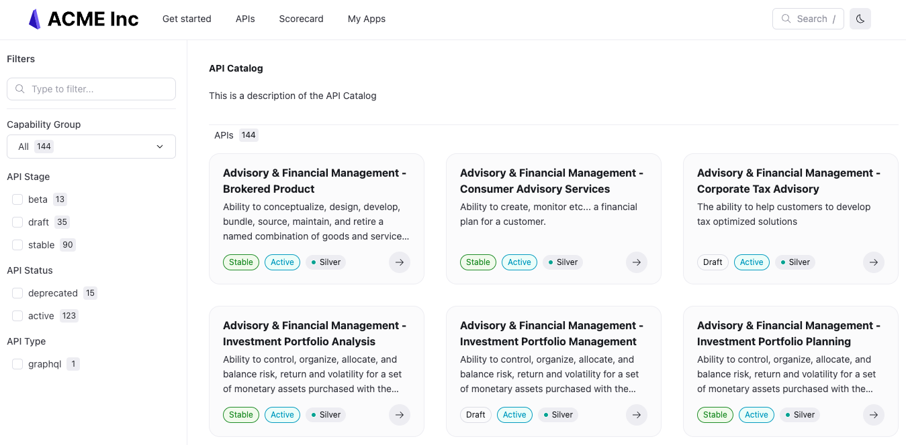

---
products:
  - Reef
  - Realm
plans:
  - Pro
  - Enterprise
  - Enterprise+
---
# `catalogClassic`

Organize your content into a catalog that users can filter and search.
You can configure multiple catalogs and set the link text, description, and filters.



## Options



- Option
- Type
- Description

---

- catalogClassic
- Map of strings to [Catalog Classic](#catalog-object)
- **REQUIRED.**
  Map of strings allows for the definition of multiple catalogs.
  Strings represent catalog only in configuration file - they do not appear in published project.
  Example: `internal-apis`



### Catalog object



- Option
- Type
- Description

---

- title
- string
- **REQUIRED.**
  Heading and page title in published project.
  Example: `Acme API catalog`

---

- titleTranslationKey
- string
- Page title key used for [localization](./l10n.md).

---

- description
- string
- **REQUIRED.**
  Description of the page that appears in published project.
  Example: `Discover how our APIs can support your business.`

---

- descriptionTranslationKey
- string
- Page description key used for [localization](./l10n.md).

---

- slug
- string
- **REQUIRED.**
  What you want the path segment of the URL for the catalog to be.
  Must have a leading and trailing slash.
  Must match the `page` or `href` value for the item on the [navbar](./navbar.md#item-object).
  Example: `/catalog/`

---

- filters
- [[Filter](#filter-object)]
- List of filter configurations which allows for quicker discovery.
  See [Categories](../author/concepts/categories.md) for more information on how to categorize content for filtering.

---

- filterValuesCasing
- string
- Transform casing of filter values. Possible values: `lowercase`, `uppercase`, `sentence`, `original`.
  Default: `original`.

---

- separateVersions
- boolean
- Separates content with multiple versions into their own distinct catalog items.
  Default: `false`.

---

- groupByFirstFilter
- boolean
- Groups items by the first filter they belong to.
  Default: `false`.

---

- items
- [[Item](#item-object)]
- List of item configurations which determines what content is included in the catalog.

---



### Filter object



- Option
- Type
- Description

---

- title
- string
- **REQUIRED.**
  Title of the filter to display above the filter options.

---

- titleTranslationKey
- string
- Filter title key used for [localization](./l10n.md).

---

- property
- string
- **REQUIRED.**
  Indicates the field from `x-metadata` (OpenAPI extension) or `metadata` (in front matter) to use for the filter.

---

- valuesMapping
- string
- Map filter values to different values. Useful for mapping legacy metadata values to new values.
  Default value: `{}`.

---

- missingCategoryName
- string
- If an API does not have `x-metadata` and the corresponding filter `property` defined, then the API belongs to this missing category.
  Default value: `Other`.

---

- missingCategoryNameTranslationKey
- string
- Missing category name key used for [localization](./l10n.md).

---

- type
- string
- Type of the filter in the UI.
  Possible values: `checkboxes` or `select`.

---

- parentFilter
- string
- Property name of the filter to use as a parent.
  The current filter becomes active only after the parent filter is selected.
  Useful with `select` filter as a parent.

---

- options
- [string]
- Static list of filter options to include for this filter.
  If not provided, the filter options are dynamically generated from the metadata values in the catalog.



### Item object



- Option
- Type
- Description

---

- directory
- string
- **REQUIRED.**
  Path to the directory where the API descriptions or content files included in catalog are stored.
  Example: `./`.

---

- flatten
- boolean
- Recurses all included sub-directories for files that match the target types and includes them in the catalog.
  When false, only the top-level items that match the target types are in the catalog as well as the first file from every subdirectory.
  Default: `false`.

---

- includeByMetadata
- Map of metadata properties to list of string values
- Restricts what to include in the catalog.
  Example: `{"type": ["openapi"]}`.





If you want to only show the catalog to users that are members of particular teams, configure
the `rbac` object in the `redocly.yaml` configuration file as follows:

```yaml
rbac:
  content:
    /catalog/:
      Developers: read
```

See [rbac](./rbac.md) reference documentation for more options and examples.



## Examples

The following is an example of a catalog configuration.

```yaml
catalog:
  acme-catalog:
    title: Acme API catalog
    description: 'This is a description of the API Catalog'
    slug: /catalog/
    filters:
      - title: API Category
        property: category
        missingCategoryName: Other
      - title: Team
        property: team
        missingCategoryName: No team
    # separateVersions: true
    groupByFirstFilter: true
    items:
      - directory: ./
        flatten: true
        includeByMetadata:
          type: [openapi]
```


To make the catalog accessible by link, you must add the catalog `slug` to the `sidebars.yaml` file or the `navbar` configuration in the `redocly.yaml` file.


## Related options

- View the configuration options available for translating content in the [localization](./l10n.md) reference documentation.
- See the [navbar](./navbar.md) configuration documentation to see the format for adding a link to your catalog to the navbar.
- Use [x-metadata](../author/reference/openapi-extensions/x-metadata.md) to make your API descriptions filterable.

## Resources

- Learn how to add a catalog in the [Add a catalog](../author/how-to/add-catalog.md) how-to documentation.
- When an API description contains metadata, and you want to exclude the metadata from the API reference documentation, use the [hideInfoMetadata](./openapi/hide-info-metadata.md) configuration option.
- Follow steps to [configure navigation on the navbar](../author/how-to/configure-nav/navbar.md) to include your catalog link.
