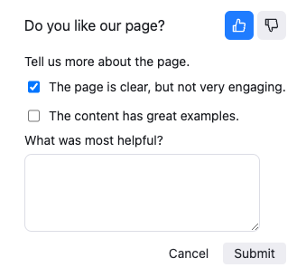
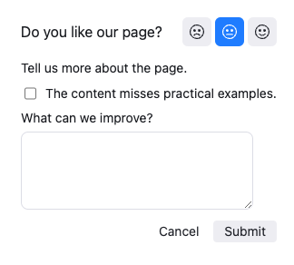
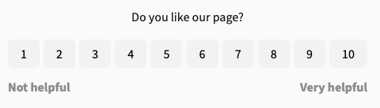

---
products:
  - Redoc
  - Revel
  - Reef
  - Realm
plans:
  - Pro
  - Enterprise
  - Enterprise+
---
# `feedback`

Customize how users leave feedback about your documentation content with the `feedback` option.
By default, the `feedback` sentiment form displays at the bottom of all Markdown and API reference pages, but you can customize or hide it.

The default configuration includes an email field for anonymous users to provide their email with the feedback.

The optional email input field is not displayed for logged-in users.



## Options



- Option
- Type
- Description

---

- hide
- boolean
- Hides the feedback form.
  Default: `false`

---

- type
- string
- Sets the feedback form type.
  Possible values: `sentiment`, `rating`, `comment`, `mood`, `scale`.
  Default: `sentiment`

---

- settings
- [Settings object](#settings-object)
- Contains specific settings for each feedback form type.



### Settings object



- Option
- Type
- Description

---

- label
- string
- Text displayed with the feedback form. Default depends on the feedback form type.

  Default for `sentiment`, `rating`, `mood`, and `scale` types: "Was this helpful?"

  Default for `comment` type: "Share your feedback with us."

---

- submitText
- string
- Text displayed when users submit the feedback form.

  Default for `sentiment`, `rating`, `mood` and `scale` types: "Thank you for your feedback!"

  Default for `comment` type: "Thank you for helping improve our documentation!"

---

- comment
- [Comment object](#comment-object)
- Settings for a comment form that displays after users submit initial feedback.
  Not applicable for the `comment` feedback form type.

---

- reasons
- [Reasons object](#reasons-object)
- Settings for a reasons form that displays after users submit initial feedback.
  Not applicable for the `comment` feedback form type.

---

- leftScaleLabel
- string
- Label for the left-hand side of the scale explaining what lower numbers mean.
  Applicable only for the `scale` feedback form type.
  Default: "Not helpful at all"

---

- rightScaleLabel
- string
- Label for the right-hand side of the scale explaining what higher numbers mean.
  Applicable only for the `scale` feedback form type.
  Default: "Extremely helpful"

---

- optionalEmail
- [OptionalEmail object](#optional-email-object)
- Settings for the optional email input field in the feedback form.

  Collects email addresses from anonymous users for follow-up information.
  **For logged-in users, feedback forms automatically collect email addresses as part of the user data.**

  Applicable to all types of feedback forms.



### Comment object



- Option
- Type
- Description

---

- hide
- boolean
- Enables or disables the comment option.
  Default: `false`.

---

- label
- string
- Text displayed with the comment feedback form field.
  Applicable only for the `rating` and `scale` feedback form type.
  Default: "Share your feedback with us."

---

- likeLabel
- string
- Text displayed with the comment form when users select the like icon.
  Applicable only for the `sentiment` feedback form type.
  Default: "What was most helpful?"

---

- dislikeLabel
- string
- Text displayed with the comment form when users select the dislike icon.
  Applicable only for the `sentiment` feedback form type.
  Default: "What can we improve?"

---

- satisfiedLabel
- string
- Text displayed with the mood form when users select the satisfied icon.
  Applicable only for the `mood` feedback form type.
  Default: "What was most helpful?"

---

- neutralLabel
- string
- Text displayed with the mood form when users select the neutral icon.
  Applicable only for the `mood` feedback form type.
  Default: "What can we improve?"

---

- dissatisfiedLabel
- string
- Text displayed with the mood form when users select the dissatisfied icon.
  Applicable only for the `mood` feedback form type.
  Default: "What can we improve?"



### Reasons object



- Option
- Type
- Description

---

- hide
- boolean
- Enables or disables the reasons option.
  Default: `false`.

---

- label
- string
- Text displayed with the reasons feedback form.
  For `sentiment` and `mood`, this label applies to every reaction-specific configuration as the default.
  Default: "Which statement describes your thoughts about this page?"

---

- component
- string
- Sets the component type to multiple-choice checkboxes or single-choice radio buttons.
  Possible values: `checkbox`, `radio`. Default: `checkbox`.
  For `sentiment` and `mood`, this component applies to every reaction-specific configuration as the default.

---

- items
- [string]
- List of choices in the feedback form. For example, "Content was accurate" or "Content was confusing".
  For `sentiment` and `mood`, these items are included in every reaction-specific configuration as defaults.

---

- like
- [Value specific reasons object](#value-specific-reasons-object)
- Settings for reasons displayed when users select the like icon.
  Applicable only for the `sentiment` feedback form.

---

- dislike
- [Value specific reasons object](#value-specific-reasons-object)
- Settings for reasons displayed when users select the dislike icon.
  Applicable only for the `sentiment` feedback form.

---

- satisfied
- [Value specific reasons object](#value-specific-reasons-object)
- Settings for reasons displayed when users select the satisfied icon.
  Applicable only for the `mood` feedback form.

---

- neutral
- [Value specific reasons object](#value-specific-reasons-object)
- Settings for reasons displayed when users select the neutral icon.
  Applicable only for the `mood` feedback form.

---

- dissatisfied
- [Value specific reasons object](#value-specific-reasons-object)
- Settings for reasons displayed when users select the dissatisfied icon.
  Applicable only for the `mood` feedback form.



### Optional Email object



- Option
- Type
- Description

---

- hide
- boolean
- Hides the optional email input. Setting to true removes the input.
  Default: `false`.

---

- label
- string
- Text displayed with the optional email input.
  Default: "Your email (optional, for follow-up)".

---

- placeholder
- string
- Placeholder text for the optional email input.
  Default: "yourname@example.com".



### Value-specific reasons object



- Option
- Type
- Description

---

- hide
- boolean
- Enables or disables the `reasons` option for a specific feedback value.
  Overrides the main [Reasons object](#reasons-object) `hide` option.
  Uses the [Reasons object](#reasons-object) `hide` option if not specified.
  Default: `false`.

---

- label
- string
- Text displayed with the reasons form for a specific feedback value.
  Overrides the main [Reasons object](#reasons-object) `label` option.
  Uses the [Reasons object](#reasons-object) `label` option if not specified.
  Default: "Which statement describes your thoughts about this page?"

---

- component
- string
- Sets the component type to multiple-choice checkboxes or single-choice radio buttons.
  Possible values: `checkbox`, `radio`.
  Overrides the main [Reasons object](#reasons-object) `component` option.
  Uses the [Reasons object](#reasons-object) `component` option if not specified.
  Default: `checkbox`.

---

- items
- [string]
- List of choices in the feedback form for a specific feedback value.
  Merged with the [Reasons settings](#reasons-object) `items` option.
  For example, "Content was accurate" or "Content was confusing".



## Configuration precedence

Configuration for the `feedback` option in the `redocly.yaml` file updates all pages globally.
You can also configure the `feedback` option for individual pages in the front matter.
Front matter configurations take precedence, but settings from the `redocly.yaml` file apply when not specified in front matter.

Add the `feedback` option under the `openapi` or `graphql` property for API reference documentation pages.

## Localization

Localize feedback form text with `translations.yaml` files. Don't set text values in `redocly.yaml` when using translations, as `redocly.yaml` settings override translation files.

## Examples

### Sentiment

The `sentiment` feedback form displays by default on Markdown and API reference documentation pages.
No configuration is required.
If you want to hide feedback on your pages, you can [configure it to be hidden](../setup/how-to/feedback/index.md#hide-feedback).

Configuration:

```yaml 
feedback:
  type: sentiment
  settings:
    label: Was this page helpful?
    submitText: Thanks for your feedback!
    reasons:
      component: radio
      items:
        - The page is clear, but not very engaging.
      like:
        label: What made this page helpful?
        items:
          - The content has great examples.
      dislike:
        label: What should we improve?
        items:
          - The content lacks practical examples.
    comment:
      likeLabel: What was most helpful?
      dislikeLabel: What can we improve?
```

Screenshot of what users see after selecting the thumbs-up icon:



### Mood

Configuration:

```yaml 
feedback:
  type: mood
  settings:
    label: Was this page helpful?
    submitText: Thanks for your feedback
    reasons:
      component: radio
      satisfied:
        label: Check all that apply.
        items:
          - The content was accurate.
      neutral:
        hide: true
        label: What can we improve?
        items:
          - The content lacks practical examples.
      dissatisfied:
        label: What went wrong?
        items:
          - The content was hard to find.
```

Screenshot of what users see after they select the neutral-face icon:



### Scale

Configuration:

```yaml
feedback:
  type: scale
  settings:
    label: How helpful was this page?
    submitText: Thanks for your feedback!
    leftScaleLabel: Not helpful
    rightScaleLabel: Very helpful
```

Screenshot:



### Star rating

Configuration:

```yaml
feedback:
  type: rating
  settings:
    label: Rate this page
    submitText: Thank you for your rating!
```

### Comment

Configuration:

```yaml
feedback:
  type: comment
  settings:
    label: Share your experience with this page.
    submitText: Your comment has been sent to our team!
```

### Optional email

```yaml
feedback:
  settings:
    optionalEmail:
      label: Email address for follow-up
      placeholder: yourname@example.com
```

## Related options

- Discover ways to customize code samples in your documentation in the [codeSnippet](./code-snippet.md#report-object).
- Learn how to configure feedback for [GraphQL](graphql/index.md) reference documentation.

## Resources

- Learn about different feedback forms available in the [Feedback concept](../setup/concepts/feedback.md).
- Learn how to customize code snippets in your documentation in [Configure code snippets](../author/how-to/configure-code-snippets.md).
- Add options after users complete initial feedback in [Extend the feedback form](../setup/how-to/feedback/extend-feedback.md).
- Find where collected feedback data is sent and how to view it in [View and export feedback data](../setup/how-to/feedback/view-export-data.md).
- Use [front matter](./front-matter-config.md) to configure feedback on individual pages.
