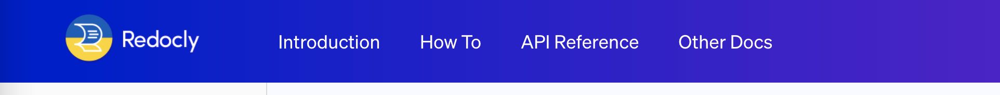
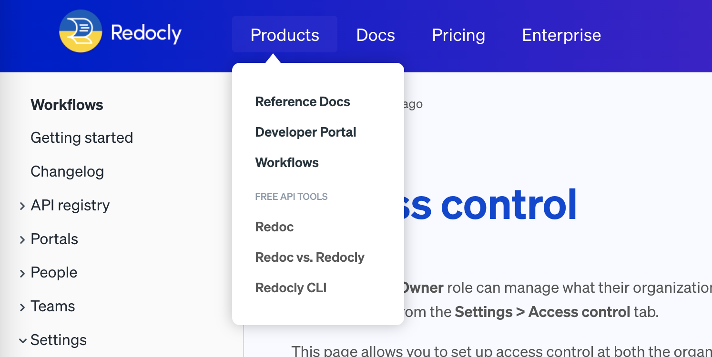

---
products:
  - Redoc
  - Revel
  - Reef
  - Realm
plans:
  - Pro
  - Enterprise
  - Enterprise+
---
# `navbar`

The `navbar` appears across the top of the website.
You can configure the links and groups of links that appear on the navbar of your site, or hide the navbar altogether.
The navbar is a good location for top-level category or frequently-used links.

## Options



- Option
- Type
- Description

---

- items
- [Item](#item-object) | [Group](#group-object)
- List of items in the Navbar.

---

- hide
- boolean
- Specifies if the navbar should be hidden.
  Default: `false`.

  



### Group object



- Option
- Type
- Description

---

- group
- string
- **REQUIRED.** Name of the group.

---

- groupTranslationKey
- string
- Specifies the group name key used for [localization](./l10n.md).

---

- items
- [Item](#item-object)
- **REQUIRED.**
  List of items.
  The navbar for the default theme may only have one level of depth to groups.

---

- linkedSidebars
- [string]
- Array of relative paths to sidebar files. This option will add the navbar item to a sidebar's breadcrumbs. Only effective for top-level navbar items.

---

- icon
- string
- Path to the icon file.

---

- external
- boolean
- Open link in new browser tab. Default is `false`.

---

- page
- string
- **MUTUALLY EXCLUSIVE.** Path to the file which represents the page to link to.
  Mutually exclusive with the `href` option.
  If you use the `page` option, and do not include the `label` option,
  the text for the link on the sidebar will match the level 1 heading of the page.

---

- href
- string
- **MUTUALLY EXCLUSIVE.** URL to link to.
  Mutually exclusive with the `page` option.
  If you use the `href` option, and do not include the `label` option,
  the text for the link on the sidebar will match the `href` option's value.




### Item object



- Option
- Type
- Description

---

- page
- string
- **CONDITIONALLY REQUIRED.** Path to the file which represents the page to link to.
  Mutually exclusive with the `href` option.
  If you use the `page` option, and do not include the `label` option,
  the text for the link on the sidebar will match the level 1 heading of the page.

---

- href
- string
- **CONDITIONALLY REQUIRED.** URL to link to.
  Mutually exclusive with the `page` option.
  If you use the `href` option, and do not include the `label` option,
  the text for the link on the sidebar will match the `href` option's value.

---

- label
- string
- Link text displayed for the item.

---

- labelTranslationKey
- string
- Link text key for the item used for internationalization.

---

- icon
- string
- Path to the icon file.

---

- external
- boolean
- Open link in new browser tab. Default is `false`.

---

- linkedSidebars
- [string]
- Array of relative paths to sidebar files. This option will add navbar item to sidebar's breadcrumbs. Only effective for top-level navbar items.



## Examples

### Simple menu

The following is an example configuration for a simple flat navbar.

```yaml 
navbar:
  items:
    - page: introduction.md
    - page: howto.md
      label: How To
    - page: api-definition.yaml
    - label: Other docs
      href: https://redoc.ly/docs/developer-portal/introduction/
      external: true
```

The following is a screenshot of that navbar.



### Dropdown Menu

The following is an example of a dropdown menu in a navbar config.

```yaml 
navbar:
  items:
    - group: Products
      items:
        - page: reference-docs.tsx
          label: Reference Docs
        - page: developer-portal.tsx
          label: Developer Portal
        - page: workflows.md
          label: Workflows
        - separator: Free API Tools
        - page: redoc.md
          label: Redoc
        - page: redoc-vs-redocly.md
          label: Redoc vs Redocly
        - page: redocly-cli.md
          label: Redocly CLI
    - label: Docs
      page: docs.md
    - label: Pricing
      page: pricing.md
    - label: Enterprise
      page: Enterprise.md
```

The following is the visual screenshot of the navbar.


### Navbar item linked to sidebar

```yaml 
navbar:
  items:
    - page: introduction.md
      linkedSidebars:
        - sidebars.yaml
    - page: howto.md
      label: How To
```

## Resources

- [footer](./footer.md) - Configuration reference for the footer.
- [logo](./logo.md) - Configuration reference for the logo that appears in the navbar.
- [localization](./l10n.md) - Configure navbar labels for multiple languages.
- Use [front matter](./front-matter-config.md) to show or hide the navbar on individual pages.
- Explore other [configuration options](./index.md) for your project.

