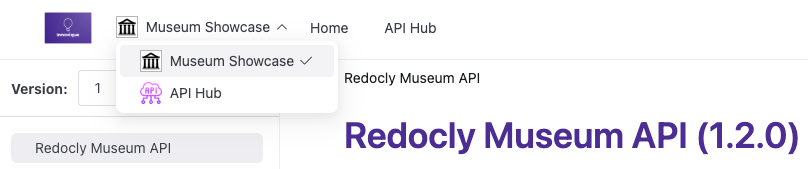

---
products:
  - Revel
  - Realm
plans:
  - Pro
  - Enterprise
  - Enterprise+
---
# `products`

Use the `products` section to set up multiple product documentation sets in your project.
This option configuration creates a product picker in the navbar and offers the ability to customize the look of each product's documentation set.



## Options



- Option
- Type
- Description

---

- products
- Map of strings to [Product](#product-object)
- **REQUIRED**
  Map of strings allows for the definition of multiple products.
  Strings represent product only in configuration file - they do not appear in published product.
  Example: `acme-us`



### Product object



- Option
- Type
- Description

---

- name
- string
- **REQUIRED**
  Name of the product that appears in product picker.
  Example: `Acme`

---

- icon
- string
- Path to the product icon file.
  Displays next to the product name in product picker.

---

- folder
- string
- **REQUIRED**
  Path to the product content folder.
  Cannot be a subfolder in another product's folder.



## Examples

The following is an example of setup for three products.

```yaml
products:
  acme:
    name: Acme
    icon: images/acme-icon.svg
    folder: products/acme/
  museum:
    name: Museum
    icon: ./images/redocly-icon.png
    folder: ./products/redocly-museum
  news:
    name: News aggregator
    icon: images/news-aggregator-icon.svg
    folder: products/news-aggregator
```

## Related guides

- [Configure multiple products](../author/how-to/multiple-products.md)
