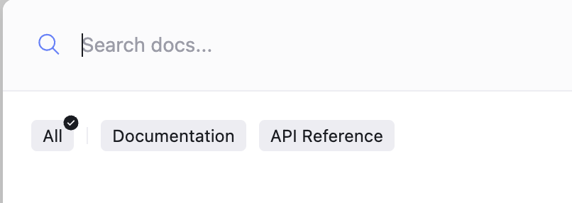
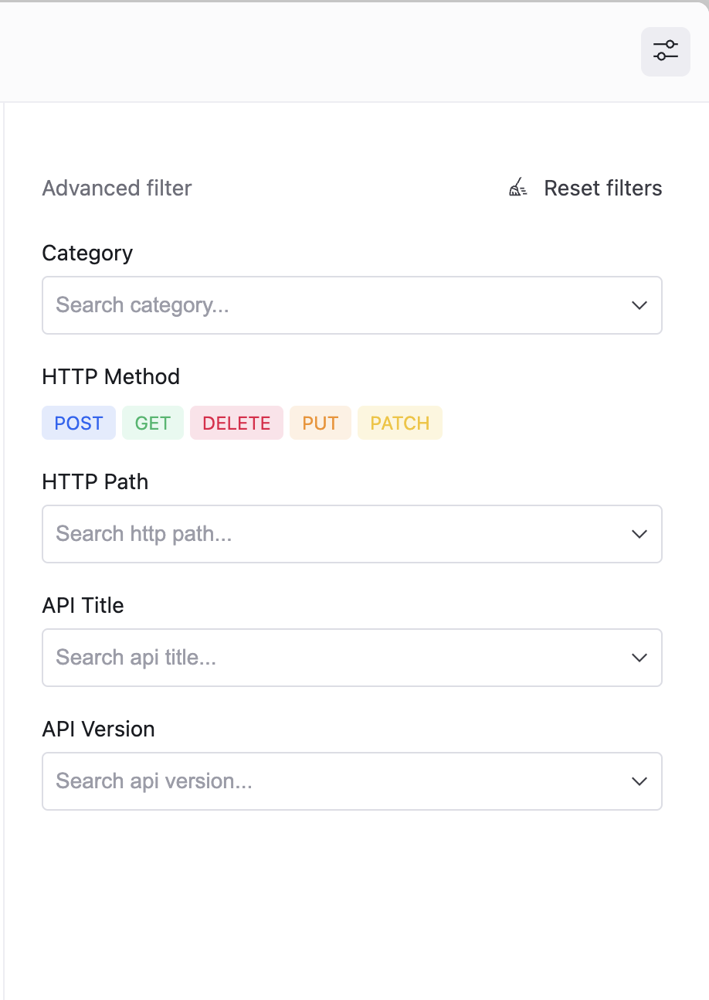

# Configure search facets

Search facets enable you to refine search results based on specific criteria, making it easier to find relevant information quickly.
With facets, navigating complex sets of documentation becomes more effective, as you can filter results by categories, versions, tags, or other relevant custom attributes.
This capability enables you to narrow your search to chosen content eliminating irrelevant results.


## Before you begin

Make sure you have the following:
- a `redocly.yaml` file located in the root directory of your project.
- searchable content including Markdown and OpenAPI files.

## Available search engines

Redocly supports two types of search engines for your project:
1. **FlexSearch**: the default search engine that supports limited facets configuration. You can only adjust the [group facet](#group-facet).
2. **Typesense**: an advanced search engine with full facets configuration capabilities.

## Default facets configuration

The default search facets configuration applies to all documents.

There are two predefined search categories that are configured by the [group facet](#group-facet) field:
- **Documentation**: includes all Markdown files present in the project.
- **API Reference**: all OpenAPI, GraphQL, AsyncAPI, and SOAP API definitions.

These categories are visible when you open the search dialog:



For search engines that support full facets configuration capabilities (see [Available search engines](#available-search-engines)) Redocly provides an additional filter panel featuring predefined facets for `HTTP Path`, `HTTP Method`, `API Title` and `API Version`:



### Default facets list

```yaml
  - name: Category
    field: redocly_category
    type: multi-select
  - name: HTTP Method
    field: httpMethod
    type: tags
  - name: HTTP Path
    field: httpPath
    type: multi-select
  - name: API Title
    field: apiTitle
    type: multi-select
  - name: API Version
    field: apiVersion
    type: select
```

## How to configure search facets

The search facets feature enables you to create custom facets or override the default configuration using `redocly.yaml` config.

The following is an example of how to override the default `redocly_category` facet:

```yaml 
search:
  filters:
    facets:
      - name: Custom 
        field: redocly_category
        type: select           
```

This configuration allows you to change `name` and `type` for default facet fields that are visible in the advanced filter panel.

The following is an example of how to create custom facet:

```yaml 
search:
  filters:
    facets:
      - name: Owner
        field: owner
        type: select            
```

## Apply facets to files

To apply facets to files, use metadata properties.
You can assign specific metadata to your files, such as custom facet fields for advanced filtering or predefined ones like `redocly_category` for grouping.

The following is an example of how to apply facets to Markdown files using frontmatter:

```yaml
---
metadata: 
  redocly_category: Custom 
  owner: Redocly
---
```

The following is an example of how to apply facets to openapi definitions:

```yaml
openapi: 3.0.0
info:
  version: 1.3.3
  title: Swagger Petstore
  x-metadata:
    redocly_category: Custom
    owner: Redocly
```

Alternatively, you can use the `metadataGlobs` property in the `redocly.yaml` configuration file to apply facets to files using a glob pattern, for example:
```yaml 
metadataGlobs:
  'museum/**':
    redocly_category: Museum
  'payments/**':
    redocly_category: Payments
```

## Group facet

The group facet categorizes the search results and is displayed in the top panel of the search dialog for quick switching between categories.


Only `redocly_category` facet field is used as a group facet.


## Resources

- Reference the options for configuring search in your project in the [search](../../config/search.md) reference documentation.
- Learn about [metadataGlobs](../../config/metadata-globs.md) configuration options.
