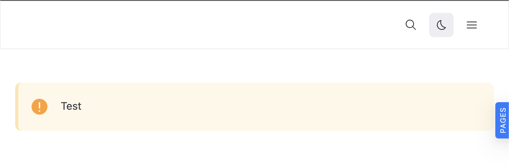
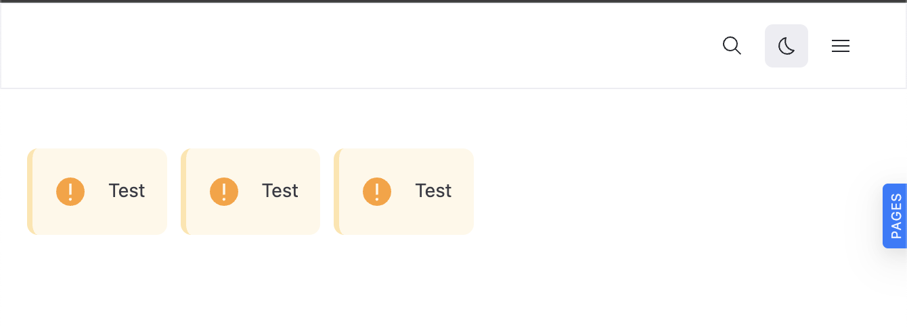

# Components usage tutorial

There are several ways to use theme components. 
Below are some of the most common approaches.


You can find the list of components you can customize [List of customizable components](./list/index.md) and icons [List of customizable icons](./list/icons.md).


We use the `Admonition` component as an example to illustrate different integration methods.

## Use components directly on a page

You can import a component directly and use it inside a page.

1. Create a page file.
2. Import the component.
3. Use it on your React page.

### Example

```tsx 
import * as React from 'react';

import { Admonition } from '@redocly/theme/components/Admonition/Admonition';

export const frontmatter = {
  seo: {
    title: 'Test',
  },
};

export default function () {
  return (
    <div>
      <Admonition type="warning">Test</Admonition>
    </div>
  );
}
```

### Rendered output



## Use components inside a custom wrapper

You can also build your own custom components that internally use theme components.
This is useful when you want to encapsulate specific logic or structure.

### Project structure example

```treeview
│  
├── components/
│   └── InfoRow.tsx
└── test.page.tsx
```

### Example





```tsx 
import * as React from 'react';
import styled from 'styled-components';

import { Admonition } from '@redocly/theme/components/Admonition/Admonition';

export const InfoRow = () => {
  return (
    <Wrapper>
      <Admonition type="warning">Test</Admonition>
      <Admonition type="warning">Test</Admonition>
      <Admonition type="warning">Test</Admonition>
    </Wrapper>
  );
};

const Wrapper = styled.div`
  display: flex;
  flex-direction: row;
  gap: 10px;
`;
```




```tsx 
import * as React from 'react';

import { InfoRow } from './components/InfoRow';

export const frontmatter = {
  seo: {
    title: 'Test',
  },
};

export default function () {
  return (
    <div>
      <InfoRow />
    </div>
  );
}
```




### Rendered output



## Resources

- Learn how to [customize theme components](./wrap-components.md).
- Discover components you can customize in [List of customizable components](./list/index.md).
- Discover icons you can customize in [List of customizable icons](./list/icons.md).