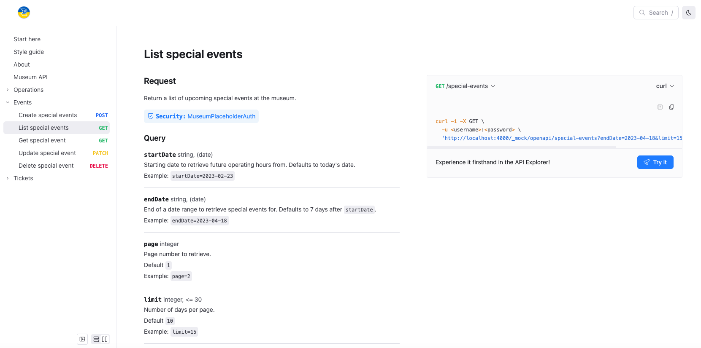
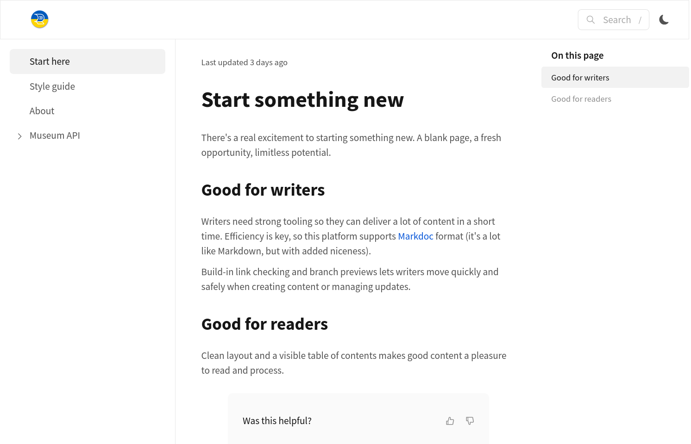
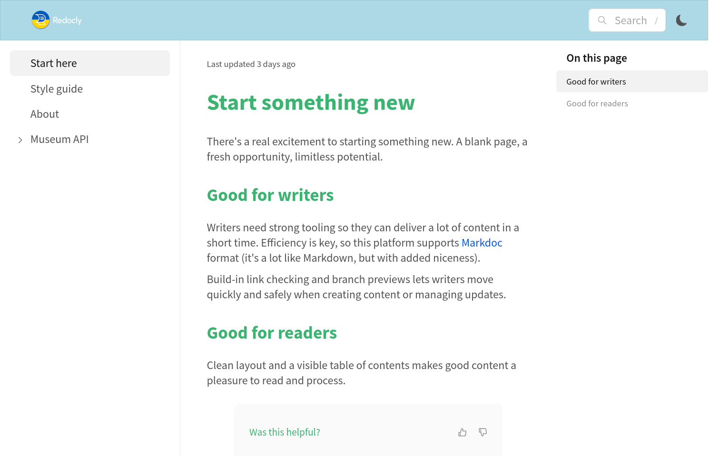

# Get started locally

This guide gets you started with a Redocly project in local development mode.

## Before you begin

To work locally with a Redocly project, you need to:

- make sure you have [NodeJS](https://nodejs.org/en), v22.12.0 or later (alternatively -- v20.19.0 or later).
- [install Redocly CLI](https://redocly.com/docs/cli/installation/).


Redocly CLI is an open source command-line tool for working with APIs.
Visit the [Redocly CLI documentation](https://redocly.com/docs/cli/) to learn more about what it can do.


Once the CLI is installed, it's time to create some content.

## Start with an index page

The landing page for each directory in your project is `index.md`.
Create a fresh directory for your new project, and then add a file named `index.md`.

Either create your own content, or you can use the following Markdown in your `index.md` file:



Content is created, let's see how it looks.


Using a particular source control is outside of the scope of this guide, but it's recommended to add your files to a Git repository or equivalent, and commit your changes after each step as you go along.



## View the project

Redocly has a local development server that you can use to preview your work on your local machine.
Start the preview by running the following command in your terminal, in your project directory:

```bash
redocly preview
```

You'll see some output while the project is building.
When it is ready, it will be available on <http://localhost:4000>.

## Add more pages, and a sidebar

One page isn't very exciting, so let's add a few more.


These examples use Markdown, but [Markdoc](https://markdoc.dev/) is also supported.
If you're new to Markdoc, visit our [Markdoc learning hub](https://redocly.com/docs/learn-markdoc/) for more information and lots of examples.


Create files named `style-guide.md` and `about.md`.
Then either create your own content there, or borrow the following examples:





When you add more pages, a sidebar is automatically generated to list them all.
If you want more control over the navigation, such as specifying the order, changing the link text, or grouping pages, then you'll want to configure the sidebar yourself.

To configure the sidebar for your project, create a file named `sidebars.yaml` and add the following content:

```yaml 
- page: index.md
- page: style-guide.md
- page: about.md
```

This displays the pages in a specific order, and you can also change the display labels.
For example, edit the file as shown in the following example to change the link to the index page:

```yaml 
- page: index.md
  label: Start here
- page: style-guide.md
- page: about.md
```

If you don't specify a label, the page title is used.
Take some time to add a few more pages, and change the navigation bar by re-ordering pages and changing the page labels.
There's more information and examples in the documentation pages for [working with sidebars](../author/how-to/configure-nav/sidebar.md) and [configuring sidebar groups](../author/how-to/configure-nav/configure-sidebar-groups.md).

## Fine-tune your configuration

Things look pretty good already, but there are plenty more ways that you can adjust your project to meet your needs.
All the configuration for Redocly projects is done using [configuration options](../config/index.md) in a file named `redocly.yaml`.
By changing the settings in this file, you can adjust the project behavior to fit your use case.

Create a file called `redocly.yaml`, then try the following examples (or pick some other configuration settings) to change how the site looks.
Change one thing at a time and check the preview as you go along.

1. When you publish a site, it will need to fit your company's brand.
   Styling is covered in a later section, but as a first step let's configure a logo file to use.

   Create an `images/` folder and add your logo there.
   If you don't have a logo file handy, copy this one and put it in your new folder.

   

   Use the following configuration to set the logo for your site:

    ```yaml 
    logo:
      image: ./images/redocly-logo.png
   ```

1. For bigger or more complex projects, the breadcrumbs feature displays above each page and helps users to understand where they are in the site structure.
   However this might be too much for our small getting started project, so let's turn them off.

    ```yaml 
    breadcrumbs:
      hide: true
    ```

1. Some links are useful on every page, so it's a good idea to add a footer to accommodate them.
   The setting for this is in `footer`, try adding something like the following example:

    ```yaml 
    footer:
      items:
        - group: Redocly
          items:
            - href: https://redocly.com
              label: Redocly.com
            - href: https://redocly.com/docs
              label: Redocly docs
        - group: Docs Resources
          items:
            - href: https://markdoc.dev/
              label: Markdoc
            - href: https://openapis.org
              label: OpenAPI
    ```

View the [full configuration options list](../config/index.md) to see what else you can change.

## Add API reference documentation

API reference documentation is a major feature of the Redocly products, so add an OpenAPI description and try the feature yourself.
If you already have an API description then you can use that, or you can download the [Museum API example](https://github.com/Redocly/museum-openapi-example/blob/main/openapi.yaml) to use as a test API.

Create an `apis/` directory in your project and add the OpenAPI file(s) there.

To include the API in the sidebar, add the root file to `sidebars.yaml`.
The API reference adds sidebar entries for the user to navigate the various sections, so try adding the API description as the page for a group sidebar entry, like the following example:

```yaml 
- group: Museum API
  page: apis/openapi.yaml
```

Explore the generated documentation and see how the API you picked is presented.
API reference documentation is a vital part of API experience, and our Redoc rendering makes it a good experience.



Many aspects of the API documentation are configurable, visit the [openapi configuration page](../config/openapi/index.md) for more information and ideas.

## Style to suit

Your company brand identity is an important part of anything you publish, so in this section you will learn how to style your new site.
Realm uses CSS variables for most of the styling on the site.
This enables you to set a few key variables and deliver a consistent experience throughout the project - then adjust the specific details as needed.

To customize the styles:

- Add a folder called `@theme` in the root of your project.
- Add a `styles.css` file in the @theme folder.
- Add entries to `style.css` to override any CSS variables you'd like to change.

For example, if your company brand color is green, set that using something like the following example:

```css 
:root {
  --heading-text-color: mediumseagreen;
}
```

Setting a CSS variable means that the change is used consistently through the site, for example, try setting `--font-size-base` to different values and see that all the text scales as a result.
Another quick way to bring a brand identity to the site is to set the background color on the navbar and the footer you just created.
The following example shows that in action:

```css 
:root {
  --heading-text-color: mediumseagreen;
  --footer-bg-color: lightblue;
  --navbar-bg-color: lightblue;
  --font-size-base: 18px;
}
```

Your site looks a bit different to the default, as you can see in the following pair of screenshots:





Explore the [CSS variables reference](../style/reference/css-variables/index.md) or inspect your site with web developer tools in your browser to identify the variables to change.

## Publish to your site

The preview feature is not designed (or, indeed, licensed) for production use, so once you're happy with how everything looks, go ahead and publish the content to Redocly.
The details will depend on the tools and platforms you use, but as a general overview:

1. Add your files into a Git repository if you haven't already.

1. Push the files to your chosen Git provider (we support GitHub, GitLab, Azure DevOps and others).

1. Log in to Reunite and create a new project; [connect to your Git remote repository](../setup/how-to/git-providers/connect-git-provider.md).

1. The project is created and your site is built - go and check it out!
