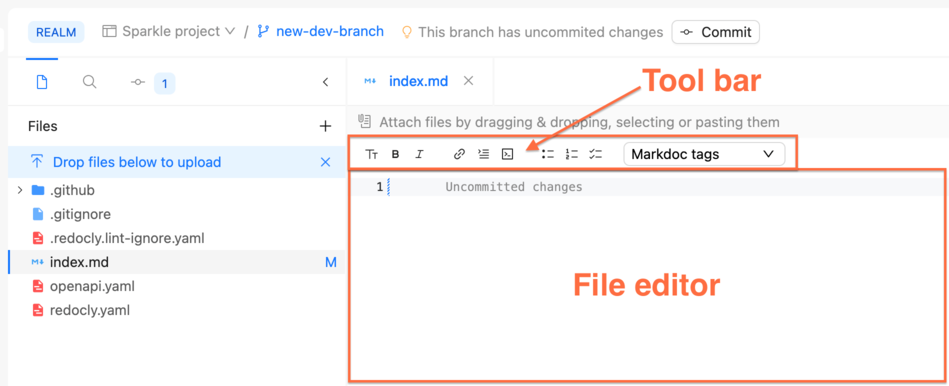
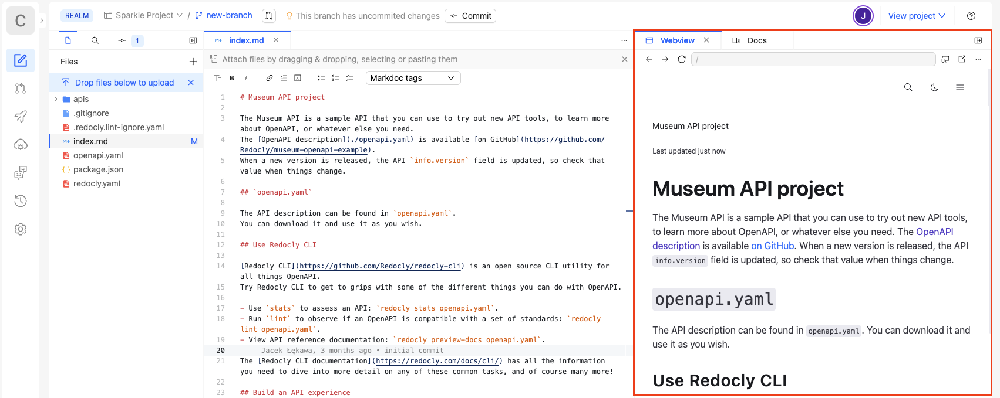
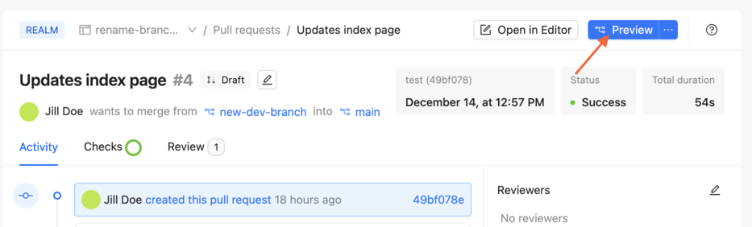
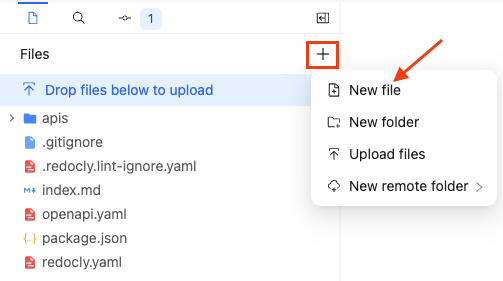
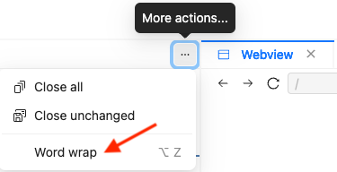
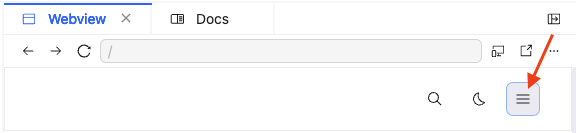
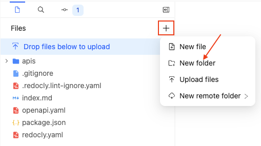

# Get started with the Reunite editor

The Reunite editor is a built-in cloud platform tool that you can use to add and edit content in your project.
This guide is to help you get started with a Redocly project using the Reunite editor.

## Before you begin

Make sure you have the following before you begin:

- A project using the **Starter** template in your Reunite organization.

  See [Create a project](../setup/how-to/manage-projects.md#create-a-project) for instructions on creating a project.

## Create a branch

<details>
  <summary>Learn more about branches</summary>

  Reunite uses Git for version control, which means changes are made on development branches and are introduced to the main branch of the project through pull requests.

  _Branches_ are copies where you can make changes to the project without affecting the production project until you are ready.
  If you want changes from a branch to be added to the production project, you merge a pull request.

</details>



## Add content to the landing page

By default, the landing page for each directory in your project is either an `index.md` or `index.tsx` file.
New projects in Reunite come with a landing page file.

For this step, replace the content in the current landing page file with new content.
You can either add your own content, or add the following sample Markdown to your landing page file:

<details>
  <summary>Example content</summary>



</details>

<details>
  <summary>Learn more about supported formatting options</summary>

The Reunite editor supports the following markup options:

- [CommonMark Markdown](https://commonmark.org/)
- [Markdoc tags](https://redocly.com/docs/learn-markdoc/tags/tag-library/)
- [Mermaid diagrams](../author/how-to/add-diagram.md)

You can also use the editor toolbar to add the following items:

- links
- Markdoc tags
- ordered or unordered lists
- images
- bold or italicized text



</details>

Now that you have added some content to your landing page, you can preview your project.


The Reunite editor automatically saves your changes as you make edits to your files.


## Preview your changes

Reunite includes a Webview live preview pane where you can view your changes as you make them in the editor.

You can also preview how all of your changes will look in a sample build before you push your changes to the production build.

### In the live preview pane

The Webview live preview pane allows you to view formatting updates to be sure they render as you expect before you publish.



Also, you can change the view to meet your needs. For instance, if you want to see how the main landing page renders on mobile screens.
See [Use the Webview](../author/how-to/use-webview.md) to learn more about the options you have when using this Webview live preview pane.

### In the deployment preview

Reunite creates deployment previews for all branches that have an open pull request.
The deployment preview includes all changes you have committed to your branch.

<details>
  <summary>Learn more about pull requests</summary>

  Reunite uses _Git_ for _version control_, which means changes are made on _development branches_ and are introduced to the _main branch_ of the project through _pull requests_.

  Before you can open a pull request, you must make a commit to your development branch.
  A _commit_ is a way of storing your changes to the branch in Git.
  You can continue to make updates to your branch and make additional commits.

  After you have committed, you can [open a pull request](../author/how-to/open-pull-request.md) with your commits.
  _Pull requests_ show the differences between your branch and the default (main) branch, run checks to be sure you are not adding broken links to the production build, create a deployment preview build, and give other users an opportunity to comment on the changes before they are merged with the main branch.
</details>

To see a preview build of your project:<a id="commit-steps"></a>

1. Commit your updates.
   <details>
     <summary>Steps to commit</summary>

      

   </details>
2. After you commit changes to the branch, open a pull request.
   <details>
     <summary>Steps to open a pull request</summary>

      

   </details>
3. Click the **Preview** button in the top right corner of the page.
   You might need to wait until the deployment completes before you can access the preview deployment,
   otherwise you will be redirected to the deployment details page.
   

A deployment preview of the project with your changes opens in a separate browser window.

## Add more pages

Now that you have updated the `index.md` page and seen a deployment preview, let's return to the editor to make some more changes to your project.
To return to the editor, click **Editor** in the navigation pane on the left side of the page.
If you only see icons, you may need to click the "greater than" symbol to expand the navigation pane.

Since a single Markdown page isn't very exciting, we should add a few more.
Using the following steps, create the following two new files:

- `style-guide.md`
- `about.md`

To create a new Markdown file:

1. Click the **+** icon in the top right corner of the file tree in your editor.

   
2. Select **New file**.
3. Enter the file name into the text field and press `return` or `enter` on your keyboard.

Now that you have two empty Markdown files, either add your own content, or use the following example content:

<details>
  <summary>Example content</summary>

  

  

</details>



You can turn on word wrap in the editor by selecting the **More actions** menu in the top right corner of the editing pane and selecting **Word wrap**.



## Customize the sidebar navigation

When you add more files to your project, a link to those files is automatically added to the generated sidebar navigation menu.
This generated sidebar is based on the file structure of your project and requires an `index.md` file at the root of your project, in other words, not in a folder.


The sidebar navigation menu usually displays on the left side of the page in the Webview; however, when the Webview pane is a small width, it is hidden under a slide drawer menu icon that displays in the top right of the Webview pane.




To customize the sidebar navigation for your project, you need to add and configure a new file named `sidebars.yaml` to the root of your project.

### Add a `sidebars.yaml` file

The `sidebars.yaml` file gives you control over the sidebar navigation menu.
You add it as you would any new file.
It must be named `sidebars.yaml`.

To add a `sidebars.yaml` file to your project:

1. Click the **+** icon in the top right corner of the file tree in your editor.\
   
2. Select **New file**.
3. Enter the `sidebars.yaml` as the file name into the text field and press `return` or `enter` on your keyboard.

Now that you have added a `sidebars.yaml` file to your project, you can configure it.

### Configure the `sidebars.yaml` file

After you have added a `sidebars.yaml` file to your project, you need to add to it the pages and links you want included in your sidebar navigation using YAML syntax.

Add the following sample configuration to your `sidebars.yaml` file:

```yaml 
- page: index.md
  label: Home
- page: style-guide.md
- page: about.md
- group: Museum API
  items:
    - page: ./openapi.yaml
```

The sample configuration adds the index page, with the link text "Home", your new Markdown pages, using the first heading as the link text, and the Museum API reference documentation, generated from the OpenAPI file.



After adding a `sidebars.yaml` file to a project, any pages you want listed in your sidebar navigation, must be included in the `sidebars.yaml` file.



Now that you have more pages and a sidebar to customize the navigation for those pages, let's update the look and feel of your project to better reflect your brand.

## Add a logo

One way to customize your project to better reflect your brand is by updating the logo.
To update the logo, you need to add a logo image file to your project, and add a `logo` configuration to the `redocly.yaml` file.

### Add an image file

Images should be stored in `images` folders close to the content where they are referenced.
You can have multiple `images` folders in your project.
For this task, we need an `images` folder at the root of the project.

For the following steps, you can use your own image or download the following sample logo image:

<details>
<summary>Download a sample logo image</summary>

  To use the Redocly logo:

    1. Right-click on the image.
    2. Select **Save Image As...**.
    3. Enter `logo.png` as the name for the image.
    4. Select where you want to save the image.
    5. Click **Save**.

  
</details>

To add an image file to your project, drag the logo image file from where it is located on your computer and drop it into your `index.md` file.
Afterward, a correctly formatted image Markdown tag is added to your `index.md` file.
Also, the image is automatically saved to an automatically generated `images` folder at the root of your project.

### Add a `logo` configuration

Now that you have your logo added to the `images` folder in your project, you can configure the `logo` option in the `redocly.yaml` configuration file.

To add a `logo` configuration:

1. Select the `redocly.yaml` configuration file in the file tree.
2. Copy and paste the following configuration into the file using the editor:
   ```yaml 
   logo:
     image: ./images/logo.png
     link: /
   ```

   
    If you used a different image or updated the logo name - update the file path in the configuration to reflect your changes.
   
You should see the logo update immediately in the live preview pane.
If you don't see your changes, try refreshing the live preview pane by clicking the [Reload](../author/how-to/use-webview.md#reload) button.
You can also commit your update to view it [in the preview build](#in-the-deployment-preview).

The project is starting to look more like yours, but the colors could use some adjusting.

## Update styles

You have come so far! Already you have new content, including a new logo and a sidebar.
But, there's one more thing you will want to update, the styles.
Your project uses [CSS variables](https://www.freecodecamp.org/news/how-to-use-css-variables/) for most of the styling.
So, to update the styles, you reassign the variable to whatever you want it to be.

Let's try reassigning variables on our sample project by updating the headings color.

To update the styles for your project, you need to create a `@theme` folder, add a `styles.css` file to the `@theme` folder, and update the CSS variable value in the `styles.css` file.

### Create a `@theme` folder

First, you need to create a `@theme` folder at the root of the project.

To create an `@theme` folder at the root of your project:

1. Click the **+** icon in the top right corner of the file tree in your editor.

   
2. Select **New folder**.
3. Enter `@theme` into the text field and press `return` or `enter` on your keyboard.

You should now have an `@theme` folder in your file tree.

### Create a `styles.css` file

Now that you have an `@theme` folder you need to create a `styles.css` file in it.

To add a `styles.css` file to the `@theme` folder:

1. Right-click on the `@theme` folder.
1. Select **New file**.
1. Enter `styles.css` into the text box.

Make sure the `styles.css` file is in the `@theme` folder, then you can update the CSS variable value.

### Update the CSS variable in the `styles.css` file

To update the headings color variable, copy and paste the following configuration into the file:

```css 
:root {
   --heading-text-color: red;
}
```

You can add colors using hexadecimal and rgba numbers as well as HTML color names.
You can also use the color picker tool by hovering over the color square next to the color and selecting a different color.


You should see the headings' color update immediately in the live preview pane.
If you don't see your changes, try restarting Webview by clicking the [Reload](../author/how-to/use-webview.md#reload) button.
You can also commit your update to view it [in the preview build](#in-the-deployment-preview).

## Next steps

Now that you have started using the editor, check out the other ways you can customize your project with new content, configurations, or styles.

- Learn more about Markdoc and how you can use it to add interactive elements to your Markdown documents in the [Markdown overview for technical writers](https://redocly.com/learn/markdoc).
- Checkout [Configure sidebar groups](../author/how-to/configure-nav/configure-sidebar-groups.md) for details on configuring `sidebars.yaml` with nested items.
- Find more CSS variables in the [CSS variables dictionary](../style/reference/css-variables/index.md) reference documentation.
- Explore the different configuration options available in the `redocly.yaml` file in the [Configure Redocly](../config/index.md) reference documentation.
- Adjust your Reunite notification settings, connect to Git providers, and change Reunite's color mode in [User profile menu](../author/how-to/user-profile-menu.md).
