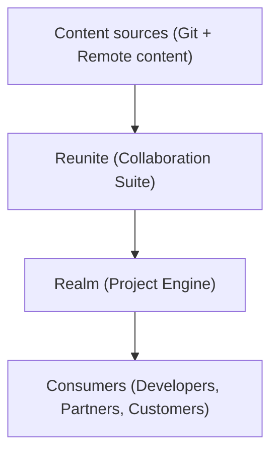
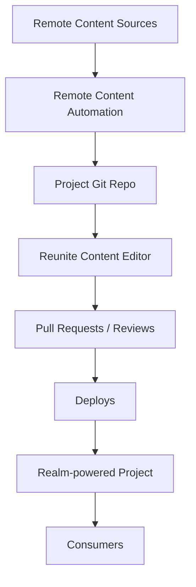

# Reunite + Realm system overview

Reunite and Realm work together to help you author, review, and publish world-class developer portals and API documentation.

This page provides an overview of how the system works — and how the different parts fit together.

## How it works

At a high level:

- **Reunite** is where publishers work: writing content, reviewing changes, and deploying Projects.
- **Realm** powers the runtime and delivery of the Project — the experience your developers, partners, and customers see.

## Content flow

- Remote content and Git content are combined via **Reunite**.
- **Reunite** manages pull requests, reviews, and deploys.
- **Realm** builds the Project for your consumers.

## Reunite workspace

The **Reunite** collaboration suite includes:
- Content editor
- Pull requests & reviews
- Deploys
- Scorecards
- Feedback
- Respect Monitoring
- Compliance reports
- And more...

## Integrations

You can connect to external systems:
- Git providers (GitHub, GitLab, Bitbucket, Azure DevOps)
- CI/CD pipelines
- Analytics and API operations platforms
- Remote content sources (Git-based or URL-based)

## Access management

Role-based access control (RBAC) applies to:
- Reunite workspace
- Projects
- Individual content pages
- Navigation elements
- API operations
- Granular bits of content

## Next steps

- [Get started with Reunite](./get-started/start-reunite-editor.md)
- [Structure your project](./author/concepts/project-structure.md)
- [Customize your branding](./style/concepts/styling.md)
- [Set up integrations](./setup/how-to/git-providers/connect-git-provider.md)