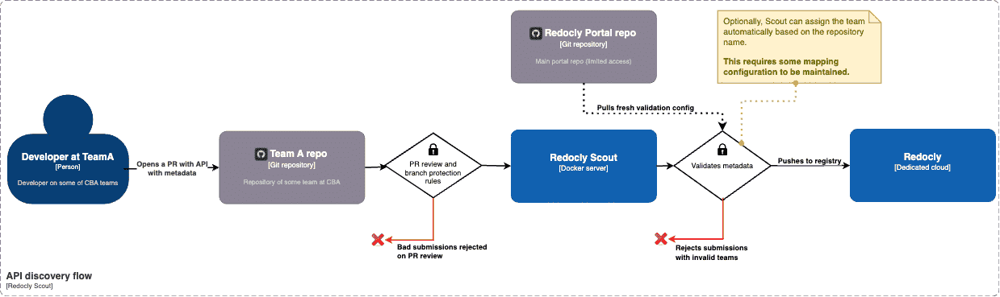

# API inventory

API discovery finds new APIs.
API inventory keeps a record of the API along with corresponding classification.

Scout is a near-stateless agent that interfaces with Git source control and Redocly to discovery new APIs, classify them, and add them to an API catalog.

## Onboarding a new API

Scout makes it easy to onboard a new API.

A developer adds an API spec file with corresponding classification metadata into any repository.
When the developer opens a pull request, Scout receives a webhook and discovers it.
Scout validates the metadata to classify it, and adds it to the API catalog.

The process of adding a new API is seamless to a developer.

If the developer entered incorrect metadata, then the developer receives automated feedback in the pull request to inform them of the metadata problem.

If the developer is part of a new team or providing any classification that is not already part of the acceptable schema, Scout reports the pull request as having a metadata problem.

In this case, it may require an API governance administrator to adjust the metadata schema to allow additional values such as a new team.
