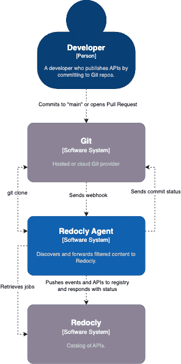

# What is Scout?

Scout finds APIs, enforces customizable API classification, and forwards only relevant data (least privilege principle) to Redocly.

The key benefits of Scout:

- Identifies shadow data.
- Automates API catalog updates.
- Makes compliance a breeze.
- Efficient because it integrates directly with Git source control.
- Shift left to catch problems fast before they are costly.

## How does Scout work?

Scout runs as an agent either from Redocly's cloud or inside of your infrastructure.

## Why Scout?

The key goal of Scout is to make APIs easier to discover, classify their APIs, in order to help organizations embrace platform-thinking in their API initiatives.
Scout reduces time-to-launch an API catalog dramatically by automating data ingestion while enforcing data integrity.
