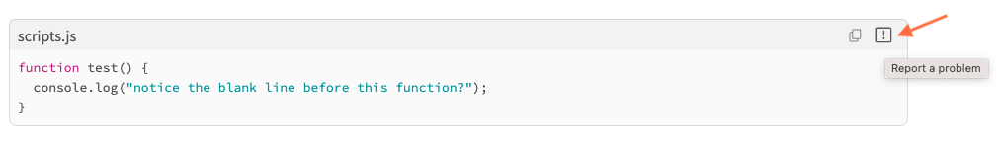
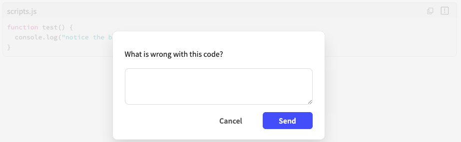
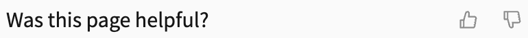
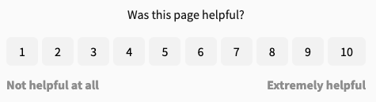
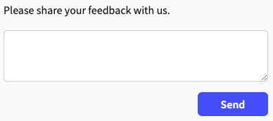

# Feedback

As part of the default theme, Realm includes built-in configurable forms you can use to collect feedback from your users.
All Markdown pages include a feedback form at the bottom of the page by default.
All OpenAPI API reference documentation includes a feedback form at the bottom of each endpoint by default.

Also, by default all sample code snippets include a report icon users can select to report an issue about the sample code snippet using a feedback form.
The [report icon](../../author/how-to/configure-code-snippets.md) and [feedback forms](../../setup/how-to/feedback/index.md) can be hidden or customized.

Users can use these forms to send you information about their experience with that page's content.
You can [view and export the collected feedback data](../how-to/feedback/view-export-data.md) by project on the **Feedback reports** page.

## Report icon

Every code snippet includes a report icon in the top right corner, next to the copy icon.

Users can select this icon to display a modal with a feedback form they can submit.

You can [hide or customize the report icon](../../author/how-to/configure-code-snippets.md#configure-codesnippet-icons) and the [feedback form modal it displays](../../author/how-to/configure-code-snippets.md#configure-report-options), globally in the `redocly.yaml` file or by page in the Markdown front matter.
The specific code snippet and the message the user enters in the feedback form is collected and displayed on the **Feedback reports** page.
See [Feedback data](#feedback-data) for more information.

## Form types

The default project theme includes multiple feedback forms that collect different types of data, depending on your needs.

The default theme includes the following feedback form types:







- Description {% width="40%" %}
- Image

---

- - Includes a question or statement with a thumbs-up and thumbs-down icon.
  - This is the default feedback form and displays without configuration.
  - Users can express either a positive or negative reaction to the page.

- 

---









- Description {% width="40%" %}
- Image

---

- - Includes a question or statement with a smiling-face, neutral-face, and frowning-face icon.
  - Users can express a positive, negative, or neutral review of the page.
- 

---









- Description {% width="40%" %}
- Image

---

- - Includes a question or statement with five star icons.
  - Users can rate a page from one to five stars.
- 

---









- Description {% width="40%" %}
- Image

---

- - Includes a question or statement, left-hand side and right-hand side text labels, and buttons for numbers 1 - 10.
  - Users can rate a page from one to ten.
- 

---









- Description {% width="40%" %}
- Image

---

- - Includes a text label and text input.
  - Users can use the text field to express their thoughts about the page in a free-form way.
- 

---







## Form settings

You can customize various aspects of the feedback form including the following settings:

- **form type:** the type of form displayed, such as `sentiment`, `mood`, `rating`, `scale`, and `comment`
- **label text:** the statement or question displayed with the feedback form icons, buttons, or text field
- **submit text:** the message that displays after users submit their feedback
- **additional settings:** additional ways for users to provide feedback after submitting the initial feedback form with one of the following options:

  - `reasons`: Select to display an additional question or statement with either a set of checkboxes that offer multiple options and users can select multiple answers or a set of radio buttons that offer multiple options but users can select only one answer.
  - `comment`: Select to display an additional question or statement with a text field for free-form answers.

You can also [hide the feedback form](../how-to/feedback/index.md#hide-feedback) on all pages or on select pages.

## Form configuration options

Configuration of the `feedback` option added to the `redocly.yaml` file updates all pages globally.
You can also configure the `feedback` option for individual Markdown pages in the front matter.
Front matter configurations take precedence, but if an option's setting is not configured in the front matter but is configured in the `redocly.yaml` file, it applies.

Configuration for the `feedback` option must be added under the `openapi` or `graphql` property for API reference documentation pages

## Feedback data

The data collected from the feedback form and `codeSnippet` report option is saved by project.
You can view the data on the **Feedback reports** page.
The **Feedback reports** page includes a table that displays the data in the order of when it was collected.

The **Feedback reports** table includes the following information:

- The **Page** where the feedback form is located.
- The **User** email of the person who submitted the feedback form.
- The **Value** the user submitted for the page.
  

  
The value differs depending on the feedback form type.

    - **Rating:** a star icon and number out of 5
    - **Scale:** a trophy icon and a number out of 10
    - **Sentiment:** a thumbs-up icon and Like or a thumbs-icon and Dislike
    - **Mood:** a smiling face and Satisfied, frowning face and Unsatisfied, or neutral face and Neutral
  

    

    
The value is also color-coded.

      - green is positive
      - yellow is neutral
      - red is negative
    

- The **Message** entered into the comment text field.
- The **Date** the user submitted the feedback form.
- The **Status** of the feedback: new, archived, or spam.

## Related how-tos

- Learn how to customize how the feedback form displays in your documentation in [Configure and view feedback](../how-to/feedback/index.md)
- Add additional options after users complete thier initial feedback selection by following the steps in [Extend the feedback form](../how-to/feedback/extend-feedback.md).
- Find out where all the data that is collected from your users is being sent and how you can view it in [View and export feedback data](../how-to/feedback/view-export-data.md).

## Resources

- Learn more about the different feedback forms available in the [Feedback reference](../../config/feedback.md).
- Discover the different ways you can customize code samples in your documentation in the [Codesnippet reference](../../config/code-snippet.md).
