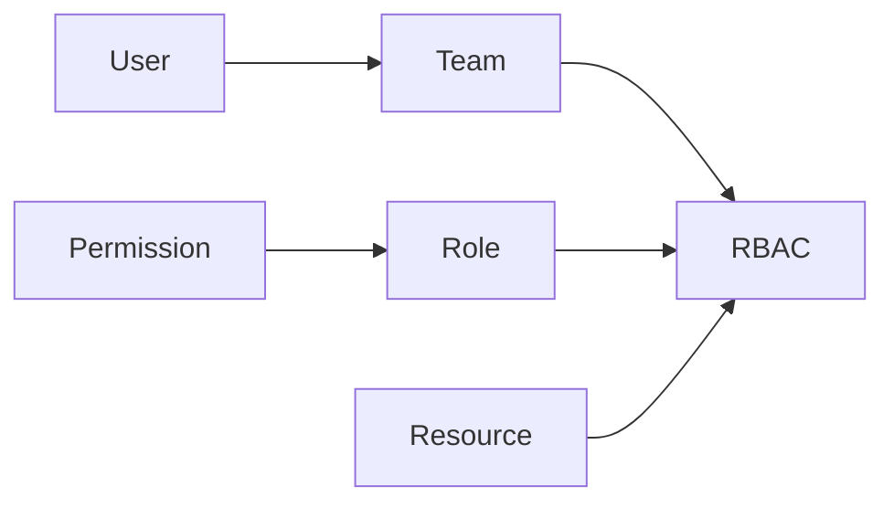

# Role-based access control (RBAC)

Role-based access control (RBAC) controls the access level granted by team membership on the files and projects in your organization.
After configuring RBAC, users are granted access to resources based on the set of permissions included in the roles assigned to the teams they are members of.
Resources are scoped using resource identifiers.

There are many components to setting up RBAC, the diagram below gives an overview of these components and how they relate to one another.



In summary, RBAC is declared as configuration. Each configuration entry describes a [resource](#resource-identifiers), and a list of [teams](./teams.md) with [role](./roles.md) assignments.
User authentication is done with [SSO (single sign-on)](./sso.md).

## Resource identifiers

When configuring RBAC, you specify access for particular resources using resource identifiers.

A resource identifier may be any of the following:

- a path to a file, for example, `docs/configuration.md`
- a route, such as, `/catalog/`
- a [glob pattern](<https://en.wikipedia.org/wiki/Glob_(programming)>), for instance, `**/*.tsx` will match all `.tsx` files recursively
- a special identifier, such as, `**`
  The `**` special identifier sets the default role for a team for any content that isn't specified as a resource identifier.

For every resource identifier, your RBAC configuration specifies a team and assigns a project role for that team, for example, `Developers: read`.
Resource identifiers define the scope for the team and role combination.

## Example configuration

The following is an example of a `rbac` configuration in a `redocly.yaml` file:

```yaml
rbac:
  reunite:
    anonymous: none
    authenticated: read
    Admins: admin
    Developers: maintain
    Writers: write
  content:
    '**':
      anonymous: none
      authenticated: read
      Admins: admin
      Developers: maintain
      Writers: write
    'docs/developer-keys.md':
      Developers: read
      Writers: read
    'docs/*.md':
      Developers: write
      Writers: write
    'public/**':
      Developers: write
      '*': read
```

In this example in the `content` option `**`, `docs/developer-keys.md`, `docs/*.md`, `**/*.tsx` are resource identifiers.
For every resource identifier, the configuration specifies a team and assigns a project role for that team, for example, `Developers: read`.
The `**` key describes the project role assignments to teams for resources that are not specified in this configuration.
For example, a user that belongs to the `authenticated` team will have `read` permission for the `index.md` file, which is not included in the three resource identifiers listed.

Assigning the `*` symbol means that a given project role is assigned to the rest of the teams that are not specified for the resource.
In the example, the `Developers` team has the `write` project role for everything under `public/`.
All other teams have `read` permission for those files.

If a resource matches with more than one pattern described in the RBAC configuration, only the rules for the best match are applied to that resource.
For example, the `docs/developer-keys.md` file matches both `docs/developer-keys.md` and `docs/*.md` entries in the RBAC configuration, but only rules from the first instance are applied.

Under the `reunite` option, it describes the project role assignments to teams for access to the project.
In this example, the `Writers` team has a `write` project role and can contribute or write comments on reviews.

## Related how-tos

- Use the step-by-step instructions to [configure RBAC](../how-to/rbac/index.md) in your project with additional information and examples for projects, pages, and navigation.

## Resources

- Learn more about the access that can be granted in [Roles and permissions](./roles.md).
- Learn about [teams and users](./teams.md), including adding users to multiple teams.
- See full configuration details in the [`rbac` configuration reference](../../config/rbac.md).
- See the configuration options for the [x-rbac](../../author/reference/openapi-extensions/x-rbac.md) extension to control access to parts of your OpenAPI description files.
