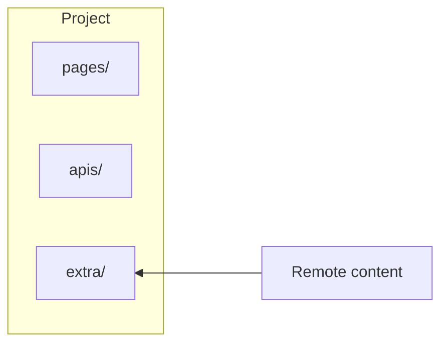

# Remote content

Remote content is a feature that copies content from other file sources into your Redocly project. Remote content enables single-source content management by allowing you to maintain content in its original location while automatically syncing it to your documentation.

Sources can be Git repositories, public URLs, or any other file sources with a way to push files to the Redocly cloud platform.

Visit the **Remote content** page in Reunite to see the remote content sources and their statuses.


Remote content differs from using a separate Git repository as the source of truth for your Redocly project.
Use remote content to bring in additional sources to add to your main project.
Read [more information about content sources](../how-to/git-providers/connect-git-provider.md).


The following diagram shows how a remote content source fits into your Redocly project:



In this example, `extra/` is the **mount folder**.
The contents of the mount folder are copied from the remote content source whenever it updates.
Make changes to the remote content source rather than in this directory in the project.

## Mount folder

The mount folder or mount point is where the remote content is placed relative to the root of your repository. When you use the **New remote folder** command, you create a folder that serves as the mount point for the remote content.

For example, adding a remote folder to `docs` and naming it `openapi`, creates a remote folder the contents of which are pulled into your Reunite project from a remote location.

```treeview
├── docs/
│   └── openapi/
│       ├── index.md
│       └── translations.yaml
```


If a remote content source is created using a non-empty folder as a mount path, the existing content will be overwritten.


Restrictions on remote content folders:

- The mount path cannot be changed after creation. Create a new remote content entry and remove the existing one if you need to rename it.
- Each mount point can only contain one remote content source.


If you add a remote content folder inside of another remote content folder, Redocly overwrites the nested remote content each time the parent remote content folder is updated.
The nested remote content folder is re-created when it receives its own update.

If a nested remote content folder has the same name as a folder on the same level, it overwrites the contents of that folder each time it receives updates.


## Content sources

Add remote content from a Git repository, a publicly-available URL, or push from your own platforms to Redocly in the following ways:

* Use our [GitHub application](https://github.com/apps/redocly/) on the organization where the remote content is for the simplest setup.
* For other Git integrations, use an access token to grant Redocly access to the remote content.
* Remote file sources can be fetched by URL if the resource is publicly available.
  Use this approach to include API descriptions that are already published in your documentation.
* For projects where Redocly does not have access, use CI/CD integration to push changes to your project in Redocly.
  This approach is also appropriate if the content is in a Git repository that Redocly doesn't have any access to.

The following sections provide more information about each type of content source.

### Use a Git integration

Git as a remote content source connects to and continuously synchronizes either an entire repository or a specific sub-folder in that repository.

To add remote content from Git, provide:

- Repository organization (GitHub/Azure) or namespace (GitLab)
- Repository (GitHub/Azure) or project (GitLab) name
- Branch name
- (Optional) Folder name if the content to use is in a single folder

Read the [how-to guide for setting up remote content on your provider](../how-to/remote-content/index.md).

#### Remote contents repository folder

If you select to only include a specific folder from a repository, only files listed in the folder are included in your Redocly project.
Project builds start only when a branch contains changes to the connected folder.

#### Pull requests and remote branches

When you open a pull/merge request against the branch that is a remote content source, Reunite fetches the proposed changes and performs the [_preview_ changes verification process](../reference/verify-remote-content.md#preview-changes-verification) with the branch.

When a pull/merge request is merged to the branch that is a remote content source, Reunite performs the [_production_ changes verification](../reference/verify-remote-content.md#production-changes-verification) with the new changes on that branch.

### Use a URL for a remote file

Use a URL as remote content to synchronize a **publicly-available** file with the project's repository.
To set up the URL as a remote content source, specify:

- The URL where the file is found
- The fetch frequency (from 15 mins to 12 hours), with smaller intervals for resources that change often

The file is downloaded at the specified interval and compared to the existing file revision. If the files differ, Reunite performs the [production changes verification](../reference/verify-remote-content.md#production-changes-verification) stage ("branching" does not exist in the scope of URL remotes).

Read the [how-to guide for adding remote content by URL](../how-to/remote-content/url.md) for detailed instructions.

### Push content to Redocly

CI/CD (Continuous Integration / Continuous Deployment) is a remote content configuration where you push content from another source to your Redocly project.
The responsibility for configuring and executing the pushes is with you; Redocly receives and processes the push events that are sent.

Add a CI/CD remote content source in Reunite and you will be guided through setting up either a [GitHub action](../reference/reunite-push-action.md) or a [CLI push command](https://redocly.com/docs/cli/commands/push) that you can run in your CI/CD pipeline.

When changes are pushed, if the push `--branch` and `--default-branch` values match, Reunite runs the [production changes verification](../reference/verify-remote-content.md#production-changes-verification) steps. For any other branch, the [preview changes verification process](../reference/verify-remote-content.md#preview-changes-verification) is triggered. The "auto-sync" setting does not apply to this type of remote content.

Read [how to push remote content to Redocly](../how-to/remote-content/push.md) for detailed instructions.

## Auto-sync and Auto-merge

Configure how the remote content is adopted into the Redocly project:

- **Auto-sync:** Configures the system behavior when changes are made to remote content:

  - For remote content in **Git** repositories, enabling Auto-sync creates pull requests automatically in Redocly when pull requests or branch changes are detected on the remote content repository. For changes to the default source branch for remote content, the Auto-merge rules then apply.
  - For remote content on a **URL**, a pull request is created with the updated content, and auto-merge rules apply.
  - For **pushed content**, the auto-sync setting is not used.

- **Auto-merge:** Automatically merges the pull request to the default branch if all tests pass.


For Auto-merge to work, the destination repository must not have branch protection rules that cannot be met.
Ensure there are no manual checks, required reviews, or other steps that could block Redocly from merging the changes.


## Remote content statuses

Remote content sources are listed under "Remote content" page in the project dashboard, with the status for each shown.

**In preview**: The remote content has been added to the project's non-default branch.
All subsequent remote content updates are applied in place to the same branch and pull request (as long as [Auto-sync](#auto-sync-and-auto-merge) is enabled) until the pull request with the remote content files is reviewed and merged.

**Enabled**: When the remote content files are merged to the main branch, the status is "Enabled". If Auto-merge is enabled, it takes effect at this point.

## Related how-tos

* [How to add remote content to your project](../how-to/remote-content/index.md)
* [Remote content verification processes](../reference/verify-remote-content.md) are performed automatically
* [Connect a Git remote](../how-to/git-providers/connect-git-provider.md) to source an entire project from an external repository while still using the editor and other Reunite features
