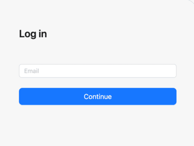

# Multi-tenant SSO: Federated identity management

In multi-tenant applications, single sign-on (SSO) setups need to accommodate various identity providers (IdPs) to let tenants “bring their own” corporate SSO configurations. Redocly supports a flexible way to enable multi-tenant SSO by allowing federated connections to multiple IdPs. This approach leverages the capabilities of the identity provider to direct each user to the correct IdP—ensuring both seamless access and improved security.

## Federated SSO for multi-tenancy

For organizations with multiple tenants, the ideal setup allows each one to connect their corporate IdP, while leaving the details of IdP selection and routing to the IdP itself. This federated SSO model simplifies authentication by offloading the work of identifying which IdP a user should use—letting popular IdPs like Okta, Microsoft Entra, Keycloak, and Ory manage the complexity.

## Heuristics to redirect users to the right IdP

When a user accesses the Redocly login screen, they enter their email address. At this point, Redocly relies on the IdP to determine the appropriate authentication path based on certain heuristics, such as the user’s email domain.
Here’s how it works in practice:
- **Initial login screen experience**: The user is presented with Redocly’s login screen, where they enter their email address.\
  
- **Redirect by IdP**:
  Using the email domain or other identifying attributes, the IdP applies its rules to route the user to the correct login page for their corporate IdP.
  If no external IdP is associated with the entered email, users are directed to a native Redocly password entry screen.

By relying on the IdP to handle this routing logic, Redocly can offer a seamless and efficient login experience without needing to manage individual tenant configurations.

## Popular identity providers approach to multi-tenant SSO routing

Many popular IdPs offer built-in features for this type of multi-tenant SSO, using various terms and configurations to accomplish it:
- **Okta**: In Okta, this is known as IdP Discovery. Okta’s IdP Discovery policies can direct users to different IdPs based on attributes like email domain, IP range, or custom logic.
- **Microsoft Entra (formerly Azure AD)**: Microsoft calls this process Home Realm Discovery (HRD). Entra uses HRD to route users based on attributes such as domain or profile properties, directing them to the correct corporate IdP.
- **Keycloak**: Keycloak also supports Identity Provider Routing and Home Realm Discovery. Administrators can configure email domain matching or use custom authenticators for more complex routing needs.
- **Ory**: Ory enables multi-tenant setups by integrating multiple IdPs and applying Identity Matching Rules to dynamically select the correct IdP based on user attributes.

## Alternatives to email domain-based routing for IdP selection

While email domain-based routing is a popular choice for multi-tenant SSO setups, it has certain limitations.
For example, it requires an additional email entry field on the login screen, usually hosted by the federated IdP, to determine the correct route.
This approach is common in SaaS applications, but other methods can also achieve seamless IdP detection without needing an email prompt.

Here are some alternative routing methods:

### IP range-based routing

IP-based routing uses the user’s IP address to identify and direct them to the correct IdP.
This approach is particularly useful in environments with distinct IP ranges for different organizations. However, it requires that IP ranges are static and predictable, which isn’t always feasible—especially in remote or hybrid work scenarios where users access from varied locations.

### Domain and path-based routing

Instead of prompting for an email, URL paths or subdomains can determine the appropriate IdP. For instance, Redocly supports routing based on the URL path, allowing it to bypass the need for email input.
Here’s how it works:
- **URL path-based routing**: At Redocly, the URL path directs users to the correct IdP when the URL provides a definitive identifier. For example, navigating to app.cloud.redocly.com/org/examplecorp would automatically redirect users to ExampleCorp’s IdP (assuming it’s configured for SSO).
- **Subdomain-based routing**: Using subdomains like examplecorp.cloud.redocly.com can also route users directly to their corporate IdP, assuming each tenant has a unique subdomain. However, subdomains have their own challenges. Each subdomain in Redocly is treated as a separate project (although multiple projects can share a single source repository). Each project also incurs server and maintenance costs, which may not scale well for organizations with numerous tenants.
Additionally, subdomain-based routing can inadvertently expose your customer base.
For example, competitive analysis tools like SimilarWeb monitor ISP traffic, which could reveal active subdomains to third parties, offering insight into your client list and traffic patterns.

### Choose the best routing approach

Each of these methods has its pros and cons, and the choice depends on the unique requirements of the tenant’s environment.
While email domain-based routing offers flexibility and is broadly compatible with most SaaS login flows, URL-based routing is an excellent alternative when direct navigation by route or subdomain is feasible.
IP-based routing, though effective in specific scenarios, may not be suitable in today’s more distributed work environments.

By understanding and exploring these options, Redocly can support diverse routing needs, providing each tenant with a seamless SSO experience while respecting their preferred authentication configurations.

## Related how-tos

- Follow steps to [Add an identity provider](../how-to/add-idp.md) in Reunite that you can use for projects and Reunite.
- Learn how to [Configure SSO](../how-to/configure-sso.md) to allow users to use multiple IdPs to log in to projects.

## Resources

- View all options for configuring SSO in the [`sso` reference documentation](../../config/sso.md).
- Read more about [SSO in Redocly](./sso.md).
