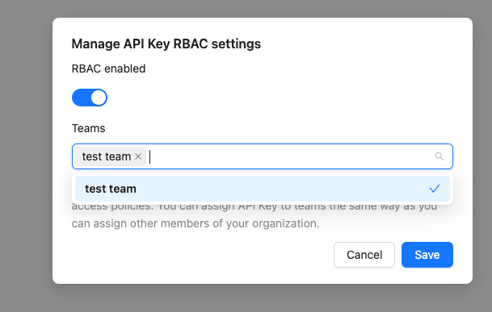

# Manage API keys

An API key is a unique identifier used to authenticate a user, developer, or an application to an API.
You can add API keys to your organization and revoke them when you are finished using them.

## Before you begin

Make sure you have the following before you begin:

- `owner` role in your organization

## Add API keys

You can add API keys to your organization if you need to access the Redocly API or the Scout tool.

To add an API key to your organization:

1. Log in to your Redocly instance.
2. Select **API keys** in the navigation menu on the left side of the page.
3. Click **New key**.
4. Enter a name for your key.
5. (Optional) Enter allowed IP addresses.
6. Click **Save**.
7. Click the copy icon to the right of the newly created API key to save it to your clipboard.
   Save the key somewhere safe, as you can't access it later.

## Revoke API keys

When you are finished using an API key, you can revoke the key, making it an invalid authentication method.

1. Log in to your Redocly instance.
2. Select **API keys** in the navigation menu on the left side of the page.
3. Click **Revoke** next to the API key you want to revoke.
4. Click **OK**.

## API keys with RBAC restrictions (beta feature)


This feature is currently experimental and may be subject to changes.


You can restrict API key access to specific teams using RBAC. When enabled, this feature limits API key access to the following endpoints:

- List projects
- Push API
- Session

To configure RBAC restrictions for an API key:

To add RBAC to API keys:

1. In your organization dashboard's left panel, click the **API keys** option.
1. In the row with the chosen API key, click **More options**  and then click **RBAC**.

1. In the **Manage API Key RBAC settings** modal, select the **RBAC enabled** toggle button.
1. In the **Teams** input field, specify which teams have access to this API key.

1. Click **Save**.

The access logic follows the same principles as standard [RBAC configuration](../concepts/rbac.md).
API keys assigned to the [Teams](../concepts/teams.md) have access to the restricted resources.
