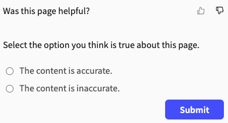
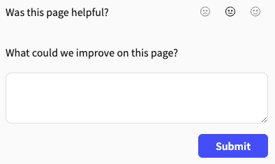

# Extend the feedback form

You can extend the feedback form to include an additional question or statement with multiple or a single answer choice or a free-form text field to submit.

## Add checkboxes or radio buttons

After users submit the initial feedback form, you can add an additional question or statement with either a set of checkboxes that offer multiple options and answers or a set of radio buttons that offer multiple options, but only one answer by configuring the `reasons` option under `settings`.

To add checkboxes or radio buttons:

1. Add the `reasons` object, under the `settings` object.
   ```yaml
   feedback:
     settings:
       reasons:
   ```

2. Add the `component` option with the value of `radio` if you want to offer users multiple options, but they can make only one choice. Otherwise, you can leave this option out to display checkboxes and offer users the ability to make multiple choices.
   ```yaml
   feedback:
     settings:
       reasons:
         component: radio
   ```
3. Add the `label` option with the value of the question or statement you want displayed above the options.
   ```yaml
   feedback:
     settings:
       reason:
         component: radio
         label: Select the option you think is true about this page.
   ```
4. Add the `items` option with the list of choices.

   ```yaml
   feedback:
     settings:
       reasons:
         component: radio
         label: Select the option you think is true about this page.
         items:
           - The content is accurate.
           - The content is inaccurate.
   ```

   The example configuration keeps the default sentiment feedback form and label text, giving users the option to select either a thumbs-up or thumbs-down icon in response to the question, "Was this helpful?"
   After selecting one of the two sentiment icons, following the statement, "Select the option you think is true about this page," users can then select a radio option for either "The content is accurate," or "The content is inaccurate."

   The following screenshot is what users see after selecting the thumbs-down icon:

   

### Add reaction specific checkboxes or radio buttons

You can also specify different options based on user reaction. This configuration is only applicable to `sentiment` and `mood` feedback form types.

1. Add the reaction name object (`like`, `dislike`, `neutral`, `satisfied`, `dissatisfied`) under the `reasons` object.
   ```yaml
   feedback:
     settings:
       reasons:
         like:
   ```

2. Follow the same steps as in [Add checkboxes or radio buttons](#add-checkboxes-or-radio-buttons) guide starting from step 2 for the specific reaction. In the following example there are specific options listed for when a user selects "like" on the sentiment form:
    ```yaml
   feedback:
     settings:
       reasons:
         like:
           component: radio
           label: Select the option you think is true about this page.
           items:
             - The content is accurate.
             - The content is inaccurate.
   ```

## Add comment form

After users submit the initial feedback form, you can add an additional question or statement with a text field by configuring the `comment` option under `settings`.

To add a comment form:

1. Add the `comment` object, under the `settings` object.

    ```yaml
    feedback:
      settings:
        comment:
    ```
2. If the initial feedback form is `rating` or `scale`, complete the following step:

    1. Add the `label` option with the value of the question or statement you want displayed with the text field, when users select their stars or number.

       ```yaml 
       feedback:
         type: rating
         settings:
           comment:
             label: Please give us your feedback on this page.
       ```

       The example configuration uses the rating feedback form with the default label text, giving users the option to select from one to five stars in response to the question, "Was this helpful?"
       After selecting their rating, following the statement, "Please give us your feedback on this page," users can then enter a free-form response into a text field.

3. If the initial feedback form is `sentiment`, complete the following steps:

    1. Add the `likeLabel` option with the value of the question or statement you want displayed with the text field, when users select the thumbs-up icon.
       ```yaml 
       feedback:
         settings:
           comment:
             likeLabel: Tell us what you like about the page.
       ```
    2. Add the `dislikeLabel` option with the value of the question or statement you want displayed with the text field, when users select the thumbs-down icon.

       ```yaml 
       feedback:
         settings:
           comment:
             likeLabel: Tell us what you like about the page.
             dislikeLabel: Tell us what you didn't like about the page.
       ```

       The example configuration keeps the default sentiment feedback form and label text, giving users the option to select either a thumbs-up or thumbs-down icon in response to the question, "Was this helpful?"
       After selecting the thumbs-up icon, following the statement, "Tell us what you like about the page," users can then enter a free-form response into a text field.
       If users select the thumbs-down icon, they can then enter a free-form response into a text field after the following alternative statement, "Tell us what you didn't like about the page."

4. If the initial feedback form is `mood`, complete the following steps:

    1. Add the `satisfiedLabel` option with the value of the question or statement you want displayed with the text field, when users select the smiling-face icon.
        ```yaml 
        feedback:
          type: mood
          settings:
            comment:
              satisfiedLabel: What did you like most about this page?
        ```
    2. Add the `dissatisfiedLabel` option with the value of the question or statement you want displayed with the text field, when users select the frowning-face icon.
        ```yaml 
        feedback:
          type: mood
          settings:
            comment:
              satisfiedLabel: What did you like most about this page?
              dissatisfiedLabel: What didn't you like about this page?
        ```
    3. Add the `neutralLabel` option with the value of the question or statement you want displayed with the text field, when users select the neutral-face icon.

        ```yaml 
        feedback:
          type: mood
          settings:
            comment:
              satisfiedLabel: What did you like most about this page?
              dissatisfiedLabel: What didn't you like about this page?
              neutralLabel: What could we improve on this page?
        ```

        The example configuration uses the mood feedback form and default label text, giving users the option to select either a smiling-face, neutral-face, or frowning-face icon in response to the question, "Was this helpful?"
        After selecting one of the three mood icons, users can enter a free-form response into a text field following a question that differs depending on the icon they selected as follows:

        - If they select the smiling-face icon: "What did you like most about this page?"
        - If they select the frowning-face icon: "What didn't you like about this page?"
        - If they select the neutral face icon: "What could we improve on this page?"

        The following screenshot is what users see after selecting the neutral-face icon:

            

## Related how-tos

- Learn how to customize how code snippets display in your documentation in [Configure code snippets](../../../author/how-to/configure-code-snippets.md).
- Learn how to customize how the feedback form displays in your documentation in [Configure and view feedback](index.md).
- Find out where all the data that is collected from your users is being sent and how you can view it in [View and export feedback data](view-export-data.md).

## Resources

- Learn more about the different feedback forms available in the [Feedback concept](../../concepts/feedback.md).
- See different configuration options and examples in the [Feedback reference](../../../config/feedback.md).
- Discover the different ways you can customize code samples in your documentation in the [CodeSnippet reference](../../../config/code-snippet.md).
