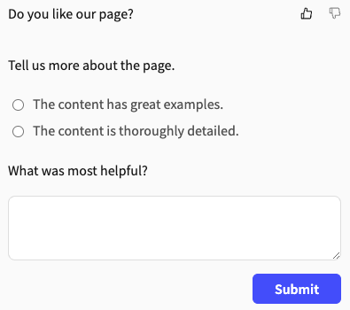

# Configure and view feedback

All GraphQL API documentation and Markdown pages include a feedback form at the bottom of the page by default.
All OpenAPI API reference documentation includes a feedback form at the bottom of each endpoint by default.
You can customize how or if a feedback form is displayed on your Markdown or API reference pages, globally or by page.
You can also:

- [Extend the feedback form](extend-feedback.md)
- [View and export feedback data](view-export-data.md)

## Before you begin

Make sure you have the following before you begin:

- a `redocly.yaml` file in the root of your project

## Configure globally

Configuration for the `feedback` option in the `redocly.yaml` file updates all Markdown and OpenAPI pages globally.
If you want your OpenAPI and GraphQL API reference pages to be different from your Markdown pages, add the configuration under the `openapi` or `graphql` property.

For example, the following configuration updates all Markdown pages to use the comment feedback form instead of the default sentiment form:

```yaml
feedback:
  type: comment
```

To change the feedback form on OpenAPI API documentation endpoints, you would use the following configuration:

```yaml
openapi:
  feedback:
    type: comment
```

## Configure by page

You can also configure the `feedback` option for individual Markdown pages in the front matter.
Front matter configurations take precedence, but if an option's setting is not configured in the front matter but is configured in the `redocly.yaml` file, it applies.

The following is an example `feedback` configuration in the front matter of a Markdown page:

```yaml
---
feedback:
  settings:
    label: Do you like our page?
    submitText: Thanks for your feedback!
    reasons:
      component: radio
      label: Tell us more about the page.
      items:
        - The content has great examples.
        - The content is thoroughly detailed.
    comment:
      likeLabel: What was most helpful?
      dislikeLabel: What can we improve?
---
```

The example configuration adds a sentiment feedback form that asks, "Do you like our page?" and offers users the ability to select either a thumbs-up or thumbs-down icon.
After selecting one of the two sentiment icons, following the statement, "Tell us more about the page," users can then select a radio option for either "The content has great examples," or "The content is thoroughly detailed."
Finally, users can enter free-form feedback into a text field under the question, "What was most helpful?" if they select the thumbs-up icon or "What can we improve?" if they select the thumbs-down icon.

The following screenshot is what users see after selecting the thumbs-up icon:



## Configure API reference pages

Configuration for the `feedback` option must be added at the top level, and for API reference pages under the specification option.

- For OpenAPI API reference pages, your configuration would start like the following example for `openapi` reference documentation:
  ```yaml 
  openapi:
    feedback:
  ```

- For GraphQL API reference pages, your configuration would start like the following example for `graphql` reference documentation:
  ```yaml 
  graphql:
    feedback:
  ```

## Hide feedback

While the `sentiment` feedback form displays by default on all Markdown and OpenAPI and GraphQL API reference pages, you can configure the form to be hidden instead.

To hide the `sentiment` feedback form on Markdown pages, add the following configuration:

```yaml 
feedback:
  hide: true
```

To hide the `sentiment` feedback form on OpenAPI API reference documentation pages, add the following configuration:

```yaml
openapi:
  feedback:
    hide: true
```

To hide the `sentiment` feedback form on GraphQL API reference documentation pages, add the following configuration:

```yaml
graphql:
  feedback:
    hide: true
```

## Related how-tos

- Learn how to customize how code snippets display in your documentation in [Configure code snippets](../../../author/how-to/configure-code-snippets.md).
- Add additional options after users complete their initial feedback selection by following the steps in [Extend the feedback form](extend-feedback.md).
- Find out where all the data that is collected from your users is being sent and how you can view it in [View and export feedback data](view-export-data.md).

## Resources

- Learn more about the different feedback forms available in the [Feedback concept](../../concepts/feedback.md).
- See different configuration options and examples in the [Feedback reference](../../../config/feedback.md).
- Discover the different ways you can customize code samples in your documentation in the [CodeSnippet reference](../../../config/code-snippet.md).
