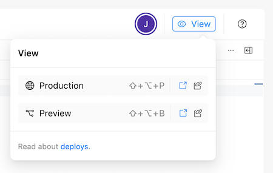
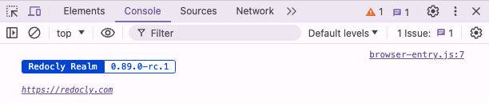

# Upgrade product version

If you are working in Reunite, your project updates automatically when new versions are released and you trigger a new build.
If you are working locally, you must update your `package.json` file to the version you want your project to use.

## Before you begin

Make sure you have the following before you begin:

- If working in Reunite, you need at least the Member role for the Organization your project has been created in.
- If you are working locally, you need [NodeJS](https://nodejs.org/en), v22.12.0 or later (alternatively -- v20.19.0 or later).
- A modern web browser such as Chrome, Safari, or Firefox.


This content applies to the following Redocly products and their corresponding package names:

- Reef = `@redocly/reef`
- Revel = `@redocly/revel`
- Redoc = `@redocly/redoc`
- Redoc + Reef = `@redocly/redoc-reef`
- Redoc + Revel = `@redocly/redoc-revel`
- Revel + Reef = `@redocly/revel-reef`

Replace package names in sample commands and JSON dependencies with the Redocly product you are using.



## Check version

Before you can decide if you want to update your version, you need to know what version your project is currently using.
You can ascertain the version your project is using with the developer tools in your browser.

To verify the version your project is using:

1. From the Reunite editor, open the preview or production build of your project in your browser, using the **View** drop-down in the top left corner of the page.

   

2. Right-click anywhere on a page and select **Inspect** or **Inspect Element**.
3. In the developer tools pane, select **Console**.
4. You should see the version displayed as in the following screenshot:

   

After you have determined what version your project is running, you can find the latest version to help you decide if you want to upgrade.

## Find the latest version

If you know what version you are running, but you are not sure if it is the latest version, you can see a list of all available versions or get only the latest version either from the [changelog](../../changelog.page.tsx) or by using npm commands.

To find the latest Realm version, use the following npm command:

`npm view @redocly/realm version`

To find a list of all available Realm versions, use the following npm command:

`npm view @redocly/realm versions`


If you are using a different product than Realm, such as Reef, Revel, Redoc, or a combination, substitute that product name in the command.
For example, to find the latest Reef version, use the following command: `npm view @redocly/reef`
See a list of product names and their corresponding packages in the [Before you begin](#before-you-begin) section.


## Run a specific version

You may need to run a specific version, instead of the latest version.
You can control what version your project runs, using a `package.json` file.

### Run a specific version locally

If you want to run a specific version, you need to add a `package.json` file to your project if you don't already have one.
You also need to install `@redocly/cli` globally and your Redocly product to your project directory.

To run a specific version working locally:

1. Add the following `package.json` file to the root of your project, replacing `realm` with the Redocly product you are using and the `*` for the version you want to run:

   ```json   
   {
      "name": "demo",
      "version": "1.0.0",
      "description": "",
      "author": "",
      "license": "UNLICENSED",
      "dependencies": {
      "@redocly/realm": "*"
    }
   }
   ```

2. Install your product to your project directory using the following command:

   `npm i`

3. Install `@redocly/cli` globally using the following command:

   `npm i @redocly/cli -g`

4. Run your project using the following command:

   `redocly preview`

5. Using your developer tools, verify the version in the console as described in [Check version](#check-version).

### Run a specific version in Reunite

If you are working in the Reunite editor, your project by default uses the most recent version, and automatically updates whenever new versions are released and you trigger a new build.
However, if you would like to use a specific version and not update automatically, you can add a `package.json` file to your project with the version listed.

To run a specific version in Reunite:

1. Create a new development branch.

   <details>
   <summary>Create a branch steps</summary>

    

   </details>

2. On the new development branch, add a new file named `package.json` by clicking the **+** icon and selecting **New file**.
3. Paste the following configuration into the `package.json` file, replacing `realm` with the Redocly product you are using and the `*` for the version you want to run::

   ```json   
   {
      "name": "demo",
      "version": "1.0.0",
      "description": "",
      "author": "",
      "license": "UNLICENSED",
      "dependencies": {
      "@redocly/realm": "*"
    }
   }
   ```

4. Commit your update.

   <details>
   <summary>Create update steps</summary>

    

   </details>

5. After the preview build has completed, open it using the **View** drop-down in the top right corner of the page.

   

6. [Check the version](#check-version).
7. To run this version in your production build, [open a pull request](../../author/how-to/open-pull-request.md), then review and [merge it](../../author/how-to/review-pull-request.md#merge-a-pull-request) with the new `package.json` file.
