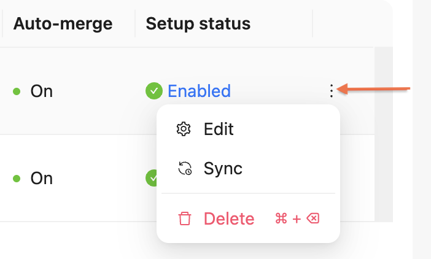

# Manually sync remote content

If you disabled [Auto-sync](../../concepts/remote-content.md#auto-sync-and-auto-merge) for your remote content, you have to sync the content manually.

## Before you begin

Make sure you have the following before you begin:

- a project in your organization in Reunite
- an existing remote content folder
- at least the [member](../../concepts/roles.md#organization-roles) role for the Organization your project has been created in

## Manually sync remote content folders

To keep your content up-to-date with changes made in the remote, you can sync the folder.

To manually sync remote content folders:

1. From the file tree of the editor, right-click the folder with remote content (remote content folders have a cloud icon), then click **Sync**. \
   OR \
   From the Remote content page, click the additional options menu on the far right side of the table on the remote content folder row, then click **Sync**. \
   \
    A window opens with the branch chosen during the remote folder setup, and the following information on the last commit to that branch:
      * the commit message
      * the user who made commit
      * the Git hash linked to a commit on the remote source
2. (Optional) You can choose a different remote branch to pull the remote content from.
    You can do this if there are issues syncing the original branch, or a different branch has the content you want to include.
3. (Optional) You can check the changes from the last commit by clicking the commit hash.
4. Click **Confirm**.



## Resources

* Learn about remote content in [Remote content](../../concepts/remote-content.md).
* Find out which remote content sources are supported and how to set them up in [Add remote files with one-way sync](./index.md).
* Change the configuration of a remote content folder in [Edit remote content folder settings](./edit-remote-content-folder.md).
