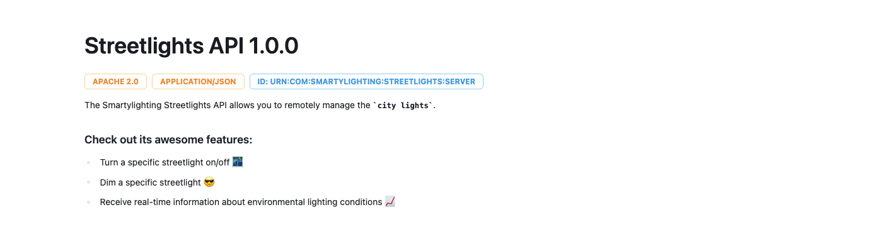
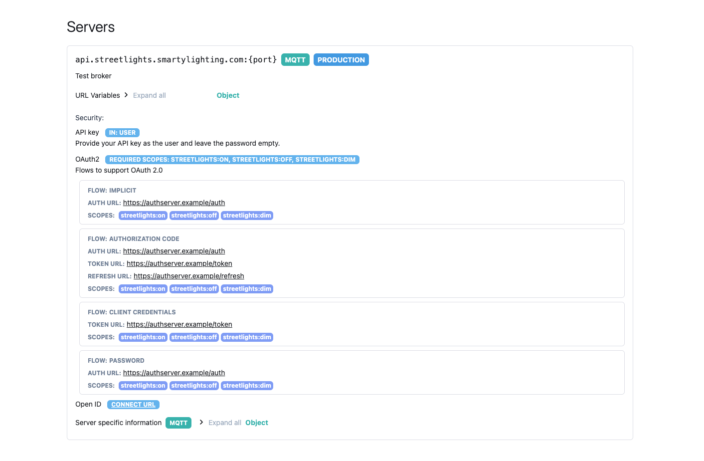
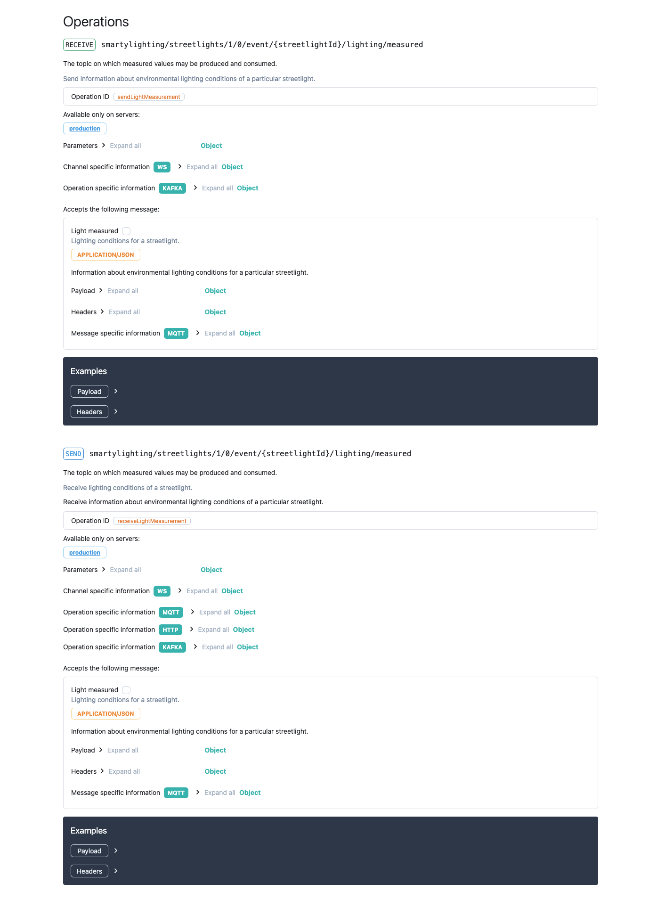
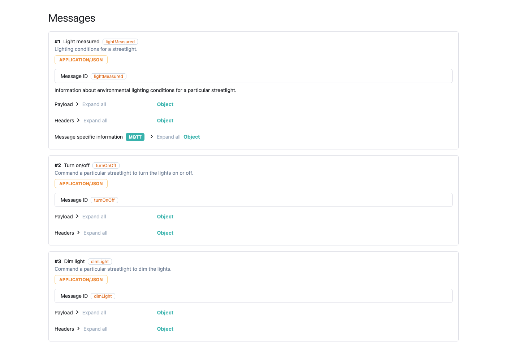
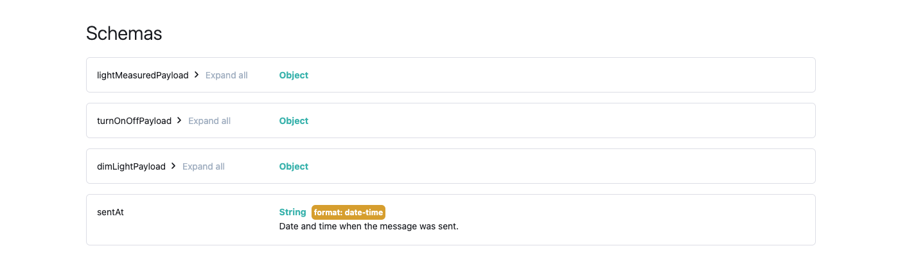

# AsyncAPI docs plugin

Render AsyncAPI documentation in a project. This plugin uses an official <a href="https://github.com/asyncapi/asyncapi-react" target="_blank">React component</a> to generate documentation for AsyncAPI 2.x and 3.x descriptions.

This is a plugin reference page. A setup guide can be found in the [How-to section](../../../../author/how-to/generate-asyncapi-docs.md)

## NPM package

`@redocly/portal-plugin-async-api`

## Introduction

When added to your project, this plugin will automatically detect AsyncAPI specifications and include them in the project as pages.
To be detected, the specification files must have a `.yaml` or `.json` extensions.

## Documentation page

The documentation page consists of multiple sections.
You can see an example of each section below:

info

servers

operations

messages

schemas

Each section can be hidden using configuration options.

## Resources

* Check out the [AsyncAPI config reference](../../../../config/asyncapi.md) page to see the different options you can configure.
* How to [generate AsyncAPI docs](../../../../author/how-to/generate-asyncapi-docs.md)
* [AsyncAPI definition examples](https://github.com/asyncapi/spec/tree/master/examples)
* [AsyncAPI docs](https://www.asyncapi.com/docs)
