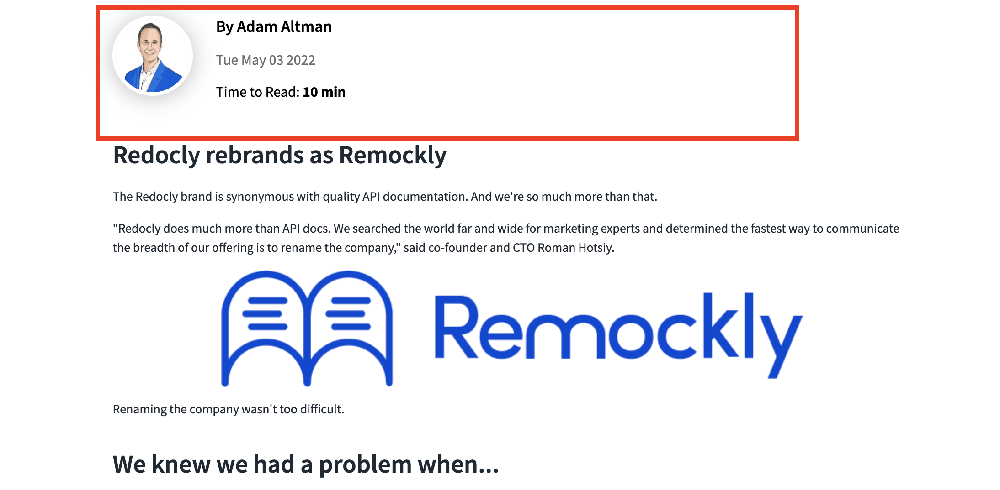
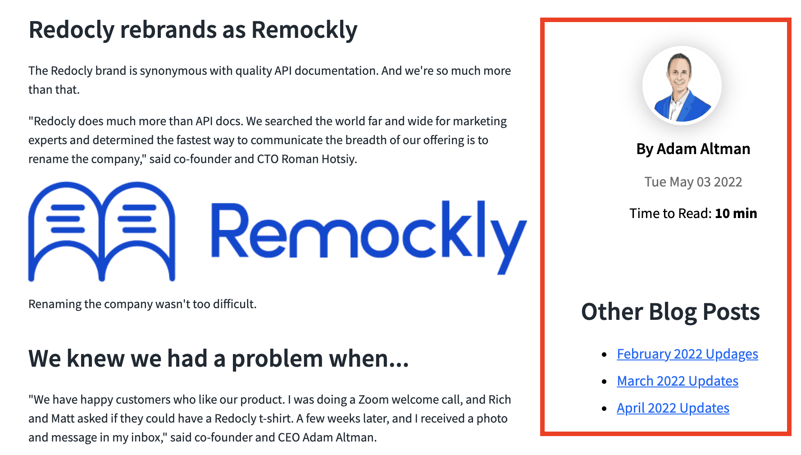

# Override a page template

Custom page templates is a feature that allows you to create more complex templates for your `.md` pages.

In the default template you have main content in the left column and Table of Content (TOC) on the right (if it's not disabled by theme config).

But there may be types of pages where you would want to display some additional metadata.

Let's consider a blog post page as an example. On that page except the text of the blog itself you may want to display:

- information about the author
- length of the article
- published date
- related articles or just newer/older articles
- list of search tags
- etc.

Also you need to know how you want to display that additional information. Here's where you can use custom page templates.

## About custom templates

A custom page template is a regular react component.

The file that defines that component should be placed within the custom theme structure (`@theme/Templates/YourTemplate`).

Below is a simplified example of a blog page template:

```jsx
import React from 'react';
import { Markdown as MarkdownWrapper } from '@redocly/theme/components/Markdown/Markdown';
import { PostInfo } from '../Blog/PostInfo';
export default function BlogPost({ pageProps, children }) {
  return (
    <Wrapper data-component-name="Templates/BlogPost">
      <PostInfo data={pageProps.frontmatter} />
      <MarkdownWrapper>{children}</MarkdownWrapper>
    </Wrapper>
  );
}
```

## How to apply custom page template

In your blog file use `template` property of frontmatter to apply custom template.

**Note:** frontmatter can be used to pass any additional data to the template. Please check out the example of blog post page.

```md
---
title: Redocly as Remockly
template: '../@theme/Templates/BlogPost'
author:
  name: Adam Altman
  avatar: https://redocly.com/static/adam-b2e77696e09f69bff10f9bc393f45249.png
date: 05-03-2022
timeToRead: 10 min
sidebar: false
---

## Redocly rebrands as Remockly

The Redocly brand is synonymous with quality API documentation. And we're so much more than that.

"Redocly does much more than API docs. We searched the world far and wide for marketing experts and determined the fastest way to communicate the breadth of our offering is to rename the company," said co-founder and CTO Roman Hotsiy.

...
```

From this example the `Redocly as Remockly` blog post will use custom template located at `@theme/Templates/BlogPost` and other data like `author`, `date`, `timeToRead`, etc. will be passed to that template in `pageProps.frontmatter` property (see example of custom template above).

### Examples

**One column template with metadata above main content**



**Two columns template with metadata on the right**


