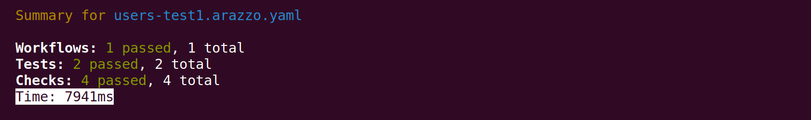

# Get started with Respect

Use this guide to take your first steps with Respect.
Learn how to log in, create a simple test description, and run the tests.

## Write your first test description

Use our handy Demo API to try Respect for the first time.

Download the OpenAPI description:

```sh
curl https://api.redocly.com/registry/bundle/testing_acme/training/v1/openapi.yaml > demo.yaml
```

This file describes some simple sample endpoints.
Respect uses the OpenAPI description to check what to expect from an API, so save the `demo.yaml` file in a known location.

Begin with a two-step test file to verify that the `demo.yaml` API operates as we expect it to:

- start with a request to list all the users
- then make another API call to fetch the first user that was returned in the collection

The following code example shows a simple test file with these two steps; copy the example and save it in `users-test1.arazzo.yaml` in the same directory as `demo.yaml`:

```yaml
arazzo: 1.0.1
info:
  title: Demo Arazzo and Respect
  version: 1.0.0
sourceDescriptions:
  - name: demo
    type: openapi
    url: demo.yaml
workflows:
  - workflowId: listAndFetchUser
    inputs:
      type: object
      properties:
        env:
          type: object
          properties:
            IMFKEY:
              type: string
              format: password # this scrubs the value from logs
    parameters:
      - in: header
        name: IMF-KEY
        value: $inputs.IMFKEY
    steps:
      - stepId: listUsers
        operationId: demo.GetUserList
        outputs:
          id: $response.body#/0/id
      - stepId: getOneUser
        operationId: demo.GetUserActivity
        parameters:
          - name: id
            in: path
            value: $steps.listUsers.outputs.id
```

The demo API needs some authentication, so the `parameters` entry at the workflow level allows us to provide an environment variable with our credentials in.

## Run the tests

Run this workflow using the following command, which includes the `IMF-KEY` environment variable used as a workflow parameter:

```bash
npx @redocly/cli respect users-test1.arazzo.yaml --input IMFKEY=abc --verbose
```


  The demo API accepts the credentials shown above so you can copy and use the command as it is.


The command runs each step of the workflow(s) in the named file in turn, and reports the outcomes.



The tool confirms that the API is performing as expected and the tests pass.
Look more closely at the Arazzo file, and then the output of the test run in verbose mode.

**In the Arazzo file**:

1. The first step lists an `output` called `id` which grabs the first item in the response array and saves the `id` field from there.
1. The second step uses that value as a parameter with the notation `$steps.[stepId].outputs.[output name]`.

**In the output from Respect**:

1. The response of the first step contains: `[{"id":"usr_abc123","badgesCount":0,"assignments":0,"activity":0}]`.
1. The request of the second step is shown as `GET /users/usr_abc123`, because it uses the data returned by the first step

Using outputs of one API request as inputs to another is a very powerful feature of Respect, and opens up new possibilities of API testing.

## Next steps

You are ready to start trying Respect out yourself or learning more about the tool and about Arazzo:

- [Learn about Arazzo](../../learn/arazzo/what-is-arazzo.md)
- The official [Arazzo specification](https://spec.openapis.org/arazzo/v1.0.1.html) reference.
- View the [Respect command reference](/docs/respect/commands/respect) to find out what else you can do.
- Try to edit and expand on the example you created in this guide, creating workflows for your own APIs.
