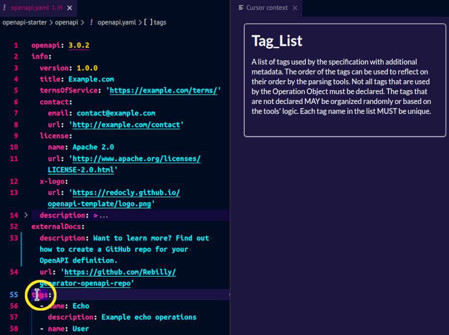

# Interactive forms and context-aware help for OpenAPI authoring

To help you write valid, specification-compliant API definitions, the Redocly OpenAPI VS Code extension provides dynamic descriptions of OpenAPI features in the cursor context panel.

Access the cursor context in any of the following ways:

- Select the **Open cursor context** button in the upper right section of your VS Code window.

- Open the *Command Palette*, start typing `redocly`, then select **Redocly OpenAPI: Open cursor context**.

Both actions open the *Cursor context* panel.

As you place your cursor into different sections of your OpenAPI document, the context-aware descriptions in the panel change to match the exact object or property you're editing.

For supported sections, the *Cursor context* panel can also display a visual editor where you can change the contents of your API definition through interactive forms.

Depending on the selected section in the OpenAPI document, the *Cursor context* panel may show triple bar ("hamburger") icons to the left of each input field in the visual editor.
Use these icons to change the order of fields in the panel.
To reorder a field, select the triple bar icon next to it, then drag it up or down in the panel.

To exit, close the *Cursor context* panel. You can open it again at any point.

