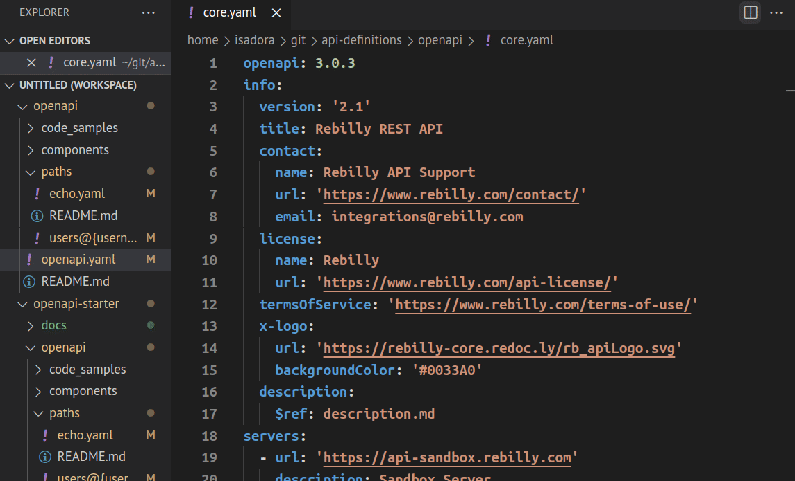

# Redocly OpenAPI VS Code extension

Redocly OpenAPI is a [Visual Studio Code](https://code.visualstudio.com/) extension that helps you write, validate, and maintain your OpenAPI documents.
It warns about errors in OpenAPI definitions and lets you quickly access referenced schemas or open the files that contain them.
The extension works with OpenAPI 2.0 and 3.0 definitions, and has basic support for OpenAPI 3.1.

**Feature highlights:**

- Validate your OpenAPI definitions
- Quickly preview and access referenced schemas
- Work with multi-file definitions
- Preview API documentation side-by-side with your OpenAPI definition
- Access context-aware help about OpenAPI features
- Edit API definitions through interactive forms

## Requirements and limitations

- The extension requires a `redocly.yaml` configuration file in your VS Code workspace. Read how to create it [in the Configuration section](configuration.md).

- Note that the extension only works with YAML files. Validation for JSON files is supported starting with version 0.2.0 of the extension.

- An API key from Redocly is required to use the live documentation preview feature in the extension.

- Functionality of the extension may be affected by some limitations of the VS Code editor. So far, we have identified these limitations:

  - Special characters `/`, `$` and `#` do not trigger VS Code suggestions
  - VS Code doesn't suggest values while inside a snippet

## Quickstart

To start using Redocly OpenAPI in your VS Code editor:

1. [Install the extension](installation.md).

2. Create the `redocly.yaml` [configuration file](configuration.md) or let the extension auto-generate it for you.

3. Open an existing OpenAPI document in VS Code, or [create a new one from the template](using-redocly-vscode.md).

4. Relax while the extension validates your OpenAPI documents automatically!

## Debug common problems

If you suspect the extension is not working properly, make sure the following conditions are true:

- the extension is enabled in the current VS Code workspace (or globally),
- a non-empty `redocly.yaml` configuration file exists in the root directory of your workspace,
- your API definition file is in the YAML format.

### Known issues

- Interactive forms are supported only for `info`, `server`, and `externalDocs` sections in the current version.

- Autocompletion support is limited in the current version.

- The `redocly.yaml` file must be saved to disk (Ctrl+S) for changes to apply.

### How to report issues

If you encounter issues with the extension that you're not able to resolve, report them in our [Redocly VS Code GitHub repository](https://github.com/Redocly/redocly-vs-code/issues/new/choose).

The [Contributing guide](https://github.com/Redocly/redocly-vs-code/blob/main/CONTRIBUTING.md) in the repository contains detailed guidelines for reporting issues.
