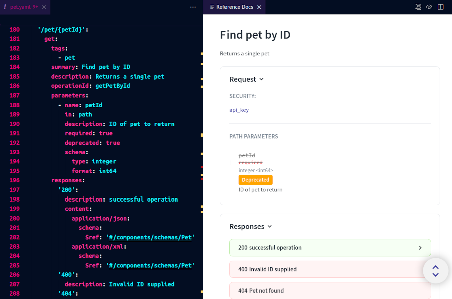

# Live API documentation preview

The Redocly OpenAPI VS Code extension relies on [Redocly API docs](https://redocly.com/reference/) to generate a preview of the API documentation based on the OpenAPI document you're editing.
With this feature, you can view the OpenAPI source and the corresponding API documentation side-by-side.
When you save a change to your OpenAPI definition, the documentation in the preview panel is automatically updated.

Access the documentation preview in any of the following ways:

- Select the **Open preview** button in the upper right section of your VS Code window.

- Open the *Command Palette*, start typing `redocly`, then select **Redocly OpenAPI: Open preview**.

Both actions open the *Preview* panel.

You can authenticate with Redocly by clicking the **Login** button in VS Code or by running `npx @redocly/cli@latest login` in your terminal.
Documentation previews are then enabled for all your workspaces.

In the tab bar above the panel, select the name of the YAML file for which you want to preview the documentation.
If you have defined custom names in the `apis` section of the `redocly.yaml` file, those names are used in tabs instead of full file names.
Selecting a name loads the API documentation preview for the API definition.



To customize the documentation preview, add [supported API docs configuration options](../../docs-legacy/api-reference-docs/configuration/functionality.md) to the `theme.openapi` section in your `redocly.yaml` file.

For example, to hide the logo image and change the font size and color, you could add the following:

```yaml
apis:
  main:
    root: path/to/your-openapi.yaml
  test:
    root: path/to/another-openapi.yaml

extends:
  - recommended
theme:
  openapi:
    theme:
      colors:
        text:
          primary: "#FF0000"
      typography:
        fontSize: 16px
```

Remember to save the `redocly.yaml` file for changes to apply.

To exit the documentation preview, close the *Preview* panel. You can open it again at any point.

To log out of your Redocly account, run the following command in your terminal: `npx @redocly/cli@latest logout`.
