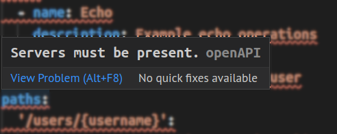
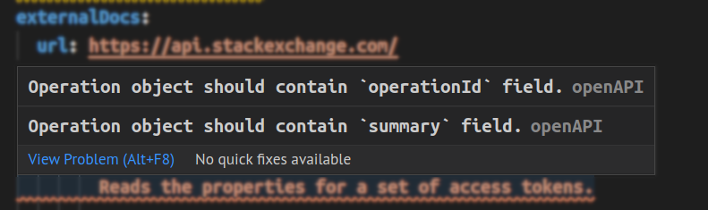
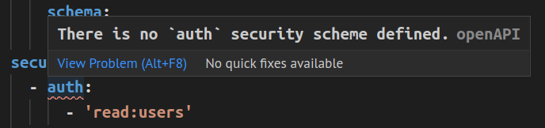
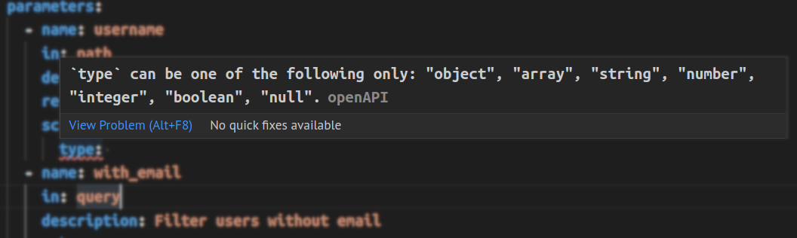
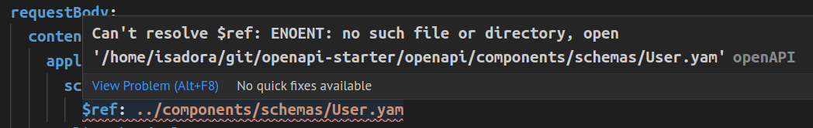

# How to use the Redocly OpenAPI VS Code extension

The Redocly OpenAPI VS Code extension helps you create and update OpenAPI documents.

To start using it, either create a new OpenAPI definition or open an existing one in your VS Code editor.

## Default OpenAPI template

If this is your first time working with OpenAPI definitions, you can use our default template to get started.

Create an empty YAML file and open the *Cursor context* panel.
In the panel, select **Add template**.
The extension automatically populates your empty YAML file.
Save the changes to the file, and now you have a fully functional OpenAPI definition.
You can make changes to it to test the extension, to learn more about the OpenAPI structure, or to design your own API.

## OpenAPI structure autocompletion

The extension provides a guided approach to OpenAPI authoring with the autocomplete feature.
To make use of this feature, create a new, empty YAML file.
As you start typing `openapi` at the top of the file, the extension will automatically offer suggestions for OpenAPI definition elements [according to the specification](https://github.com/OAI/OpenAPI-Specification).

Select a suggestion from the list.
The extension will automatically generate the fields supported by the selected OpenAPI section.
You can then add your values for each of the fields.

## Value autocompletion

Starting with version 0.2.0, the extension supports value autocompletion for references (`$ref` fields).

To use this feature, your OpenAPI document must have `components` with a proper type defined. For example, the extension will only suggest values for `$ref` inside `requestBody` if you have `components` defined in `requestBodies`. Similarly, it will only suggest values from `schemas` for `$ref` fields inside `schema`.

Autocompletion for `example` and `default` fields will suggest values you have previously defined in `enum` on the same level.

The extension will also show suggested values for all other fields that have a predefined set of values according to the OpenAPI specification (like `required`, which has `boolean` type; or `type`, which must be one of `array | object | number`) and that are supported by [Redocly CLI](../cli).

## Dynamic OpenAPI validation

The extension continuously validates the OpenAPI definition you're working on.
Depending on the rules you've added to your `redocly.yaml` file, the extension will warn you about the following issues:

- indentation
- incorrect type usage
- wrong paths to referenced files
- missing or undefined fields and sections
- and more

Here are some examples illustrating different types of issues and how Redocly OpenAPI points them out.

**Missing fields and sections**

**Undefined sections**

**Type usage**

**Wrong path to referenced file**

## Quick navigation

When you use references in your OpenAPI definition, the extension will validate them and warn you if they are incorrect (for example, if the path to a schema in a separate file is incorrect).

Right-click on any `$ref` value to access additional navigation options: **Go to Definition** and **Peek**.

Selecting **Go to Definition** opens the referenced item in a new VS Code tab (if it's a separate file) or takes you directly to the section where it's defined (if it's in the same file).

Selecting **Peek > Peek definition** opens an inline preview of the referenced item within the current VS Code tab.

