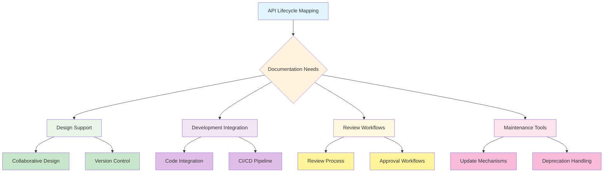
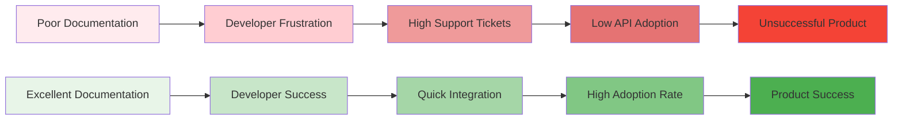
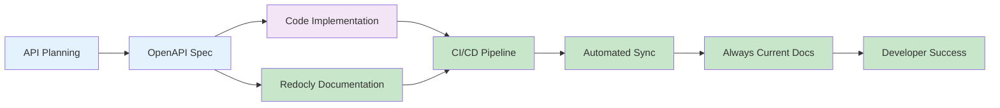

# How to choose an API documentation tool

In the competitive world of APIs, usable documentation can make the difference between enthusiastic adoption or frustrated abandonment.

As APIs become more complex, selecting the right documentation tool is both a technical decision and a strategic investment in your product's success. Somewhat like choosing the right translator for an international business negotiation, your API documentation tool needs to accurately communicate your API's capabilities while creating as seamless an experience for developers as possible.

## Documentation Tool Decision Factors


> **Platform Perspective**: Modern documentation solutions go beyond simple tools to provide integrated platforms that support the entire API lifecycle. For example, comprehensive platforms offer capabilities for discovery and governance, collaborative design, reference documentation generation, and developer onboarding—all working together as a unified system.


## TL;DR: What You'll Discover
Great API documentation is more than a nice to have and it's often the difference between adoption and abandonment. In this guide, we explore how the right documentation tool can improve the developer experience while saving your team time and effort. Let's explore:

- Why specialized documentation tools dramatically outperform generic solutions for APIs
- Four critical capability areas that separate adequate tools from exceptional ones
- How modern documentation tools can integrate seamlessly with your existing development workflow
- The hidden cost factors that make "build vs. buy" decisions more nuanced than they first appear
- Real-world examples of how thoughtful documentation transforms developer onboarding and adoption

Whether you're just starting your documentation journey or looking to upgrade your existing solution, this article will help you make an informed decision that balances immediate needs with long-term benefits.


## Key Takeaways
After reading this article, you will be able to:
- [Explain the value of proper API documentation and why specialized tools are necessary](#why-an-api-documentation-tool)
- [Evaluate documentation tools across four essential capability areas: authoring, theming, publishing, and collaboration](#features-to-consider-when-choosing-an-api-documentation-tool)
- [Assess how documentation tools handle complex OpenAPI features like discriminators and schema composition](#authoring)
- [Make informed decisions about build-vs-buy for your documentation toolchain](#choosing-an-api-documentation-tool-you-dont-have-to-diy)
- [Establish effective maintenance and update workflows for your API documentation](#publishing)
- [Implement best practices for measuring the effectiveness of your documentation](#how-do-i-measure-the-effectiveness-of-my-api-documentation)

## Why an API documentation tool?

Imagine building an elaborate machine but providing only a single-page instruction manual. No matter how powerful your API is, without comprehensive documentation, developers will struggle to harness its full potential. According to industry surveys, "accurate and detailed documentation" consistently ranks as one of the top factors influencing API adoption.



Good API documentation needs to cover:

- **Your top API calls and what they do** - Like a well-organized menu at a restaurant, developers should quickly see what "dishes" your API offers
- **How calls work together** - Beyond individual endpoints, showing how they can be combined for common workflows
- **Reusable code examples** - Practical snippets developers can copy, paste, and adapt
- **Exceptions and error handling** - What happens when things go wrong and how to recover

> **Evaluation Tip**: Before committing to a documentation tool, ask for examples of documentation built with it. Examine how these examples handle errors, code samples, and authentication—these complex areas will reveal the tool's true capabilities.

However, creating good API documentation goes far beyond simply annotating your OpenAPI specification. You need a system that supports:

- **Multiple versions** - APIs evolve, and your documentation needs to reflect each release
- **Source control integration** - Documentation changes should be trackable just like code changes
- **CI/CD compatibility** - Documentation should be automatically built and deployed with your API
- **Collaborative editing** - Multiple team members need to contribute to documentation

> **Industry Insight**: In our experience working with API teams, approximately 50% of all OpenAPI descriptions are generated directly from source code annotations. This makes robust Git and CI/CD integration crucial for maintaining documentation accuracy and consistency. The right tool should seamlessly handle both manually written and code-generated OpenAPI specifications.

As Taylor Krusen noted: "One of the hardest problems when building APIs is getting the API description started. Whether you're designing a brand new API or retrofitting an existing API into an OpenAPI description, staring at a blank canvas can feel daunting."

The right documentation tool transforms this daunting task into a manageable, even enjoyable process.

## Features to consider when choosing an API documentation tool

When evaluating API documentation tools, consider these four critical areas:

| Feature Category | What to Look For | Why It Matters |
|-----------------|------------------|----------------|
| **Authoring** | Editor integration, OAS support, advanced schema support, validation and linting | Streamlines creation of accurate documentation and ensures consistency |
| **Theming** | Custom branding, responsive design, "Try it" consoles | Creates professional, engaging developer experience |
| **Publishing** | CI/CD integration, preview capability, CDN support | Ensures documentation stays in sync with API changes |
| **Collaboration** | Git workflow, SSO, feedback mechanisms | Enables team contribution and continuous improvement |

> **Decision Tip**: Create a weighted scorecard for your evaluation. Rate each tool from 1-5 in categories that matter most to your team. This approach prevents being swayed by flashy features that don't address your core needs.

> **CI/CD Priority**: When evaluating publishing capabilities, pay special attention to CI/CD integration. Since many teams generate OpenAPI descriptions from code annotations, your documentation tool should support automated builds and deployments that trigger on code changes. This ensures your documentation stays perfectly synchronized with your API implementation.

### Authoring

The authoring experience is like the kitchen of a restaurant—it's where the magic happens, but customers don't see it. However, a well-designed kitchen makes for better meals and happier chefs. Similarly, good authoring tools make for better documentation and happier technical writers.

Key authoring features to look for:

- **Editor integration** - Tools should work with popular code editors like VSCode, providing real-time validation, autocompletion, and side-by-side documentation preview
- **OpenAPI support** - Look for support for multiple versions of the OpenAPI Specification (OAS)
- **Advanced schema support** - The tool should handle complex schemas including oneOf, anyOf, and discriminator patterns
- **Git workflow integration** - Support for code-generated OpenAPI descriptions with seamless Git operations and CI/CD pipelines
- **[Configurable linting](https://redocly.com/docs/cli/guides/configure-rules)** - Real-time validation against customizable API style guides that can be enforced in both the editor and CI/CD pipeline

For example, when using the OpenAPI discriminator (which helps differentiate between different object types), your tool should make implementation straightforward:

```yaml
requestBody:
  content:
    application/json:
      schema:
        discriminator:
          propertyName: vehicleType
          mapping:
            car: ../components/schemas/Car.yaml
            truck: ../components/schemas/Truck.yaml
            motorcycle: ../components/schemas/Motorcycle.yaml
        oneOf:
          - $ref: ../components/schemas/Car.yaml
          - $ref: ../components/schemas/Truck.yaml
          - $ref: ../components/schemas/Motorcycle.yaml
```

Advanced tools like Redocly's VS Code extension provide real-time validation and smart suggestions, making complex schema designs more manageable.

As Lorna Mitchell (on the openAPI committee) stated: "The hardest part of API design can be aligning your team on a set of rules and standards. If you're new to API linting, it can be especially difficult to know where to start, or which questions to ask."

Look for tools that not only help you write documentation but also enforce standards and best practices.

> **Productivity Tip**: Documentation tools with linting capabilities can save hours of manual review. Look for tools that enforce your API standards automatically during the authoring process, catching errors before they reach production.

### Theming

The visual presentation of your API documentation significantly impacts how developers perceive your API's quality. Documentation should be an extension of your brand while maintaining high readability and usability standards.

> **Design Tip**: Rather than building a custom documentation theme from scratch, look for tools that provide a professional foundation with straightforward customization options. Most teams find the optimal approach is to start with a polished template and apply brand-specific adjustments.

### Flexible theming capabilities

A good API documentation tool should offer flexible theming options that let you align with your brand without requiring extensive custom development. Look for these key capabilities:

- **Custom CSS support** - The ability to override default styles with your own custom CSS
- **Color schemes** - Support for both light and dark modes, with the option to customize the color palette
- **Responsive design** - Documentation that looks good on all devices, from desktop to mobile
- **Custom fonts** - The ability to use your brand's typography
- **Logo customization** - Easy integration of your logo, potentially with different versions for light/dark modes

For example, with [Redocly's theming capabilities](https://redocly.com/docs/realm/style/reference/css-variables/component), you can apply custom styling to specific elements using the built-in CSS variables and targeting actual rendered components:

```css
/* Example: Custom styling for API method labels */
[data-testid="http-method"] {
  color: var(--text-color-primary);
  border-radius: var(--border-radius);
  padding: var(--spacing-xs) var(--spacing-sm);
  transition: all 0.2s ease;
}
[data-testid="http-method"]:hover {
  color: var(--bg-color);
  background-color: var(--text-color-primary);
  box-shadow: var(--bg-raised-shadow);
  transform: translateY(-1px);
}

/* Example: Custom styling for request/response examples */
[data-component-name="CodeBlock"] {
  background-color: var(--panel-samples-code-block-bg-color);
  border: 1px solid var(--border-color-primary);
  border-radius: var(--border-radius);
  padding: var(--spacing-md);
}

/* Example: Custom styling for schema property names */
[class*="styled__PropertyName"] {
  color: var(--text-color-primary);
  font-family: var(--font-family-monospaced);
  font-size: var(--font-size-base);
}

These variables automatically adapt to light and dark modes, ensuring consistent styling across your documentation. You can also override these variables to match your brand's design system.

### Practical styling approaches

When customizing Redocly documentation, there are several effective approaches:

**1. Using CSS Variables**
Redocly provides a comprehensive set of CSS variables that you can override to maintain consistency:

```css
:root {
  --redocly-primary-color: #your-brand-color;
  --redocly-secondary-color: #your-secondary-color;
  --redocly-font-family: 'Your Brand Font', sans-serif;
  --redocly-border-radius: 8px;
}
```

> **CSS Variables Reference**: For a complete dictionary of Redocly's built-in CSS variables specific to API documentation components, such as dropdowns, response panels, and schema properties, refer to the [CSS variables documentation](https://redocly.com/docs/realm/style/reference/css-variables/component) in our developer resources.

**2. Targeting Specific Components**
Use browser developer tools to identify the actual selectors for components you want to customize:

```css
/* Hide specific panels */
[data-testid="panel-overview"] {
  display: none;
}

/* Customize API headers */
[class*="styled__ApiHeader"] {
  background-color: var(--redocly-primary-color);
}

/* Style specific components */
[data-component-name="Panel/Panel"] {
  border-radius: var(--redocly-border-radius);
}
```

**3. Using Redocly's Theme Configuration**
For more advanced customization, Redocly supports theme configuration files that provide structured theming options without requiring custom CSS.

> **Best Practice**: Start with CSS variables for basic theming, then use component-specific selectors for targeted customizations. Always test your styles across different browsers and devices to ensure consistency.

### Brand-consistent components

Beyond basic styling, look for tools that allow you to customize critical UI components:

- **Interactive API examples** that visually align with your brand
- **Custom code snippet styles** that improve readability
- **Navigation components** that can be customized to match your information architecture
- **Documentation landing pages** that can showcase your brand effectively

When evaluating documentation tools, request a demo or trial to test customization options with your actual brand assets. Some tools may look customizable but have hidden limitations that only become apparent during implementation.

> **ROI Tip**: When calculating the cost of a documentation tool, factor in the hidden costs of DIY solutions: ongoing maintenance, security updates, browser compatibility issues, and the opportunity cost of engineers working on docs tooling instead of product features.

A comprehensive API documentation tool should address all the areas we've discussed:
- Streamline the authoring process
- Create professional, branded documentation
- Integrate with your development workflow
- Enable team collaboration

### Publishing

Publishing documentation is like delivering a finished product to market—it needs to be reliable, consistent, and able to reach your audience effectively.

Look for these publishing capabilities:

- **CI/CD tooling** - Documentation should be automatically built and deployed when code changes
- **Git integration** - Changes to documentation should be tracked in version control
- **Environment-specific builds** - Different builds for development, staging, and production
- **Linting in build process** - Catch documentation errors before they reach users
- **Preview capability** - See how changes will look before publishing
- **CDN support** - Fast loading times globally

> **Integration Tip**: Documentation that lives separately from your code inevitably becomes outdated. Prioritize tools that integrate with your existing CI/CD pipeline so documentation updates automatically with code changes.

**Traditional Approach - Separate Documentation**

```mermaid
flowchart LR
    A1[API Planning] --> B1[OpenAPI Spec]
    B1 --> C1[Code Implementation]
    C1 --> D1[Separate Documentation]
    D1 --> E1[Manual Sync Issues]
    E1 --> F1[Outdated Docs]
    F1 --> G1[Developer Frustration]
    
    style A1 fill:#e3f2fd
    style B1 fill:#e3f2fd
    style C1 fill:#f3e5f5
    style D1 fill:#ffcdd2
    style E1 fill:#ffcdd2
    style F1 fill:#ffcdd2
    style G1 fill:#ffcdd2
```



**Modern Integrated Approach - Redocly**



A robust publishing process ensures that your documentation stays in sync with your API. For instance, using [Redocly CLI](https://redocly.com/docs/cli/commands/preview), you can preview documentation changes in real-time:

```bash
npx @redocly/cli@latest preview
```

This creates a local server that monitors your project directory for OpenAPI specification files and refreshes as you edit them, allowing for rapid iteration and immediate feedback. The command automatically detects and serves your OpenAPI files from the current directory.

### Collaboration

APIs are rarely built by a single person, and neither is their documentation. Like an orchestra, documentation requires multiple specialists working in harmony.

Important collaboration features include:

- **Git workflow support** - Track changes and manage reviews through pull requests
- **SSO integration** - Secure and streamlined access for team members
- **Feedback mechanisms** - Ways for users to suggest improvements
- **Role-based permissions** - Control who can edit what
- **[Searchable registry](https://redocly.com/reef)** - Make APIs discoverable within your organization

Teams that establish good collaboration practices see higher quality documentation and faster iteration cycles. As Lorna Mitchell noted: "We see great success from teams that make a habit of sharing information and resources with one another, ensuring everyone learns together."

## Choosing an API documentation tool: You don't have to DIY

Many teams, faced with inadequate documentation tools, resort to building their own solutions. This is like deciding to build your own car because you can't find one with exactly the features you want—it's expensive, time-consuming, and takes resources away from your core product.

> **ROI Tip**: When calculating the cost of a documentation tool, factor in the hidden costs of DIY solutions: ongoing maintenance, security updates, browser compatibility issues, and the opportunity cost of engineers working on docs tooling instead of product features.

A comprehensive API documentation tool should address all the areas we've discussed:
- Streamline the authoring process
- Create professional, branded documentation
- Integrate with your development workflow
- Enable team collaboration

Redocly has emerged as a leading solution in this space, offering both open-source tools and enterprise solutions that cover the entire API documentation lifecycle. As one user of Redocly's toolset noted: "When creating example request and response payloads, the real-time, schema-based validation felt like a superpower!"

By choosing a proven documentation solution rather than building your own, you can focus on what matters most—building great APIs and helping developers use them effectively.

[Try Redocly out today for free](https://app.redocly.com/signup)

## Frequently Asked Questions

### What is the difference between API documentation and API reference?
API documentation includes comprehensive guides, tutorials, and conceptual information about using an API, while API reference specifically describes the endpoints, methods, parameters, and responses. Good API documentation combines both elements.

### How often should API documentation be updated?
API documentation should be updated whenever there are changes to the API itself. Ideally, this should be part of your continuous integration process to ensure documentation and code stay synchronized.

### Can I generate documentation automatically from code?
Yes, many API documentation tools can generate reference documentation from OpenAPI specifications or code annotations, but you'll still need to write conceptual documentation manually. The best approach is a combination of automated generation and manual curation.

### How do I measure the effectiveness of my API documentation?
Track metrics such as API adoption rates, support ticket volume related to documentation queries, developer onboarding time, and direct feedback through ratings or comments on documentation pages.

### Should I create separate documentation for different versions of my API?
The need for separate API documentation versions depends on your versioning strategy:

For patch versions (e.g., v1.0.1 → v1.0.2) that fix bugs or security issues, separate documentation is usually unnecessary since these updates fully replace previous versions. In these cases, maintaining a single set of documentation is clearer for users.

However, separate documentation becomes crucial when you make breaking changes or evolve your API with major/minor versions (e.g., v1.0.0 → v2.0.0 or v1.1.0) that will coexist. If you allow clients to continue using previous API versions while gradually migrating to newer ones, you should maintain version-specific documentation to support users on different versions. Your documentation tool should provide version selector capabilities to help users navigate between these different versions easily.

## Additional Resources

- [Understanding the OpenAPI Specification](https://redocly.com/learn/openapi/openapi-visual-reference/)
- [API Style Guides: Creating Consistent Developer Experiences](https://redocly.com/blog/build-your-own-api-guidelines/)
- [Developer Experience: Why It Matters for API Adoption](https://redocly.com/blog/api-documentation-essentials/)
- [How to Measure API Documentation Success](https://redocly.com/gsod-casestudy/)
- [Using Redocly Tools for Better OpenAPI Development](https://redocly.com/blog/tame-openapi/)

> **SEO Tip**: Enhance your documentation pages with [Schema.org TechArticle](https://schema.org/TechArticle) markup to improve search engine visibility and display rich results.