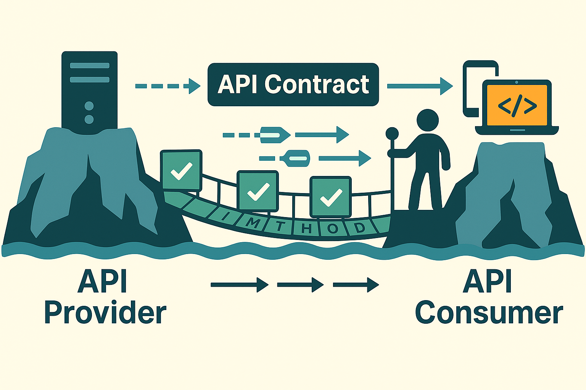
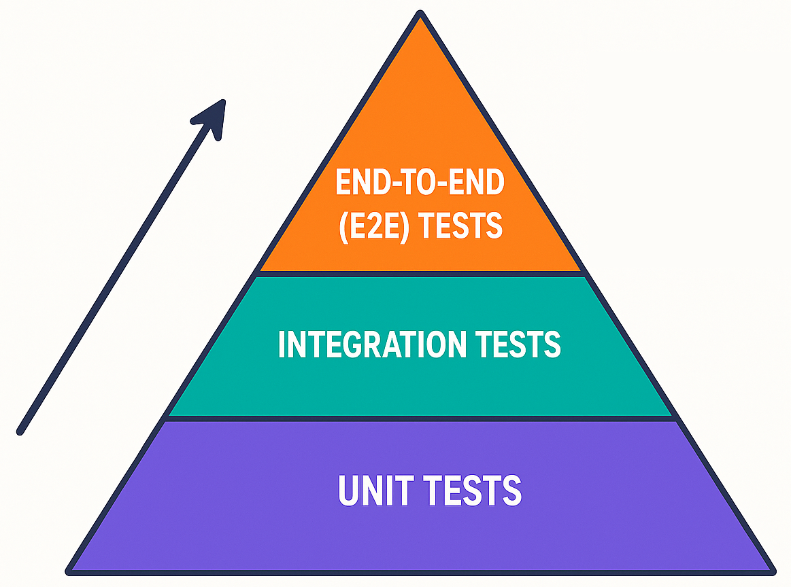
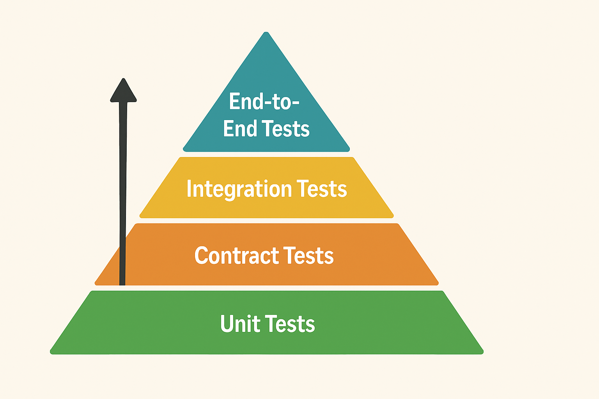
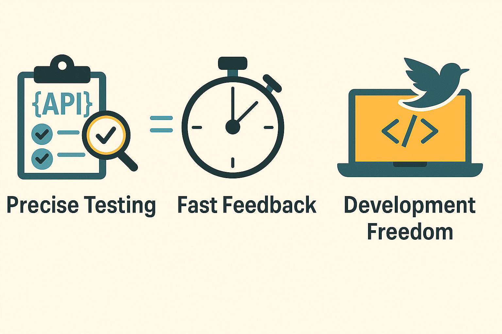
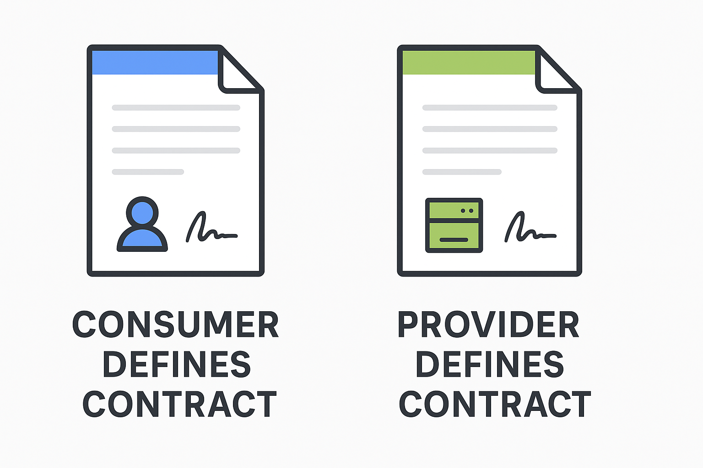
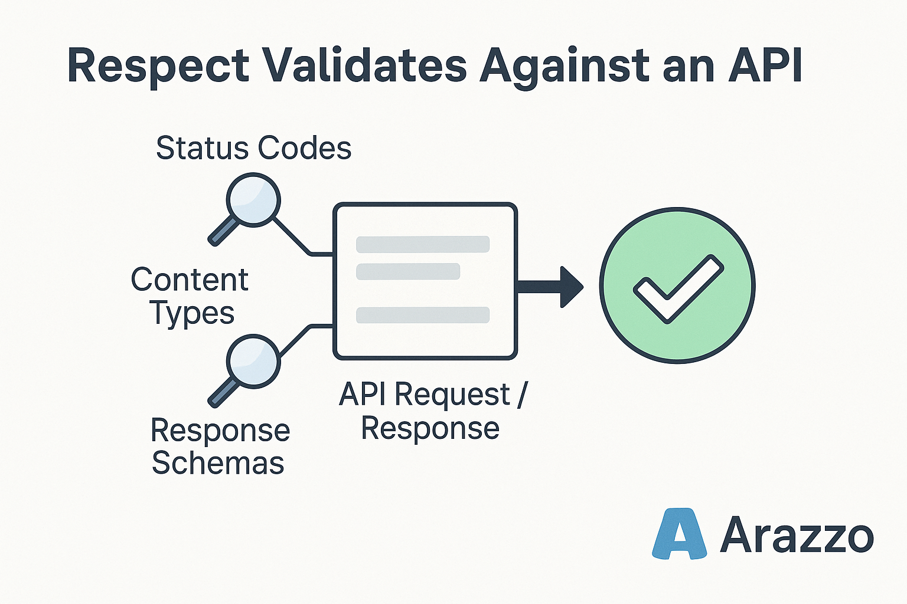

# API Contract Testing 101: Benefits, challenges, and when you need it

Picture this: Your team just deployed a new API version, and suddenly your mobile app starts crashing for thousands of users. The root cause? A subtle change in the response format that wasn't caught by traditional testing. This is exactly the kind of problem that API contract testing prevents.

## The API Testing Challenge

Modern development teams face a common challenge: ensuring reliable communication between services while maintaining development velocity. We've all been there:

* Spending hours debugging integration issues that could have been caught earlier
* Waiting for other teams to finish their services before we can test ours
* Worrying about breaking changes in shared APIs
* Running slow, expensive end-to-end tests that don't pinpoint the problem

### The Traditional Testing Pyramid

**Understanding the Traditional Testing Layers:**
* **Unit Tests**: Form the base of the pyramid. They are fast, cost-effective, and easy to maintain. These tests focus on individual components or functions in isolation.
* **Integration Tests**: Occupy the middle layer. They verify the interactions between different components or systems. These tests are slower than unit tests and require more maintenance.
* **End-to-End (E2E) Tests**: Sit at the top of the pyramid. They simulate real user scenarios to ensure the system works as a whole. These tests are the slowest and most expensive to maintain.

For years, teams have relied on the traditional testing pyramid, introduced by Mike Cohn in 2009. This model provides a hierarchical approach to testing:

* **Unit Tests** (Base): Fast, low-cost tests that focus on individual components in isolation
  * Quick execution
  * Easy to maintain
  * Great for catching logic errors
  * Limited scope

* **Integration Tests** (Middle): Verify interactions between components
  * Moderate execution speed
  * More complex setup
  * Good for catching interface issues
  * Can be flaky

* **End-to-End Tests** (Top): Simulate real user scenarios across the entire system
  * Slow execution
  * Expensive to maintain
  * Best for catching system-wide issues
  * Often brittle and time-consuming

The pyramid suggests having many unit tests, fewer integration tests, and minimal E2E tests. While this approach works well for monolithic applications, it falls short when dealing with modern microservices architectures where service boundaries and API contracts become critical points of failure.

## A Better Way: Contract Testing

Contract testing offers a pragmatic solution to these challenges. It's a methodology that ensures services can communicate reliably by validating their interactions against agreed-upon contracts. Here's what it brings to the table:

1. **Precise Testing**: Focus on what matters—the API contract
   * Verify endpoints and methods
   * Validate request/response formats
   * Check status codes and headers
   * Ensure authentication works

2. **Fast Feedback**: Catch issues early in your workflow
   * Run tests as part of your CI/CD pipeline
   * Get immediate feedback on API changes
   * Identify problems before they reach production

3. **Development Freedom**: Work independently without blockers
   * Use mock APIs for frontend development
   * Evolve backend services safely
   * Maintain development velocity

Let's dive into how contract testing works and how it can streamline your development process.

## What is Contract Testing?

API contract testing is a method of verifying that an API follows a predefined agreement, or "contract," between the API provider and API consumers. This contract defines how the API is expected to behave, including details like: 

* API endpoints and HTTP methods  
* Request and response payload structures  
* Expected HTTP status codes  
* Required headers and authentication mechanisms

When API providers make changes—such as modifying response structures or removing endpoints—contract tests immediately highlight these discrepancies. Teams get early alerts about potential issues, allowing them to address problems before impacting production environments.

Validating API contracts enables teams to confidently iterate on services, as they won't accidentally break downstream consumers or integrations.

Modern applications are often composed of multiple microservices, each interacting through APIs. Contract testing can be implemented using two primary approaches:

* **Consumer-driven contract testing (CDCT)**: Consumers define the contracts, allowing providers to validate against consumer expectations. This approach ensures that providers understand exactly what consumers need.  
* **Provider-driven contract testing**: Providers define the contracts, and consumers validate their integrations against these provider expectations. This approach gives providers more control over the API evolution.

## How Contract Testing Works in Practice

Consider an e-commerce platform with separate microservices for product catalog, user authentication, order processing, payment handling, and inventory management. When the product catalog team updates their API to include additional product metadata, several potential issues could arise:

1. The order processing service might break if it strictly validates product responses
2. The inventory management service could fail when trying to access products with the new structure

With contract testing in place:
1. The product catalog team defines the updated API contract
2. Automated tests verify that all consumers can handle the new response format
3. If any service breaks, the team is alerted before deploying to production
4. The product catalog team can work with affected teams to update their consumers

This process prevents potential outages and ensures smooth deployments even as the platform evolves.

## When to Use Contract Testing

Contract testing is particularly valuable in these scenarios:

* **Microservices Architecture**: When services need to communicate reliably
  * If one service updates its API, it can break consumers without warning
  * Contract tests catch these issues early, ensuring services remain compatible as they evolve

* **Independent Team Development**: When multiple teams work on different parts of a system
  * If separate teams manage different parts of a system, contract tests prevent miscommunication
  * The API provider can verify their implementation against the consumer's expectations, reducing surprises during integration

* **Third-Party API Integration**: When your application depends on external services
  * If your app depends on external services, contract testing helps safeguard your integration
  * You can write tests against the third-party API's schema or mock expected responses, catching breaking changes before they impact users

* **CI/CD Pipeline Integration**: When you need to catch API issues automatically
  * Running contract tests in your CI/CD pipeline lets you catch API issues automatically with every code change
  * This reduces the risk of deploying breaking changes to production

* **Evolving APIs**: When your API is actively changing or adding features
  * If your API is actively changing or adding features, contract tests help manage versioning and backward compatibility
  * You can ensure existing consumers will work as expected, even as you introduce new fields or endpoints

## Challenges of API Contract Testing

While contract testing offers significant benefits, it's not without its challenges. Here are some common obstacles teams face and strategies to overcome them:

* **Keeping tests up-to-date**:
  * **Challenge**: Small changes, like renaming a field or modifying a status code, can break consumers unexpectedly
  * **Solution**: Implement automated contract validation in your CI/CD pipeline to catch changes early. Modern tools can automatically validate your API against its OpenAPI description, alerting you to any discrepancies before they cause problems

* **Managing test environments**:
  * **Challenge**: Setting up and maintaining dedicated environments can be complex and resource-intensive
  * **Solution**: Use containerization and infrastructure-as-code to create consistent, reproducible test environments. Some contract testing tools can run against mock servers or in isolated environments, reducing dependency on complex infrastructure

* **Dealing with third-party APIs**:
  * **Challenge**: External APIs may have rate limits, unpredictable downtime, or evolving schemas
  * **Solution**: Create comprehensive API contracts for third-party services and use mock servers for testing. Look for tools that support mocking external services and validating against their schemas, allowing you to test without relying on live third-party APIs

* **Data variability and edge cases**:
  * **Challenge**: Designing test suites that cover a wide range of inputs without ballooning test complexity is challenging
  * **Solution**: Focus on contract validation rather than exhaustive data testing, and use data generation tools for edge cases. The right tools will validate your API structure and types while allowing you to define specific test cases for critical edge scenarios

* **Flaky and slow tests**:
  * **Challenge**: Network delays, inconsistent environments, or dependency issues can cause tests to pass and fail unpredictably
  * **Solution**: Isolate API tests from network dependencies and implement retry mechanisms with clear failure criteria. Choose tools that provide consistent, fast validation focused specifically on API contracts, avoiding the complexity that leads to flaky tests

By understanding these challenges and implementing the right strategies and tools, teams can maximize the benefits of contract testing while minimizing its drawbacks.

## API Contract Testing with Arazzo

Arazzo is an OpenAPI specification for testing workflows across APIs. It provides a standardized way to document and validate API interactions.

* You can use it to document workflows in a machine-readable format
* These workflows can then be run, tested, and monitored with tools like [Redocly's Respect](https://redocly.com/respect)
* Arazzo enables consistent testing approaches across different API types and environments

Redocly Respect is an API contract testing system based on OpenAPI's Arazzo. Respect sends API requests to an API server and validates that the response matches the expectations described in the OpenAPI description and in the Arazzo file. This ensures that your APIs function as expected by validating:

* Status codes
* Content types
* Response schemas against their OpenAPI descriptions

## Getting Started with Contract Testing

To implement contract testing effectively, follow these best practices:

1. **Start with a Contract-First Approach**
   * Define the API contract before implementation
   * Ensure shared understanding between providers and consumers
   * Document expectations clearly

2. **Automate Contract Validation**
   * Integrate tests into your CI/CD pipeline
   * Run validation on every code change
   * Set up automated alerts for contract violations

3. **Handle Common Challenges**
   * Keep tests up-to-date as APIs evolve
   * Use containerization for consistent test environments
   * Implement proper versioning for contracts
   * Use mock servers for consumer testing

### Redocly Respect: A Comprehensive Solution

Redocly Respect is an API contract testing system based on OpenAPI Arazzo. It's designed to ensure APIs function as expected by validating status codes, content types, and response schemas against their OpenAPI descriptions.

This proactive approach helps detect issues like unexpected status codes, incorrect content types, and schema mismatches before they impact users, thereby reducing downtime and repair time.

Respect offers:
* Automated checks
* Real-time alerts via Slack or email
* Graphical reporting to track API health over time
* Seamless integration into CI/CD pipelines
* Support for complex API sequences
* Latency monitoring
* Detection of data leaks

These features make Respect a comprehensive tool for maintaining API reliability and performance.

## Tools and Resources

When implementing contract testing, choosing the right tool is essential for success. Redocly Respect is a comprehensive API contract testing system based on OpenAPI Arazzo. Respect stands out for its ability to validate APIs against their OpenAPI descriptions, providing immediate feedback on contract violations. It offers automated checks, real-time alerts, and graphical reporting to track API health over time. With support for complex API sequences and latency monitoring, Respect helps teams maintain reliable APIs throughout their lifecycle. [Learn more about Redocly Respect](https://redocly.com/respect).

When evaluating contract testing tools, consider factors like:
* Integration with your existing development workflow
* Support for your specific API types (REST, GraphQL, etc.)
* Ease of setup and maintenance
* Reporting and visualization capabilities
* Community support and documentation

For teams working with OpenAPI specifications, Redocly Respect offers a particularly seamless experience, as it's built specifically to work with the OpenAPI ecosystem and provides comprehensive validation against your API descriptions.

## Common Questions

**Q: What's the difference between contract testing and integration testing?**
A: While both verify service interactions, contract testing focuses specifically on the API boundary and whether services adhere to their agreed contracts. Integration testing typically involves testing actual service implementations together.

**Q: Do I need contract tests if I already have comprehensive end-to-end tests?**
A: Yes. End-to-end tests validate complete workflows but are slow, expensive to maintain, and don't easily pinpoint the exact cause of failures. Contract tests provide faster feedback specifically about API compatibility issues.

**Q: How do I handle authentication in contract tests?**
A: Most contract testing frameworks support adding authentication headers to test requests. For consumer tests, you typically mock the authentication process. For provider verification, you may need to configure test users or authentication bypasses specifically for the verification environment.

**Q: Can contract testing work with GraphQL APIs?**
A: Yes, though it requires specialized approaches. Tools like Apollo's schema validation perform similar functions for GraphQL APIs by ensuring schema changes don't break existing queries.

## Next Steps

Ready to start implementing contract testing? Here are your next steps:

1. Choose a contract testing tool that fits your needs
2. Define your first API contract
3. Set up your testing environment
4. Integrate contract testing into your CI/CD pipeline
5. Monitor and refine your approach

For more information and resources:
* [Learn more about Redocly Respect](https://redocly.com/respect)  
* [See what our customers have to say](https://redocly.com/customers)  
* [Explore Redocly Respect pricing](https://redocly.com/pricing)  
* [Get started with Redocly Respect](https://redocly.com/docs/respect)

