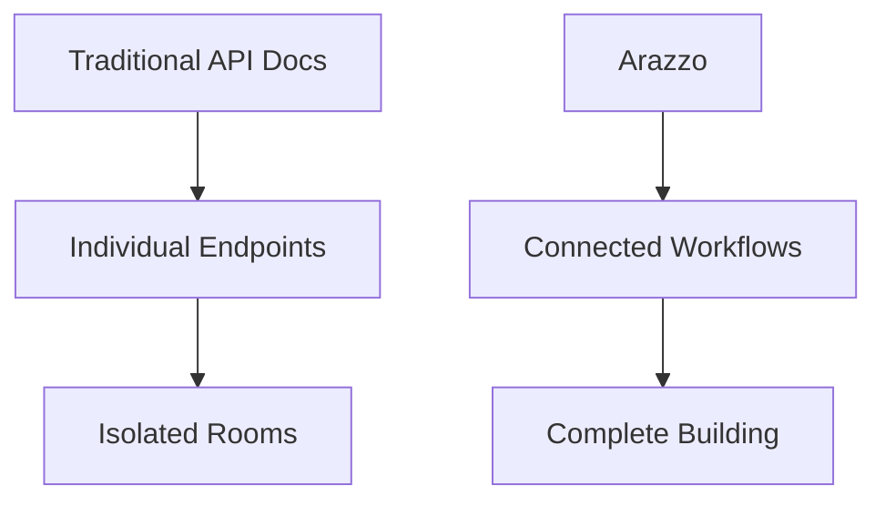
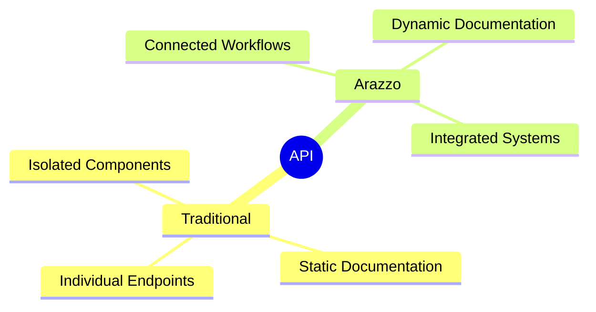
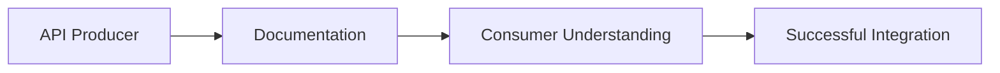
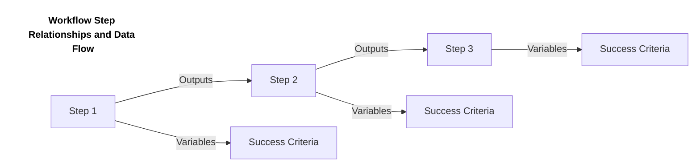
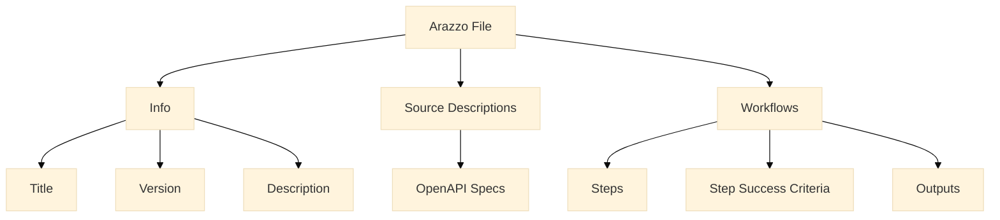

# Document workflows for multiple APIs with Arazzo

## What is Arazzo?

Arazzo is an OpenAPI specification designed specifically for expressing workflows and articulating functional use cases that span multiple APIs.

Let's step back from software for a moment and think about physical architecture. Imagine you're an architect looking at a set of blueprints. Traditional API documentation is like having detailed drawings of each individual room in a building — you can see exactly how the kitchen is laid out, the dimensions of the bathroom, or where each electrical outlet is placed.



But what if you want to understand how people actually *move* through these spaces? How do they navigate from the front door to the kitchen, then to the dining room for a meal? These movement patterns and workflows are equally important to the building's function, yet they're missing from individual room blueprints.

Arazzo fills this gap in the API ecosystem. Just as OpenAPI revolutionized how we document HTTP endpoints, Arazzo provides a standardized, machine-readable way to document complex multi-step workflows that involve multiple API calls.

The Arazzo specification enables you to:

* Document complex, multi-step workflows in a format that's both human and machine-readable  
* Increase internal knowledge of how APIs are used together  
* Create better understanding of dependencies, data flow, and business logic across APIs  
* Test complete user journeys rather than just individual API calls

But, why does this matter? Good Question\! By documenting complete API workflows that accomplish real business outcomes, Arazzo bridges the gap between technical implementation and business requirements. Product managers gain insight into how features actually work across systems, developers understand the broader impact of their code changes, and QA teams can validate that full user journeys—not just individual endpoints—deliver the promised experience, creating alignment that drives more successful (and likely faster and less error prone) product development.

Arazzo emerged from a working group formed in 2021 under the OpenAPI Initiative. Since then, it has grown from a concept into a full specification\!

At Redocly, we view Arazzo as a game-changing development for API producers. As our CEO Adam Altman shared in our [Arazzo roadmap blog post](https://redocly.com/blog/arazzo-roadmap), this approach mirrors how we've been thinking about APIs for years. Our internal product Respect (which we've made available for use) has been using a similar philosophy to test API workflows rather than just endpoints. When we discovered the Arazzo project, we recognized an opportunity to contribute to a standardized approach for workflow documentation that would benefit the entire API ecosystem.

## Why to use Arazzo

Continuing our architectural metaphor, consider what happens when a client commissions a building. They don't just want to know what each room looks like in isolation—they want to understand how the entire structure functions as a cohesive whole. How does foot traffic flow during a busy event? Where are the bottlenecks? How do service staff navigate from kitchen to dining areas efficiently?

Arazzo addresses this fundamental gap by providing a standardized way to document workflows that use multiple APIs to achieve an outcome or complete a task. Until now, API producers have been like architects handing over individual room designs without circulation diagrams:

* Using separate tools like Postman Collections to demonstrate workflow sequences (more like hand-drawn maps rather than professional circulation diagrams)  
* Creating external documentation and guides that quickly become outdated (similar to having the building's usage patterns documented separately from the blueprints)  
* Employing non-standardized approaches that aren't consistent with how people browse OpenAPI documentation (like using different scales and formats for different aspects of the building plans)



What's particularly problematic about these approaches is that they often live outside the core API documentation, creating potential disconnects between documented functionality and actual implementation. When APIs change, these external workflow documents frequently get left behind—just as revised blueprints might not get reflected in separate circulation diagrams.

By integrating workflow documentation directly alongside your OpenAPI specs, Arazzo helps:

* Improve internal and external API consumer experience (like providing both detailed room layouts AND circulation patterns in the same document set)  
* Increase understanding of what's possible with your APIs (showing not just what rooms exist, but how they're meant to be used together)  
* Support enablement, testing, and monitoring activities (ensuring the building works as designed in real-world usage)

At Redocly, we've embraced this approach because it directly addresses two critical issues:

1. It reduces the potential for mismatch between documentation and implementation (ensuring the actual building matches ALL aspects of the design)  
2. It ensures APIs are practical, runnable, testable, and monitorable from end to end (confirming people can actually move through the spaces as intended)

## How your APIs benefit from Arazzo

In architecture, there's a world of difference between a building that looks good on paper and one that functions well in reality. Similarly, Arazzo transforms your API documentation from static blueprints into a living, functional guide.

We believe Arazzo matters because it fundamentally changes how API producers think about their offerings. Before shipping an API, Arazzo documentation forces you to explain how the API will be used in practical, real-world scenarios. This shifts the paradigm from documenting endpoints to documenting outcomes.



Too often, well-intentioned API producers create excellent APIs but leave the burden of figuring out practical applications entirely to consumers. While internal teams might have unit tests for individual endpoints, that's fundamentally different from describing sequences of API calls across multiple services that achieve practical business outcomes — like testing that a door works versus confirming that the entire fire evacuation route functions as designed.

### External API benefits

For external APIs, Arazzo is providing a guided tour instead of just handing over the blueprints and wishing visitors good luck.

Arazzo encourages more effective human integrations by:

* Replacing expensive alternatives for explaining API workflows:  
* Traditional guides and tutorials are high-cost to create, difficult to verify, and become outdated quickly  
* Without clear workflow documentation, developers often abandon APIs that don't immediately work for their use case

It also opens the door for more effective machine integrations, particularly for AI agents. As AI becomes more prevalent in development workflows, machine-readable documentation of what your API can accomplish (not just what endpoints exist) will become increasingly valuable.

```
workflows:
  - workflowId: createAndUpdateUser
    summary: Create a user and update their profile
    description: Shows how to create a user and then update their profile information
    steps:
      - stepId: createUser
        description: Create a user with basic information
        operationPath: '{$sourceDescriptions.users.url}#/paths/~1users/post'
        requestBody:
          payload:
            email: "john.doe@example.com"
            name: "John Doe"
        successCriteria:
          - condition: $statusCode == 201
        outputs:
          userId: $response.body#/id
      - stepId: updateProfile
        description: Add additional profile information
        operationPath: '{$sourceDescriptions.users.url}#/paths/~1users~1{userId}/patch'
        parameters:
          - name: userId
            in: path
            value: $steps.createUser.outputs.userId
        requestBody:
          payload:
            address: "123 Main St"
            phoneNumber: "555-123-4567"
        successCriteria:
          - condition: $statusCode == 200

```

### Internal API benefits

For internal APIs, Arazzo serves as both blueprint and building inspector for your API ecosystem—ensuring not just that individual rooms are built to code, but that the entire structure functions as designed.

An API can comply with all technical requirements and still not be practical in real-world scenarios. Arazzo documentation forces producers to use their APIs practically, revealing gaps in functionality that might otherwise remain hidden until consumers encounter them.

Internal benefits include:

* Ensuring APIs work together to support actual business processes (like confirming all evacuation routes are functional)  
* Documenting dependencies between services that might not be obvious from individual API specs (like showing how HVAC, electrical, and plumbing systems interact)  
* Providing clear examples for internal teams transitioning to new API versions or features (like updating staff on the new layout after a renovation)

## How Arazzo works

### Arazzo descriptions

Arazzo descriptions function like the circulation diagrams in an architectural plan. While the detailed room blueprints (OpenAPI specs) remain unchanged, Arazzo adds the critical layer that shows how people move through and use these spaces together.

These descriptions are separate documents that reference your existing OpenAPI descriptions. This approach allows you to leave your OpenAPI documentation as is while augmenting it with workflow documentation. Typically, Arazzo files are stored alongside OpenAPI specs in your repository, making them part of the same versioning and review processes — just as circulation diagrams would be filed alongside the detailed room drawings in an architect's office.



Here's a comprehensive example of an Arazzo structure that demonstrates real-world API workflow documentation:

```yaml
arazzo: 1.0.1
info:
  title: Healthcare Patient Onboarding
  version: 1.0.0
  description: |
    Complete patient onboarding workflow that spans multiple healthcare systems.
    This workflow demonstrates error handling, conditional paths, and data flow
    between different healthcare services.

sourceDescriptions:
  - name: patient-registry
    type: openapi
    url: ./patient-registry-api.yaml
  - name: insurance-verification
    type: openapi
    url: ./insurance-api.yaml
  - name: appointment-scheduling
    type: openapi
    url: ./scheduling-api.yaml

components:
  parameters:
    authorizationHeader:
      name: Authorization
      in: header
      required: true
  failureActions:
    standardRetry:
      name: standardRetry
      type: retry
      retryLimit: 3
      retryAfter: 1
  successActions:
    continueToNext:
      name: continueToNext
      type: goto
      stepId: next
    gotoScheduleAppointment:
      name: gotoScheduleAppointment
      type: goto
      stepId: scheduleAppointment
    gotoHandleUnverified:
      name: gotoHandleUnverified
      type: goto
      workflowId: handleUnverified

workflows:
  - workflowId: patientOnboarding
    summary: New Patient Registration and Scheduling
    description: |
      Complete workflow for registering a new patient, verifying insurance,
      and scheduling their first appointment. Includes error handling and
      conditional paths based on insurance verification results.
    inputs:
      type: object
      properties:
        firstName:
          type: string
        lastName:
          type: string
        dateOfBirth:
          type: string
          format: date
        insuranceProvider:
          type: string
        insuranceId:
          type: string
        preferredAppointmentDate:
          type: string
          format: date
    failureActions:
      - name: handleCriticalFailure
        type: goto
        workflowId: handleUnverified
        criteria:
          - condition: $statusCode >= 500

    steps:
      - stepId: registerPatient
        description: Create new patient record in the system
        operationPath: '{$sourceDescriptions.patient-registry.url}#/paths/~1patients/post'
        parameters:
          - $components.parameters.authorizationHeader
        requestBody:
          payload:
            firstName: {$inputs.firstName}
            lastName: {$inputs.lastName}
            dateOfBirth: {$inputs.dateOfBirth}
        successCriteria:
          - condition: $statusCode == 201
        outputs:
          patientId: $response.body#/id
        onFailure:
          - $components.failureActions.standardRetry
        onSuccess:
          - $components.successActions.continueToNext

      - stepId: verifyInsurance
        description: Verify patient's insurance coverage
        operationPath: '{$sourceDescriptions.insurance-verification.url}#/paths/~1verify/post'
        parameters:
          - $components.parameters.authorizationHeader
        requestBody:
          payload:
            patientId: {$steps.registerPatient.outputs.patientId}
            provider: {$inputs.insuranceProvider}
            insuranceId: {$inputs.insuranceId}
        successCriteria:
          - condition: $statusCode == 200
          - context: $response.body
            condition: $.status
            type: jsonpath
        outputs:
          coverageDetails: $response.body#/coverage
          isVerified: $response.body#/status
        onSuccess:
          - $components.successActions.gotoScheduleAppointment
            criteria:
              - condition: $response.body.status == "verified"
          - $components.successActions.gotoHandleUnverified
            criteria:
              - condition: $response.body.status != "verified"

      - stepId: scheduleAppointment
        description: Schedule initial appointment
        operationPath: '{$sourceDescriptions.appointment-scheduling.url}#/paths/~1appointments/post'
        parameters:
          - $components.parameters.authorizationHeader
        requestBody:
          payload:
            patientId: {$steps.registerPatient.outputs.patientId}
            preferredDate: {$inputs.preferredAppointmentDate}
            appointmentType: "initial_consultation"
            insuranceDetails: {$steps.verifyInsurance.outputs.coverageDetails}
        successCriteria:
          - condition: $statusCode == 201
        outputs:
          appointmentId: $response.body#/id
          appointmentDate: $response.body#/scheduledDate
        onSuccess:
          - $components.successActions.continueToNext

      - stepId: sendWelcomeEmail
        description: Send welcome email with appointment details
        operationPath: '{$sourceDescriptions.patient-registry.url}#/paths/~1notifications~1email/post'
        parameters:
          - $components.parameters.authorizationHeader
        requestBody:
          payload:
            patientId: {$steps.registerPatient.outputs.patientId}
            template: "welcome"
            data:
              appointmentId: {$steps.scheduleAppointment.outputs.appointmentId}
              appointmentDate: {$steps.scheduleAppointment.outputs.appointmentDate}
              insuranceStatus: {$steps.verifyInsurance.outputs.isVerified}
        successCriteria:
          - condition: $statusCode == 200

  - workflowId: handleUnverified
    summary: Handle Unverified Insurance Cases
    description: Manages cases where insurance verification fails
    steps:
      - stepId: notifyUnverified
        description: Send notification about unverified insurance
        operationPath: '{$sourceDescriptions.patient-registry.url}#/paths/~1notifications~1email/post'
        parameters:
          - $components.parameters.authorizationHeader
        requestBody:
          payload:
            patientId: {$steps.registerPatient.outputs.patientId}
            template: "insurance_unverified"
            data:
              provider: {$inputs.insuranceProvider}
              insuranceId: {$inputs.insuranceId}
        successCriteria:
          - condition: $statusCode == 200
```

This example demonstrates several advanced Arazzo features:

1. **Workflow Inputs**: Defines structured input parameters with JSON Schema validation
2. **Error Handling**: Implements retry logic using reusable failure actions from components
3. **Flow Control**: Uses reusable success actions for both sequential and conditional branching
4. **Data Flow**: Shows how data flows between steps using outputs and inputs
5. **Success Criteria**: Uses proper JSONPath expressions for response validation at the step level
6. **Reusable Components**: Defines and references common parameters and actions using `$components` expressions
7. **Workflow-level Actions**: Demonstrates workflow-level failure actions
8. **Multi-Service Integration**: Spans multiple healthcare systems (patient registry, insurance, scheduling)
9. **Business Logic**: Implements real-world healthcare workflow patterns

Best practices for Arazzo descriptions include:

* Focus on real-world use cases that consumers might need to implement (like documenting common visitor journeys through a building)  
* Include all necessary steps in the workflow, from authentication to final outcome (showing the complete path from entrance to destination)  
* Extract and reuse values (like IDs or tokens) between steps (accounting for how one action affects subsequent ones)  
* Document expected responses at each stage to enable effective testing (like noting what should happen at each point in the journey)
* Use reusable components to maintain consistency and reduce duplication across workflows
* Define success criteria at the step level, not the workflow level, as per the Arazzo Specification
* Name all reusable objects in the components section as required by the specification
* Apply criteria to component references when needed for conditional execution

### Arazzo linting

In architecture, building inspectors ensure that designs meet code requirements before construction begins. Similarly, Arazzo linting ensures your workflow documentation remains accurate and follows best practices before it reaches your API consumers.

The Redocly CLI provides linting capabilities for Arazzo files, helping you:

* Validate that referenced OpenAPI operations actually exist (ensuring doors in your circulation diagrams actually exist in the room blueprints)  
* Ensure proper syntax and structure in your Arazzo documents (maintaining consistent notation and scale)  
* Verify that extracted variables are used correctly in subsequent steps (confirming logical progression between spaces)  
* Maintain consistency across your workflow documentation (keeping the same standards throughout your building plans)

## Arazzo use cases and examples

### Technical Pattern-Based Examples

#### Authentication and Authorization

Here's an example of an OAuth2 flow with multiple providers:

```yaml
arazzo: 1.0.1
info:
  title: Multi-Provider OAuth2 Flow
  version: 1.0.0
  description: Demonstrates OAuth2 authentication flow with multiple identity providers

sourceDescriptions:
  - name: auth-service
    type: openapi
    url: ./auth-service.yaml
  - name: user-service
    type: openapi
    url: ./user-service.yaml

workflows:
  - workflowId: oauth2Authentication
    summary: OAuth2 Authentication with Multiple Providers
    description: Complete OAuth2 flow supporting multiple identity providers
    inputs:
      type: object
      properties:
        provider:
          type: string
          enum: [google, github, microsoft]
        redirectUri:
          type: string
          format: uri
    steps:
      - stepId: initiateAuth
        description: Start OAuth2 flow with selected provider
        operationPath: '{$sourceDescriptions.auth-service.url}#/paths/~1oauth2~1{provider}~1authorize/get'
        parameters:
          - name: provider
            in: path
            value: {$inputs.provider}
          - name: redirect_uri
            in: query
            value: {$inputs.redirectUri}
        successCriteria:
          - condition: $statusCode == 302
        outputs:
          authUrl: $response.headers#/location

      - stepId: handleCallback
        description: Process OAuth2 callback and exchange code for tokens
        operationPath: '{$sourceDescriptions.auth-service.url}#/paths/~1oauth2~1{provider}~1token/post'
        parameters:
          - name: provider
            in: path
            value: {$inputs.provider}
        requestBody:
          payload:
            code: {$inputs.code}
            redirect_uri: {$inputs.redirectUri}
        successCriteria:
          - condition: $statusCode == 200
        outputs:
          accessToken: $response.body#/access_token
          refreshToken: $response.body#/refresh_token

      - stepId: getUserProfile
        description: Fetch user profile using obtained access token
        operationPath: '{$sourceDescriptions.user-service.url}#/paths/~1me/get'
        parameters:
          - name: Authorization
            in: header
            value: "Bearer {$steps.handleCallback.outputs.accessToken}"
        successCriteria:
          - condition: $statusCode == 200
        outputs:
          userId: $response.body#/id
          email: $response.body#/email
```

#### Data Synchronization

Example of a real-time data replication workflow:

```yaml
arazzo: 1.0.1
info:
  title: Real-time Data Replication
  version: 1.0.0
  description: Demonstrates real-time data synchronization between systems

sourceDescriptions:
  - name: source-db
    type: openapi
    url: ./source-db-api.yaml
  - name: target-db
    type: openapi
    url: ./target-db-api.yaml

workflows:
  - workflowId: dataReplication
    summary: Real-time Data Replication Workflow
    description: Replicates data changes from source to target system
    steps:
      - stepId: captureChanges
        description: Capture changes from source system
        operationPath: '{$sourceDescriptions.source-db.url}#/paths/~1changes/get'
        parameters:
          - name: since
            in: query
            value: {$inputs.lastSyncTimestamp}
        successCriteria:
          - condition: $statusCode == 200
        outputs:
          changes: $response.body#/changes
          newTimestamp: $response.body#/timestamp

      - stepId: applyChanges
        description: Apply changes to target system
        operationPath: '{$sourceDescriptions.target-db.url}#/paths/~1sync/post'
        requestBody:
          payload:
            changes: {$steps.captureChanges.outputs.changes}
        successCriteria:
          - condition: $statusCode == 200
        onFailure:
          - name: retryOnConflict
            type: retry
            criteria:
              - condition: $statusCode == 409
            retryLimit: 3
            retryAfter: 1
```

### Business Process-Focused Examples

#### Customer Journey Workflows

Example of a subscription management workflow:

```yaml
arazzo: 1.0.1
info:
  title: Subscription Management
  version: 1.0.0
  description: Complete subscription lifecycle management workflow

sourceDescriptions:
  - name: subscription-service
    type: openapi
    url: ./subscription-api.yaml
  - name: billing-service
    type: openapi
    url: ./billing-api.yaml
  - name: notification-service
    type: openapi
    url: ./notification-api.yaml

workflows:
  - workflowId: subscriptionLifecycle
    summary: Subscription Lifecycle Management
    description: Handles the complete lifecycle of a subscription
    inputs:
      type: object
      properties:
        customerId:
          type: string
        planId:
          type: string
        paymentMethodId:
          type: string
    steps:
      - stepId: createSubscription
        description: Create new subscription
        operationPath: '{$sourceDescriptions.subscription-service.url}#/paths/~1subscriptions/post'
        requestBody:
          payload:
            customerId: {$inputs.customerId}
            planId: {$inputs.planId}
            paymentMethodId: {$inputs.paymentMethodId}
        successCriteria:
          - condition: $statusCode == 201
        outputs:
          subscriptionId: $response.body#/id
        onSuccess:
          - type: goto
            stepId: processInitialPayment

      - stepId: processInitialPayment
        description: Process initial subscription payment
        operationPath: '{$sourceDescriptions.billing-service.url}#/paths/~1payments/post'
        requestBody:
          payload:
            subscriptionId: {$steps.createSubscription.outputs.subscriptionId}
            amount: {$response.body#/amount}
        successCriteria:
          - condition: $statusCode == 200
        onFailure:
          - name: handlePaymentFailure
            type: goto
            workflowId: handleFailedPayment
            criteria:
              - condition: $statusCode == 402
        onSuccess:
          - type: goto
            stepId: sendWelcomeEmail

      - stepId: sendWelcomeEmail
        description: Send welcome email to new subscriber
        operationPath: '{$sourceDescriptions.notification-service.url}#/paths/~1notifications~1email/post'
        requestBody:
          payload:
            template: "subscription_welcome"
            data:
              subscriptionId: {$steps.createSubscription.outputs.subscriptionId}
              customerId: {$inputs.customerId}
        successCriteria:
          - condition: $statusCode == 200

  - workflowId: handleFailedPayment
    summary: Handle Failed Payment
    description: Manages cases where initial payment fails
    steps:
      - stepId: notifyPaymentFailure
        description: Send notification about failed payment
        operationPath: '{$sourceDescriptions.notification-service.url}#/paths/~1notifications~1email/post'
        requestBody:
          payload:
            template: "payment_failed"
            data:
              subscriptionId: {$steps.createSubscription.outputs.subscriptionId}
              customerId: {$inputs.customerId}
        successCriteria:
          - condition: $statusCode == 200
```

#### Operational Workflows

Example of a deployment workflow:

```yaml
arazzo: 1.0.1
info:
  title: Service Deployment
  version: 1.0.0
  description: Automated service deployment workflow

sourceDescriptions:
  - name: deployment-service
    type: openapi
    url: ./deployment-api.yaml
  - name: monitoring-service
    type: openapi
    url: ./monitoring-api.yaml

workflows:
  - workflowId: serviceDeployment
    summary: Service Deployment Workflow
    description: Handles the deployment of a new service version
    inputs:
      type: object
      properties:
        serviceName:
          type: string
        version:
          type: string
        environment:
          type: string
          enum: [staging, production]
    steps:
      - stepId: deployService
        description: Deploy new service version
        operationPath: '{$sourceDescriptions.deployment-service.url}#/paths/~1deploy/post'
        requestBody:
          payload:
            serviceName: {$inputs.serviceName}
            version: {$inputs.version}
            environment: {$inputs.environment}
        successCriteria:
          - condition: $statusCode == 200
        outputs:
          deploymentId: $response.body#/id
        onSuccess:
          - type: goto
            stepId: verifyDeployment

      - stepId: verifyDeployment
        description: Verify deployment health
        operationPath: '{$sourceDescriptions.monitoring-service.url}#/paths/~1health/get'
        parameters:
          - name: deploymentId
            in: query
            value: {$steps.deployService.outputs.deploymentId}
        successCriteria:
          - condition: $statusCode == 200
          - context: $response.body
            condition: $.status
            type: jsonpath
        onFailure:
          - name: rollbackDeployment
            type: goto
            workflowId: rollbackService
            criteria:
              - condition: $statusCode != 200

  - workflowId: rollbackService
    summary: Rollback Failed Deployment
    description: Handles rollback of failed deployments
    steps:
      - stepId: initiateRollback
        description: Start deployment rollback
        operationPath: '{$sourceDescriptions.deployment-service.url}#/paths/~1rollback/post'
        requestBody:
          payload:
            deploymentId: {$steps.deployService.outputs.deploymentId}
        successCriteria:
          - condition: $statusCode == 200
```

These examples demonstrate how Arazzo can be used to document and implement both technical patterns and business processes. Each example includes:

1. Clear workflow structure and dependencies
2. Error handling and recovery strategies
3. Data flow between steps
4. Input validation and output mapping
5. Success criteria and failure handling
6. Real-world implementation patterns

### API contract testing

There's a vast difference between checking that individual components meet specifications (like testing that a door closes properly) and verifying that the entire building functions as designed. Arazzo enables this holistic testing approach for your APIs.

Redocly's internal tool (Respect) has long emphasized the importance of testing API workflows rather than just individual API calls. With Arazzo, this approach becomes standardized and accessible to all API producers.

Contract testing with Arazzo allows you to:

* Validate that entire user journeys work as expected  
* Test interactions between multiple microservices or APIs  
* Ensure that data flows correctly from one step to the next  
* Detect breaking changes that might not be apparent from testing individual endpoints

### End-to-end API testing

End-to-end testing with Arazzo goes beyond contract testing by validating complete user journeys in real-world scenarios. This approach is like conducting a full building simulation with actual users rather than just verifying plans meet code requirements.

With Arazzo-based end-to-end testing, you can:

* Automate testing of entire workflows in CI/CD pipelines  
* Validate business-critical journeys across multiple systems  
* Test with real or mocked dependencies  
* Create living documentation that proves your APIs work as described

For the latest updates on our Arazzo support, check out our [Arazzo roadmap blog post](https://redocly.com/blog/arazzo-roadmap).

## Get started with Arazzo

Ready to transform your API documentation from static blueprints to complete architectural plans with circulation patterns? Here's how to get started:

1. **Learn from real examples**: Explore the [Arazzo Specification repository](https://github.com/OAI/Arazzo-Specification/tree/main/examples/1.0.0).
2. **Create your first workflow**: Start with a simple, common use case that involves multiple API calls.
3. **Validate your workflow**: Use the Redocly CLI to lint and validate your Arazzo files:
```sh
npx @redocly/cli@latest lint YOUR_ARAZZO_FILE
```
4. **Integrate with your documentation**: Store your Arazzo files alongside your OpenAPI specs.
5. **Use Respect to run your workflows**: Execute your Arazzo workflows with Redocly CLI:
```sh
npx @redocly/cli@latest respect YOUR_ARAZZO_FILE
```

As you begin implementing Arazzo, remember that the most valuable workflows are those that reflect real-world usage patterns. Focus on documenting the journeys that matter most to your API consumers. This approach will yield immediate benefits in terms of comprehension, integration success, and overall API usability.

Join us in embracing this new standard for API workflow documentation.
