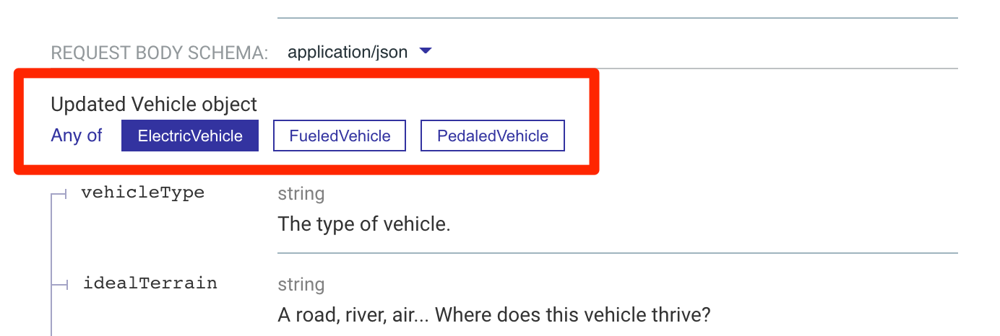
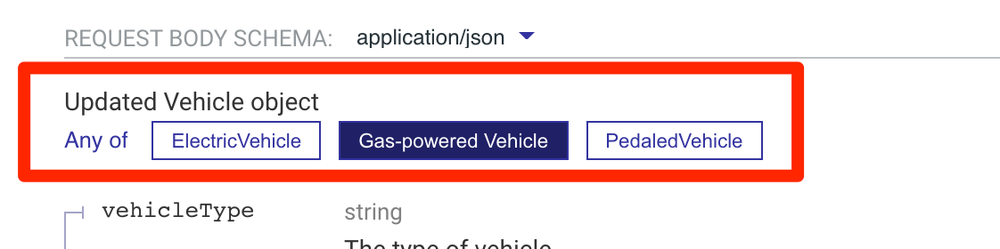
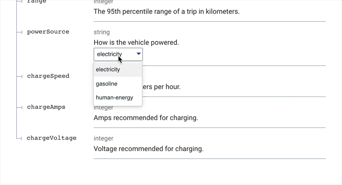
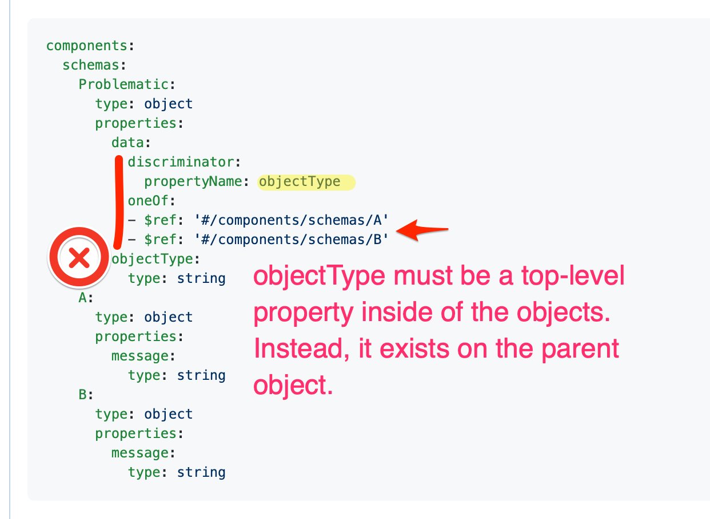

# How to use the OpenAPI discriminator

When an API can return two or more different types of objects (aka polymorphism), use `oneOf` or `anyOf` to describe those schemas (a JSON Schema concept).
You might also want to use the `discriminator` (an OpenAPI concept).
But why?
And how?

## oneOf vs. anyOf

Use `anyOf` when the item might be valid against more than one of the schemas.
Use `oneOf` when it can **only** be valid against one of the schemas.

How could it be valid against more than one of the schemas?
This is easier than you may initially think.
Two schemas with some overlapping properties and no other required properties indicate the need for `anyOf`.

The examples below with the vehicles would require `anyOf` to be valid.

`oneOf` and `anyOf` are visually presented in our reference docs by choice of buttons.



Control the button labels by defining a `title` in the corresponding object schema.

```yaml Example of schema with title
type: object
title: Gas-powered Vehicle
properties:
  vehicleType:
    description: The type of vehicle.
```



## When to use the OpenAPI discriminator

Whenever you see the discriminator used, engage in this dialog:

> The discriminator adds complexity. Is it necessary?

If the clarity gained by describing the objects distinctly is greater than the cost of the complexity added by doing so, then it may be a good idea to use the discriminator.

It is also possible to create nested discriminators (which involves extra complexity and should be used sparingly).

The discriminator explicitly declares which property you can inspect to determine the object type.


```yaml
type: object
description: Electric Vehicle
properties:
  vehicleType:
    description: The type of vehicle.
    type: string
    example: Tesla
  idealTerrain:
    type: string
    description: A road, river, air... Where does this vehicle thrive?
    example: roads
  topSpeed:
    description: The top speed in kilometers per hour rounded to the nearest integer.
    type: integer
    example: 83
  range:
    description: The 95th percentile range of a trip in kilometers.
    type: integer
    example: 100
  powerSource:
    description: How is the vehicle powered.
    type: string
    example: electricity
  chargeSpeed:
    description: In range kilometers per hour.
    type: integer
  chargeAmps:
    description: Amps recommended for charging.
    type: integer
  chargeVoltage:
    description: Voltage recommended for charging.
    type: integer
```


```yaml
type: object
title: Gas-powered Vehicle
properties:
  vehicleType:
    description: The type of vehicle.
    type: string
    example: car
  idealTerrain:
    type: string
    example: roads
  topSpeed:
    description: The top speed in kilometers per hour rounded to the nearest integer.
    type: integer
    example: 83
  range:
    description: The 95th percentile range of a trip in kilometers.
    type: integer
    example: 100
  powerSource:
    description: Describes how the vehicle is powered.
    type: string
    example: gasoline
  tankCapacity:
    type: number
    format: double
    description: Capacity of the fuel tank in gallons.
  milesPerGallon:
    type: number
    format: double
    description: Miles per gallon on the highway.
```


```yaml
type: object
description: Pedaled Vehicle
properties:
  vehicleType:
    description: The type of vehicle.
    type: string
    example: bicycle
    enum:
      - bicycle
  idealTerrain:
    type: string
    example: roads
  topSpeed:
    description: The top speed in kilometers per hour rounded to the nearest integer.
    type: integer
    example: 83
  range:
    description: The 95th percentile range of a trip in kilometers.
    type: integer
    example: 100
  powerSource:
    description: How is the vehicle powered.
    type: string
    example: pedaling
```


The discriminator must apply to the same level of the schema it is declared in (common mistake when using nested objects).

Also, it must be used in combination with `anyOf`, `oneOf`, or `allOf`.

We represent the discriminator like a pull down menu on the discriminated property.

```yaml
  requestBody:
    content:
      application/json:
        schema:
          discriminator:
            propertyName: powerSource
            mapping:
              electricity: ../components/schemas/ElectricVehicle.yaml
              gasoline: ../components/schemas/FueledVehicle.yaml
              human-energy: ../components/schemas/PedaledVehicle.yaml
          anyOf:
            - $ref: ../components/schemas/ElectricVehicle.yaml
            - $ref: ../components/schemas/FueledVehicle.yaml
            - $ref: ../components/schemas/PedaledVehicle.yaml
```

In this example the `powerSource` property must be declared in each of the corresponding schemas.

<div class="warning">The discriminated property must be of type string.</div>

The `mapping` is optional and we **recommend** using it explicitly.
If it is not explicitly declared, implicit `mapping` is introspected from the schema names from the list of schemas included in `allOf`/`anyOf`/`oneOf` including [children schema](#allof-for-inheritance) names.

Schema names (including case) must match exactly to the discriminated properties values.

A better alternative is to use the `mapping` property and making the names explicitly declared.
The possible values are determined from introspection by the schema names.



### allOf for inheritance

Another common technique used with the discriminator is to define a base schema, and then inherit from it using `allOf`.

For example, we could have created a base `Vehicle` schema.
Then, each of the specific implementations would "extend" the `Vehicle` schema using `allOf`:


```yaml
type: object
description: Vehicle
discriminator:
  propertyName: powerSource
  mapping:
    electricity: ./ElectricVehicle.yaml
    gasoline: ./FueledVehicle.yaml
    human-energy: ./PedaledVehicle.yaml
properties:
  vehicleType:
    description: The type of vehicle.
    type: string
    example: bicycle
  idealTerrain:
    type: string
    example: roads
  powerSource:
    description: How is the vehicle powered.
    type: string
    example: pedaling
```


```yaml
# I think of allOf like a "merge"
allOf:
  - $ref: ./Vehicle.yaml
  - type: object
    description: Pedaled Vehicle
    properties:
      topSpeed:
        description: The top speed in kilometers per hour rounded to the nearest integer.
        type: integer
        example: 83
      range:
        description: The 95th percentile range of a trip in kilometers.
        type: integer
        example: 100
```


## Common mistakes

### Property outside of the object

The discriminator property name is not inside of the object.
This typically causes the object to not be rendered.



### Case sensitivity

The discriminator property value is case sensitive (as well as the schema or mapping name).

### Discriminator is described inline

The discriminator must use `anyOf`, `oneOf` or `allOf`.
When you define it inline, for example, as I did on a version of the `ElectricVehicle` schema below, it ignores that schema (per the spec):

> When using the discriminator, inline schemas will not be considered.

```yaml
type: object
description: Electric Vehicle
discriminator:
  propertyName: powerSource
properties:
  vehicleType:
    description: The type of vehicle.
    type: string
    example: bicycle
  idealTerrain:
    type: string
    description: A road, river, air... Where does this vehicle thrive?
    example: roads
  topSpeed:
    description: The top speed in kilometers per hour rounded to the nearest integer.
    type: integer
    example: 83
  range:
    description: The 95th percentile range of a trip in kilometers.
    type: integer
    example: 100
  powerSource:
    description: How is the vehicle powered.
    type: string
    example: electricity
  chargeSpeed:
    description: In range kilometers per hour.
    type: integer
  chargeAmps:
    description: Amps recommended for charging.
    type: integer
  chargeVoltage:
    description: Voltage recommended for charging.
    type: integer
```

Catch mistakes early by using our [Redocly CLI tool](../../pages/redocly-cli/redocly-cli.page.tsx).
