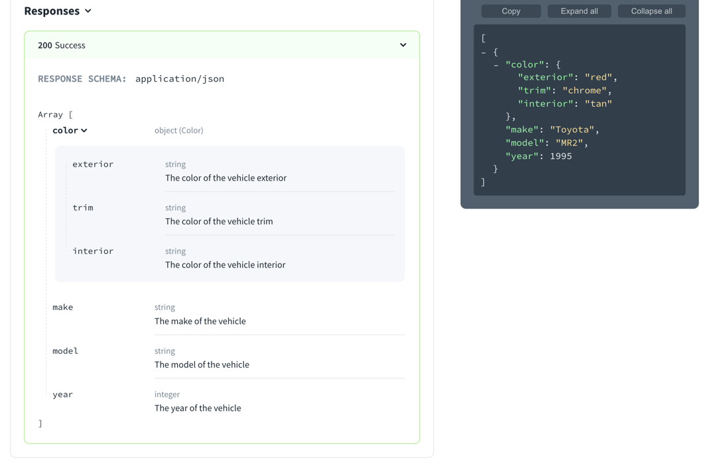

# `array`

> Arrays are used for ordered elements. In JSON, each element in an array may be of a different type.

## Visuals

The following is an example of an array of vehicles.

```yaml Schema
type: array
items:
  $ref: "#/components/schemas/vehicle"
```
```yaml Components
components:
  schemas:
    vehicles:
      type: array
      items:
        $ref: "#/components/schemas/vehicle"
    vehicle:
      type: object
      title: Vehicle
      properties:
        color:
          type: object
          title: Color
          properties:
            exterior:
              type: string
              description: The color of the vehicle exterior
              example: red
            trim:
              type: string
              description: The color of the vehicle trim
              example: chrome
            interior:
              type: string
              description: The color of the vehicle interior
              example: tan
        make:
          type: string
          description: The make of the vehicle
          example: Toyota
        model:
          type: string
          description: The model of the vehicle
          example: MR2
        year:
          type: integer
          description: The year of the vehicle
          example: 1995
```
The following image displays that array schema and example object.



## Types

- SchemaProperties

```ts
const SchemaProperties: NodeType = {
  properties: {},
  additionalProperties: 'Schema',
};
```
